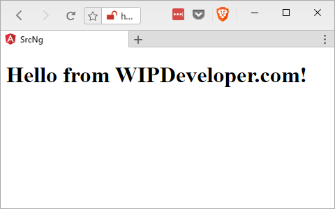
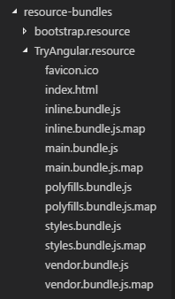
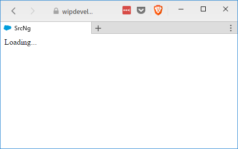
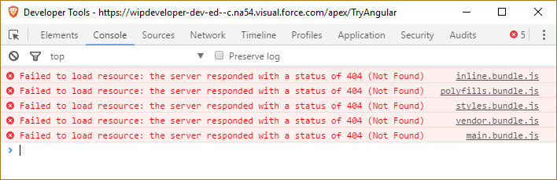
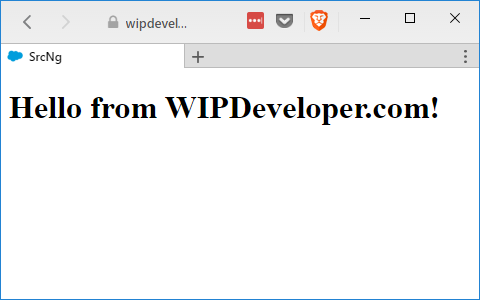

If you have been following along we now have the basics set up: a Visualforce page, a Static Resource, and an Angular app. Now we need to tie them all together.

## Update Angular Output

First thing we are going to do is update the default output folder for our Angular app. You can do it is `src-ng/.angular-cli.json`. Under `"apps"` we will change `"outDir"` from `"dist"` to `"../resource-bundles/TryAngular.resource"`

Now if you run the app

#### Run Angular

ng serve

you will see the app working still.

#### Working App

Yay! We didn't break anything.... but our folder for the static resource did go away. Don't worry about it. The Angular CLI serves the app from memory so when we used the `ng serve` command it removed the out put folder.

Now Let's build our app and send it to Salesforce.

## Build Angular App

Stop the Angular CLI from serving the app (`Ctrl + c` on Windows, `Command + c` on Mac) press `y` if it asks and then build the app from dev.

#### Build for Development

ng build

you should see your output/static resource folder back in your editor now with some content.

#### Our App Built

Now lets send it to the server with Mavensmate. Open the command palette with `Control + Shift + p` on Windows or `Command + Shift + p` on Mac, enter `Mavensmate: Deploy Resource Bundle` press `Enter`, select the `TryAngular.resource` from the drop down and wait for the it to upload.

## Add the App to the Visualforce Page

Now we should have our static resource with our app loaded up to Salesforce and it's time to get it to display on our Visualforce page.

Open the Visualforce page you created [previously](/2017/04/20/visualforce-and-angular-setting-up-salesforce/) and the first thing we are going to want to do is opt out of using the default Salesforce styles, header, sidebar, body tag, and not show chat.

#### Updated `apex:page`

<apex:page 
    doctype="html-5.0" 
    standardStylesheets="false" 
    showChat="false" 
    applyBodyTag="false" 
    applyHtmlTag="false" 
    showHeader="false" 
    sidebar="false">

This will make our Visualforce page a proverbial blank slate so lets open up the `index.html` that the CLI generated in our `resource-bundles/TryAngular.resource` folder.

If should look something like this:

#### Generated `index.html`

<!doctype html>
<html>
<head>
  <meta charset="utf-8">
  <title>SrcNg</title>
  <base href="/">

  <meta name="viewport" content="width=device-width, initial-scale=1">
  <link rel="icon" type="image/x-icon" href="favicon.ico">
</head>
<body>
  <app-root>Loading...</app-root>
  
  
  
  
  
</body>
</html>

> I added some page breaks and spacing to make things look a little nicer on the eyes.

We already specified the `doctype` with the `doctype="html-5.0"` in the `apex:page` so lets copy everything else and put it in our Visualforce page.

#### Updated `TryAngular.page`

<apex:page 
    doctype="html-5.0" 
    standardStylesheets="false" 
    showChat="false" 
    applyBodyTag="false" 
    applyHtmlTag="false" 
    showHeader="false" 
    sidebar="false">
    <html>
        <head>
            <meta charset="utf-8" />
            <title>SrcNg</title>
            <base href="/" />

            <meta name="viewport" content="width=device-width, initial-scale=1" />
            <link rel="icon" type="image/x-icon" href="favicon.ico" />
        </head>
        <body>
            <app-root>Loading...</app-root>
            
            
            
            
            
        </body>
    </html>
</apex:page>

> I did have to add `/` to close the `meta` tags, `base` tag, and the `link` tag so it would save properly. If you might copy and paste the page from the generated `index.html` again you may want to close those tags on the `src-ng/src/index.html` so you don't have to do it again.

If you go to your Visualforce page now by logining and and changing your url path to `/apex/TryAngular`. What I mean here is if you log in and the url is `https://brett-test-dev-ed.my.salesforce.com/setup/forcecomHomepage.apexp?setupid=ForceCom` delete everything after `https://brett-test-dev-ed.my.salesforce.com/` and add `apex/TryAngular` to it so it would be `https://brett-test-dev-ed.my.salesforce.com/apex/TryAngular`. That should take you do you recently updated Visualforce page.

#### `TryAngular`

You can see the page title `SrcNg` this is what we named the app and the `Loading...` that is in our `app-root`. Nothing else is happening ad if you open up the console you will see we have 5 errors for resources that failed to load.

#### Failed to Load

Of course all those failed to load resources are the JavaScript files that are located in our static resource and not at the same level as our page so we will need to update them to reference the static resource.

Lets correct these errors by changing the `src=""` to use the `{!URLFOR($Resource.TryAngular, '.js')}` so `src="inline.bundle.js"` becomes `src="{!URLFOR($Resource.TryAngular, 'inline.bundle.js')}"`.

When you are done your `script` tags should look like this:

#### Udpate `script` Tags

## Ship It

Reload your page and the app should work!

#### Working App

## Conclusion

We now have a working Angular app on a Visualforce page in Salesforce.com! Sounds like we are done! Do you think we should add anything like accessing data? Let me know by leaving a comment below or emailing [brett@wipdeveloper.com](mailto:brett@wipdeveloper.com).
