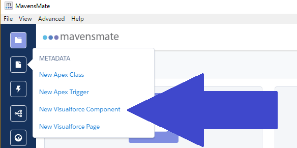
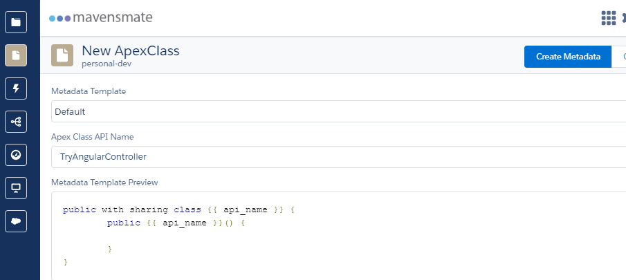

With our Angular app running on Visualforce page we now need to be able to get some data for it from Salesforce. We will be adding an Apex controller for this.

## Create Apex Controller

In Mavensmate to to the `METADATA` menu and choose `New Apex Class` to open the `New ApexClass` menu.

#### `METADATA` Menu



Choose a `Metadata Template` of `Default` and give it a `Apex Class API Name`. I will be calling mine `TryAngularController`.

#### Completed `New ApexClass` Menu



With that filled in select the `Create Metadata` button and watch it work.

You should now have an empty class that looks something like this:

#### `TryAngularController.cls`

```java
public with sharing class TryAngularController {  
    public TryAngularController() {

    }
}
```

## Add Some Functions

We will need to add a few methods that are decorated with the `@RemoteAction`.

### GetContacts

Let's start by creating a method to `GetContacts`. We will use it to get a list of contacts name and id.

#### `GetContacts` Method

```java
@RemoteAction
public static List<Contact> GetContacts(){  
    List<Contact> contacts = [select id, Name from contact LIMIT 50];

    return contacts;        
}
```

### GetContact

Next let's add `GetContact`. This will take an id and return the contacts `Id`, `Name`, and `Email`.

#### `GetContact` Method

```java
@RemoteAction
public static Contact GetContact(String contactId){  
    Contact contact = [SELECT Id, Name, Email FROM Contact WHERE Id =: contactId];

    return contact;        
}
```

### UpdateContact

Now create a `UpdateContact` method. This will take a `contactID` and `email` and update the email of the contact.

#### `UpdateContact` Method

```java
@RemoteAction
public static void UpdateContact(String contactId, String email){  
        Contact contact = [SELECT Id, Name FROM Contact WHERE Id =: contactId];

        contact.Email = email;

        update contact;
}
```

### NewContact

Of course we need a `NewContact` method. It will take a `firstname`, a `lastName`, and an `email` to create a new contact.

#### `NewContact` Method

```java
@RemoteAction
public static void NewContact(String firstName, String lastName, String email){  
    Contact newContact = new Contact(FirstName = firstName, LastName = lastName, Email = email);

    insert newContact;
}
```

### DeleteContact

And if your going to create contacts you will definettly want a `DeleteContact` method. You can probably guess that it is goint to take an `Id` and delete the contact.

#### `DeleteContact` Method

```java
@RemoteAction
public static void DeleteContact(String contactId){  
        Contact contact = [SELECT Id FROM Contact WHERE Id =: contactId];

        delete contact;
}
```

## Conclusion

With our new `TryAngularController` in place we can start accessing data in our org. What do you think we should try to do first? Let me know by leaving a comment below or emailing [brett@wipdeveloper.com](mailto:brett@wipdeveloper.com).
