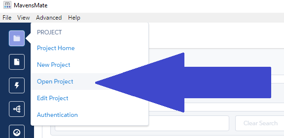
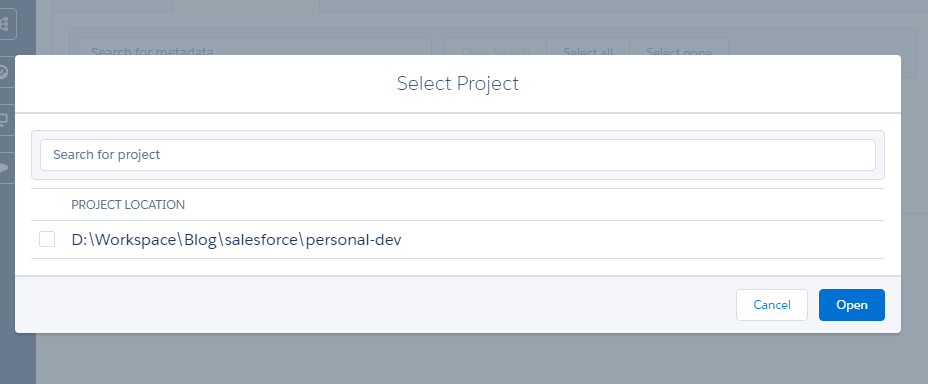
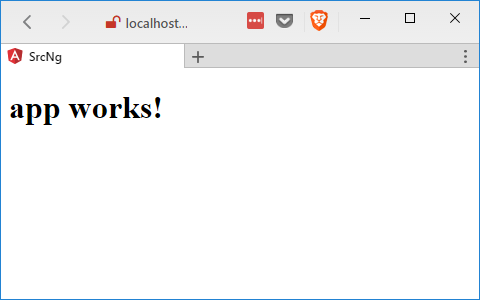

Last time we did most of the setup for our Salesforce.com things so now lets get a basic Angular app set up.

## Get the CLI

We will be using the Angular CLI so the first thing you need to do in install it. You can either install it if you haven't installed it before:

#### Install Angular CLI

npm install -g @angular/cli@latest

Or you can uninstall it, clear your npm cache, and install it again :)

#### Reinstall Angular CLI

npm uninstall -g angular-cli @angular/cli
npm cache clean
npm install -g @angular/cli@latest

Armed with the cli you can now create an Angular project.

## Create an Angular Project

Open a command line or terminal or your favorite shell in the root of your Salesforce Project. If you don't know where this is, in Mavensmate it is displayed on the "Select Project" menu. Get there by going to `Project` then `Open Project`.

#### `Project` => `Open Project`

#### `Select Project`

> Note: This is also the first menu you see when first opening Mavensmate.
> 
> Note 2: You can also get here if you are using Visual Studio Code by right clicking a file or folder in root and choosing copy path. And then open your command line and use `cd` and past the path just remembering to remove the the file or folder you clicked on from the path.

Now that you are in the proper place if your terminal we will create our Angular Project. I'm going to call my project src-ng but you may choose something different.

#### Create New Angular Project

ng new src-ng

This should so you a list of what is being created and look something like this once it is done:

#### `ng new src-ng` Output

PS D:\\Workspace\\Blog\\salesforce\\personal-dev> ng new src-ng
installing ng
  create .editorconfig
  create README.md
  create src\\app\\app.component.css
  create src\\app\\app.component.html
  create src\\app\\app.component.spec.ts
  create src\\app\\app.component.ts
  create src\\app\\app.module.ts
  create src\\assets\\.gitkeep
  create src\\environments\\environment.prod.ts
  create src\\environments\\environment.ts
  create src\\favicon.ico
  create src\\index.html
  create src\\main.ts
  create src\\polyfills.ts
  create src\\styles.css
  create src\\test.ts
  create src\\tsconfig.app.json
  create src\\tsconfig.spec.json
  create src\\typings.d.ts
  create .angular-cli.json
  create e2e\\app.e2e-spec.ts
  create e2e\\app.po.ts
  create e2e\\tsconfig.e2e.json
  create .gitignore
  create karma.conf.js
  create package.json
  create protractor.conf.js
  create tsconfig.json
  create tslint.json
Successfully initialized git.
Installing packages for tooling via yarn.
Installed packages for tooling via yarn.
Project 'src-ng' successfully created.
PS D:\\Workspace\\Blog\\salesforce\\personal-dev>

> I have Yarn installed on my computer so Angular makes use of that _automagically_.

Lets try running it and see what happens.

## Run Angular

Go into the directory that was just created

#### Change Directory

cd src-ng

And start the Angular app

#### Start the Angular App

ng serve

It should have some output:

#### `ng serve` Output

PS D:\\Workspace\\Blog\\salesforce\\personal-dev\\src-ng> ng serve
\*\* NG Live Development Server is running on http://localhost:4200 \*\*
Hash: 29d45a42885670da5809
Time: 8111ms
chunk    {0} polyfills.bundle.js, polyfills.bundle.js.map (polyfills) 165 kB {4} \[initial\] \[rendered\]
chunk    {1} main.bundle.js, main.bundle.js.map (main) 3.69 kB {3} \[initial\] \[rendered\]
chunk    {2} styles.bundle.js, styles.bundle.js.map (styles) 9.77 kB {4} \[initial\] \[rendered\]
chunk    {3} vendor.bundle.js, vendor.bundle.js.map (vendor) 2.39 MB \[initial\] \[rendered\]
chunk    {4} inline.bundle.js, inline.bundle.js.map (inline) 0 bytes \[entry\] \[rendered\]
webpack: Compiled successfully.

You see on the first like where it says `** NG Live Development Server is running on http://localhost:4200 **` that means you can now open a web browser to `http://localhost:4200` and see your brand new Angular app!

#### Angular App Live!

Lets change something to make sure it's working properly.

In your editor go to the `src-ng/src/app/app.component.ts` and change line 9 from `app works` to something else:

#### Updated `src-ng/src/app/app.component.ts`

import { Component } from '@angular/core';

@Component({
  selector: 'app-root',
  templateUrl: './app.component.html',
  styleUrls: \['./app.component.css'\]
})
export class AppComponent {
  title = 'Hello from WIPDeveloper.com!';
}

It should auto reload the page in the web browser, if you left it open, so you can see you changes right away!

#### Update Angular App!

## Conclusion

Now we have an Angular app setup we are ready to get it working on a Visualforce page. Are you having fun yet? Let me know by leaving a comment below or emailing [brett@wipdeveloper.com](mailto:brett@wipdeveloper.com).
