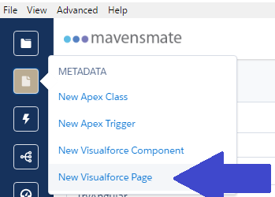
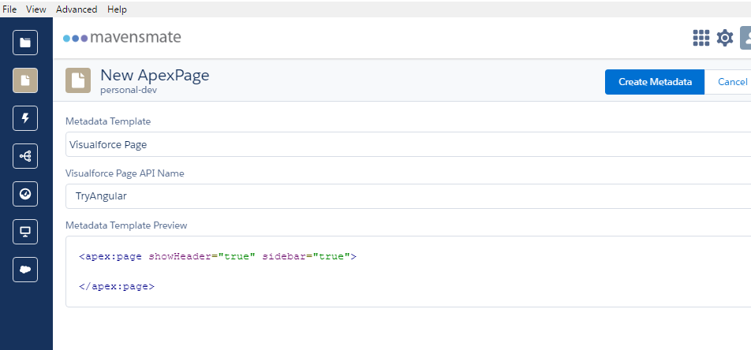
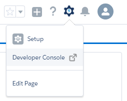
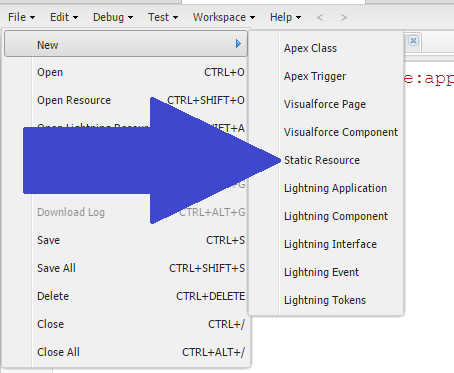
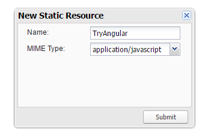
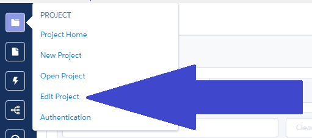
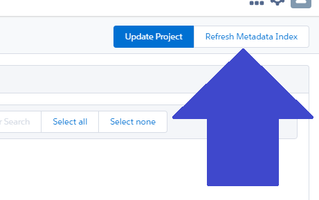
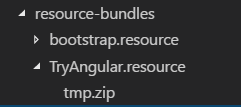

Lets take a look at using Angular on a Visualforce page. To do that we will need to set up a few things. I will be using [Mavensmate](http://mavensmate.com/) with [Visual Studio Code](https://code.visualstudio.com/) for this, you can read more about it [here](/2016/10/28/visual-studio-code-with-mavensmate/).

## Setup Visualforce.page

We are going to need a Visualforce page for our app to "live" on so lets begin by creating one. In the Mavensmate go to the `METADATA` menu expansion and choose `New Visualforce Page`.

#### `New Visualforce Page` Menu Location

This will give you the `New ApexPage` screen. Choose `Visualforce Page` for the template and give your page a name, I'm going to call mine `TryAngular`.

#### `New ApexPage` Screen

Once you have it filled out use select the `Create Metadata` button and wait for it to finish `Creating Metadata...`

## Setup Static Resource

Next we will need a Static Resource to put our apps assets in. Since I haven't figured out how to do this in Mavensmate yet so it's off to Salesforce for us.

Log into your org and head to the Developer Console by going to the gear icon and choosing Developer Console.

#### GoTo Dev Console

With the Developer Consol Open go to File > New > Static Resource. This will open a new little window in the console to create a Static Resource.

#### File > New > Static Resource Menu

Give it a name, I'm going to call mine `TryAngular`. And choose a MIME Type, for now I'm going to go with `application/javascript` not for any particular reason other that it's the type I feel I identify the most with.

#### Give the Deets

Then hit submit and go back to MavensMate.

In Mavensmate go to `Edit Project`

#### Edit Project

Refresh your Metadata with the `Refresh Metadata Index` button.

#### Refresh Metadata

Then update your project with the `Update Project` button right next to the `Refresh Metadata Index` button.

Now you should see your new Static Resource, `TryAngular.resource` in my case, in your `src/staticresources` folder.

Now you can use the command palette (`ctrl + shift + p` on windows or `command + shift + p` on Mac) to use the `Mavensmate: Create Resource Bundle` to create a `TryAngular.resource/` folder in your `resource-bundles/` folder.

#### `TryAngular.resource/` Folder

> It seems to have created a file named `tmp.zip` in the `TryAngular.resource/` folder you can delete that now or you can delete it later once we get Angular set up.

## Conclusion

With the basics of the Salesforce setup for our Angular app we can move on to setting up Angular next time. Are there any steps you would change so far? Let me know by leaving a comment below or emailing [brett@wipdeveloper.com](mailto:brett@wipdeveloper.com).
