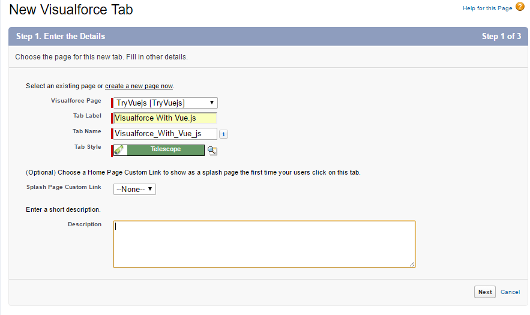
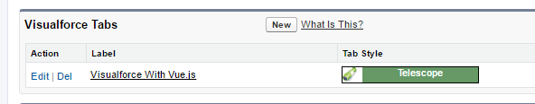
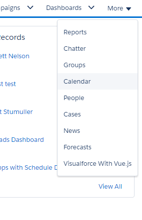
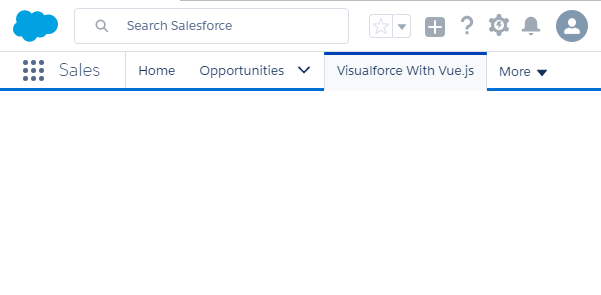
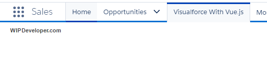
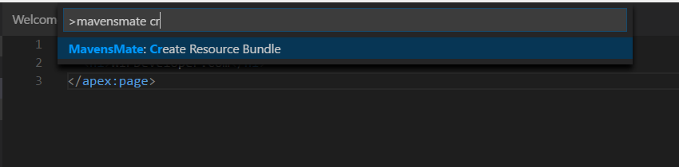
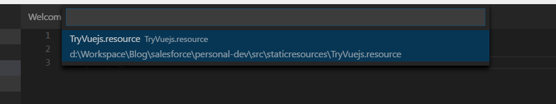
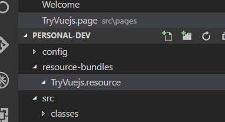
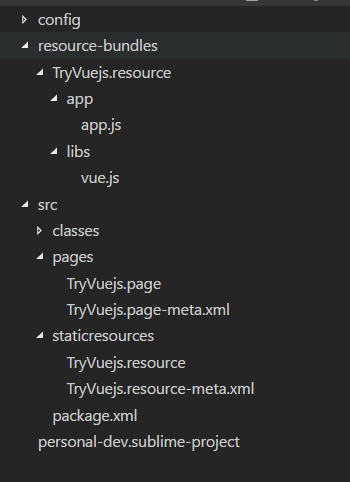

In [Visualforce with Vue.js](/2017/03/30/visualforce-with-vue-js/) we did most of the work necessary to start working on our Vue.js app on a Visualforce page. Let's continue where we left off and get Vue.js working!

## Make a Tab

First thing we should do is make a Tab for our Visualforce page just so we can get to it faster. In Setup use the Quick find and enter `tab`. in the `Custom Tabs` menu choose the `New` button in the `Visualforce Tabs` section. Fill out the `Step 1. Enter the Details` form by selecting the Visualforce page we created [last time](/2017/03/30/visualforce-with-vue-js/) give it a label, I used `Visualforce With Vue.js` but feel free to be creative and choose a style.

#### Step 1. Enter the Details

For now lets just use the defaults for the next 2 steps so hit `next` twice before choosing `save`.

When you are returned to the `Custom Tabs` Menu you should see your new tab listed:

#### We have a Tab!

Or course if you go back to your org and look for the tab you may have to refresh the page to see it and it will probably be hidden under the down arrow:

#### Hiding Tab

## Verify Correct Page

But now we can go to our Visualforce page and see that we have not added anything yet.

> I was going to put a screen shot here but do we really need an image of an empty page? Ok if you insist.

#### Empty Page!

Lets just verify that the page the one we have in our editor by adding a simple header tag:

#### The Entire `TryVuejs.page`

<apex:page showHeader="true" sidebar="true">
  <h1>WIPDeveloper.com</h1>
</apex:page>

After a quick save and refresh we get something:

#### Something!

## Start Adding to Our Static Resource

Now that we have quick access to our page an have verified it is the correct page when we go to the tab lets start adding to our static resource. In Visual Studio Code open the command pallet with `shift + ctrl + p` on Windows or `shift + cmd + p` on Mac. The command we are looking for is called `Mavensmate: Create Resource Bundle`. Since the command pallet works like a quick find so you can type out the whole command name if you would like but it probably wont be necessary. I only need to type `mavensmate cr` before `Mavensmate: Create Resource Bundle` is the only option:

#### `Mavensmate: Create Resource Bundle`

Choose `Mavensmate: Create Resource Bundle` and then select the bundle you would like to work with. Last time I called my bundle `TryVuejs` so I will select `TryVuejs.resource`

#### `TryVuejs.resource`

This will create a new folder at the same level as `src` named `resource-bundles`. And inside `resource-bundles` will be a folder named `TryVuejs.resource`. `TryVuejs.resource` has some junk we just used to create the static resource last time so lets delete that and leave it empty:

#### Empty `TryVuejs.resource` Folder

Now lets add a folder called `libs` to `resource-bundlesTryVuejs.resource` and lets download a development copy of `Vue.js` from [here](WorkspaceBlogsalesforcepersonal-devresource-bundlesTryVuejs.resource) so we have a static copy for our org and put it in our `libs` folder.

While we are here lets add a folder named `app` at the same level as `libs` and create a JavaScript file named `app.js` in it.

#### Current File Structure

Now lets just add the sample Vue.js app to our `app.js` so we can make sure things are working:

#### `app.js`

window.onload = function () {
  var app = new Vue({
    el: '#app',
    data: {
      message: 'Hello WIPDeveloper Readers from Vue.js!'
    }
  })
}

> I put the creation of the app inside of a `window.onload` so that everything would be loaded before it was called.

Now Deploy your resource bundle to the org using the command pallet and `Mavensmate: Deploy Resource Bundle` select your bundle and watch it go to the cloud.

Now if you refresh your page... Nothing new should happen. We haven't added references to the `vue.js` file or our `app.js` file yet. Lets do that.

## Add References

Back on your `TryVuejs.page` add a `div` with an id of `app` and then we will add 2 `apex:includeScript` tags, one for the library and one for the app:

#### Final `TryVuejs.page`

<apex:page applyHtmlTag="false" showHeader="false" sidebar="false">
  <h1>WIPDeveloper.com</h1>
  
{{message}}

  <apex:includeScript value="{!URLFOR($Resource.TryVuejs, '/libs/vue.js')}"/>
  <apex:includeScript value="{!URLFOR($Resource.TryVuejs, '/app/app.js')}"/>
</apex:page>

To get this to work I had to change some of the properties for the `apex:page`: `applyHtmlTag`, `showHeader`, and `sidebar` to false. We will take a closer look at why next time and see what else we could do.

## Conclusion

We now have a Visualforce page working with Vue.js but we had to do some questionable things to get it working. This is probably because we are actually loading our page inside of the Lightning Experience so we are really running Vue.js inside of an Aura instance and we should probably avoid that. What do you think? Let me know by leaving a comment below or emailing [brett@wipdeveloper.com](mailto:brett@wipdeveloper.com).
