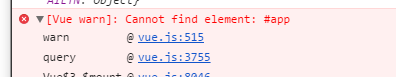
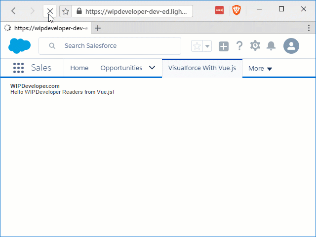

Last time we added a tab and started our Vue.js app. It had some issues and we had to use some attributes with our `apex:page` to get things working in Lightning. Is there a way to get around that? Lets take a look.

## What We Had

This is what we left off with:

#### Previous `TryVuejs.page`

<apex:page applyHtmlTag="false" showHeader="false" sidebar="false">
  <h1>WIPDeveloper.com</h1>
  
{{message}}

  <apex:includeScript value="{!URLFOR($Resource.TryVuejs, '/libs/vue.js')}"/>
  <apex:includeScript value="{!URLFOR($Resource.TryVuejs, '/app/app.js')}"/>
</apex:page>

Let's try to understand why this worked.

We had set `applyHtmlTag`, `showHeader`, and `sidebar` to false on our page. In Lightning `showHeader`, and `sidebar` default to false but Mavensmate was giving the following error when trying to save with just `applyHtmlTag="false"`:

#### Error

'Attribute 'showHeader' on component <apex:page> must be false when 'applyHtmlTag' is false.'

This was probably coming from the tooling api or wherever Mavensmate send things so we set `showHeader="false"` so we can save things even if it is supposed to be false by default. Since it's a Visualforce page we could be trying to use it outside of Lightning so this seems like proper behavior.

This allowed our page to load our `app.js` properly if we created our Vue.js app in `window.onload` function.

#### Previous `app.js`

window.onload = function () {
  var app = new Vue({
    el: '#app',
    data: {
      message: 'Hello WIPDeveloper Readers from Vue.js!'
    }
  })
}

In our work with [Vue.js and ForceJS](/2017/03/14/using-forcejs-with-vue-js/) this wasn't necessary so what's different?

## The Difference

In our Visualforce page we used `apex:includeScript` to add the scripts to the page. According to the [Visualforce Developer Guide](https://developer.salesforce.com/docs/atlas.en-us.pages.meta/pages/pages_compref_includeScript.htm) `apex:includeScript` creates "A link to a JavaScript library that can be used in the Visualforce page. When specified, this component injects a script reference into the element of the generated HTML page." By default these scripts that are added to the head are evaluated as the browser loads the page so without the using the `window.onload` the JavaScript was evaluated and executed before the rest of the html was loaded causing Vue.js to be unable to find the element `#app`:

#### `vue.js:515 [Vue warn]: Cannot find element: #app`

## Some Solutions

We could use the `apex:includeScript`'s `loadOnReady` attribute to load the scripts only after the page is ready. It has the added benefit of preventing us from loading the same script twice but it is noticeably slow.

#### Slow Load

We can speed this up by using `script` tags to load the JavaScript files provided we place them at the end of our page, or at least after any markup they reference.

#### Update `TryVuejs.page`

<apex:page showHeader="true" sidebar="true">
  <h1>WIPDeveloper.com</h1>
  
{{message}}

  
  
</apex:page>

#### Faster Load

Looking at the time to load to finish in the dev tools also indicates using the script tags almost a second faster as well 5.43(ish) seconds using `apex:includeScript` versus 4.63(ish) seconds using `script` tags.

> This added time is probably the extra JavaScript that is loaded to add it to the DOM after the page loads and the act of adding it to the DOM.

## Some Other Thoughts

In the gifs above you can see the Lightning UI loaded and ready to go before the `html` of our Visualforce page is loaded.

This makes me think that if you are using Lightning Experience it would probably be better to develop with Lightning Components or a Lightning app than to load a second front end framework after the Lightning Experience is loaded.

Using Vue.js or React or Angular in the Lightning Experience is probably going to create a worse experience for your end users as they wait for 2 front end frameworks to load, one after the other. If you are doing a fully custom experience that doesn't use Lightning, use what ever framework you happen to love at the moment and have fun.

## Conclusion

Disagree with anything I said? Let me know by leaving a comment below or emailing [brett@wipdeveloper.com](mailto:brett@wipdeveloper.com).
