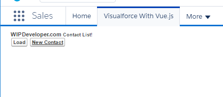

Now that we have things loading properly we can start reproducing our Contacts app we built with [ForceJS](/2017/03/14/using-forcejs-with-vue-js/).

> If you didn't follow along or are just joining us now the source code for the [ForceJS with Vue.js](/2017/03/14/using-forcejs-with-vue-js/) can be found at [https://github.com/BrettMN/vue-forcejs-sample](https://github.com/BrettMN/vue-forcejs-sample)

## Move It On Over

Lets begin by copying everything we had in our app directory from the ForceJS app to the app directory of our static resource. Now we will need to add references for each of these on our page. Lets add those references now:

#### References

> I also have added vue-router.js from [https://router.vuejs.org/en/installation.html](https://router.vuejs.org/en/installation.html) to the libs folder so we can use it later

## Remove ForceJs References

Since we are not using ForceJS we should remove all references to if from our app or we will get an `Uncaught ReferenceError: force is not defined`. In our `app/services/sf.service.js` we might as well delete everything inside the body of our anonymous function:

#### Empty `sfService`

let sfService = (() => {

})()

Now lets start adding things back. We will need to start with 2 functions once named `getContacts` the other `getContact` and expose these in a return object.

> For right now lets just return Promises in these new functions

#### Updated `sfService`

let sfService = (() => {

  // public functions
  function getContacts() {
    return new Promise((resolve, reject) => {
      
    })
  }

  function getContact(id) {
    return new Promise((resolve, reject) => {
      
    })
  }

  // return object
  return {
    getContacts: getContacts,
    getContact: getContact
  }
})()

This means we will need to update our call to the `sfService` from `contacts.js` and `contact-details.js`

In `contacts.js` change the load method to the following:

#### Updated `contact.js` `load` Method

load: function() {
  contactsData.contacts = \[\]
  eventHub.$emit('overlay:show')

  sfService.getContacts()
    .then(function(response) {
      console.log(response)
      contactsData.contacts = response
      eventHub.$emit('overlay:hide')
    })
}

Now it will call the new `getContacts` method on our service and put the response in the `contacts` array.

For `contact-details.js` update the `loadContact` method to the following:

#### Updated `contact-details.js` `load` Method

loadContact: function (id) {
  this.showContact = false
  this.currentContact = {}

  sfService.getContact(id)
    .then(response => {
      this.currentContact = response
      this.showContact = true
    })
}

It will take the response from our new `getContact` method of our service and store it in the `currentContact`.

## Update Markup

Lets update the markup on our `TryVuejs.page` so that it's what the `index.html` had in the ForceJS project. Lets remove the `h1` and the `div` with `id="app"` and use the following instead:

#### Updated Markup

  

    <h1>
      {{ header }}
      <small>{{ subHeader }}</small>
    </h1>
  

  <router-view></router-view>

That should be enough to load the app and see our header, sub-header and buttons.

#### App Loads

## Conclusion

The buttons don't work and it looks ugly but we know it loads. Now we just need to build out the calls to Salesforce. I was thinking of using RemoteActions, do you have a sugestion? Let me know by leaving a comment below or emailing [brett@wipdeveloper.com](mailto:brett@wipdeveloper.com).
