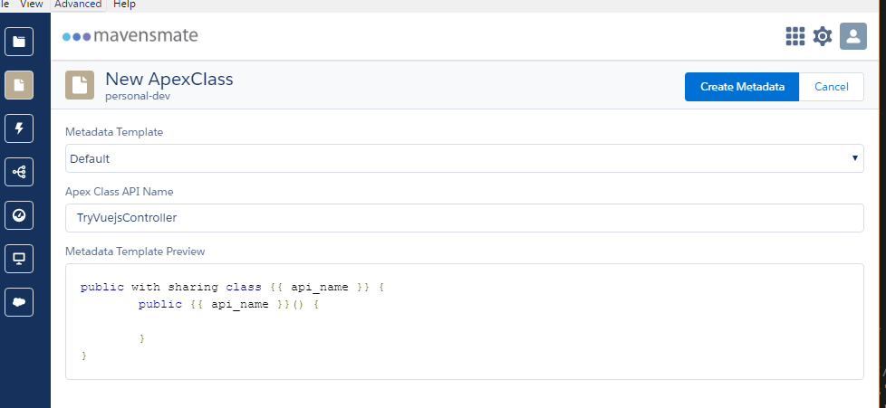
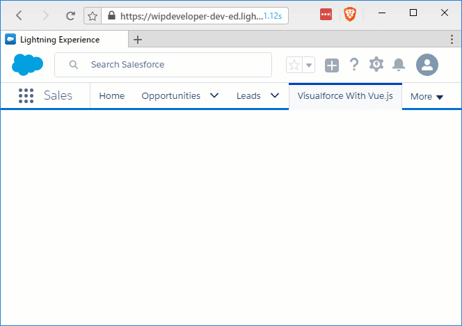

[Last time](/2017/04/06/visualforce-with-vue-js-part-4-add-the-app/) we got the app to load lets see what it would take to get something from Salesforce.

## Get Some Class

Alright let's start by adding a class. In Mavensmate with your project open to to the `Metadata` Menu and choose `New Apex Class`. In the next menu choose `Default` for `Metadata Template` and give your new class a name, I'm going to call mine `TryVuejsController`. It should look something like this:

#### New Class

Now choose `Create Metadata` and watch the magic, or spinner, happen.

You should now have a new class in your project called `TryVuejsController` open it up if you haven't already and you should see...

#### Not Much

public with sharing class TryVuejsController {
  public TryVuejsController() {
    
  }
}

Lets add 2 methods to this, both will have the `@RemoteAction` decorator so we can call it from JavaScript. One to get "all", or 50, contacts called `GetContacts`. One to get a single contact based on ID called `GetContact`.

The Whole class should look like this:

#### Updated `TryVuejsController` Class

public with sharing class TryVuejsController {
  public TryVuejsController() {
    
  }

  @RemoteAction
  public static List<Contact> GetContacts(){        
    List<Contact> contacts = \[select id, Name from contact LIMIT 50\];
    
    return contacts;        
  }

  @RemoteAction
  public static Contact GetContact(String contactId){        
    Contact contact = \[SELECT Id, Name, MobilePhone, Email, Title, Department, LeadSource, Level\_\_c, Languages\_\_c FROM Contact WHERE Id =: contactId\];
    
    return contact;        
  }

}

> Yeah, I may be doing something incorrect or in a not "best practice" way here but Apex isn't my strong suit. Feel free to recomend any improvements to my Apex-ing by leaving a comment below or emailing [brett@wipdeveloper.com](mailto:brett@wipdeveloper.com) :)

Now lets add an attribute to our `TryVuejs.page` to add the controller. Update your `apex:page` tag to look like the following:

#### Updated `TryVuejs.page` `apex:page` Tag

<apex:page controller="TryVuejsController" showHeader="false" sidebar="false">

Now that we have something to make calls against let's make some JavaScript happen.

## Meanwhile, Back at `sf.service.js`

When last we left our `sf.service.js` file we had exposed 2 functions, `getContacts()` and `getContact(id)`, both of these returned empty promises.

> PROTIP: Don't tell your significant other you are returning empty promises, no matter how funny you think it is.

First let's create a "private" function called `callRemote` that takes a `methosName`, an array of `params` and the `resolve` and `reject` from a promise. This will call the `Visualforce.remoting.Manager.invokeAction` that is added to the page because we have `@RemoteAction`s on the pages controller. It accepts the `methodName`, the parameters and a callback function.

> For the parameters we are using the spread operator so we can pass in an array of values and then the function will accept them as expanded, ie not an array.

#### `callRemote` function

function callRemote(methodName, params, resolve, reject) {
  Visualforce.remoting.Manager.invokeAction(
    methodName,
    ...params,
    function (result, event) {
      console.log({ event })
      console.log({ result })

      if (event.status) {
        resolve(result)
      }
    },
    {
      //Options I am not setting
    }
  );
}

Since we are only going to be using this function inside our service we don't need to add it to our return object.

## Update `getContacts()` And `getContact(id)`

Back in our empty promises of `getContacts()` and `getContact(id)` let's add a call to the `callRemote` function. For `getContacts()` we will pass the a string with the name of the Apex controller and the method, an empty array, and the `resolve` and `reject` from the promise. `getContact(id)` will be almos the same but the string will be for the `GetContact` method and the array will have the id.

#### Updated `getContacts()` And `getContact(id)`

function getContacts() {
  return new Promise((resolve, reject) => {
    callRemote('TryVuejsController.GetContacts', \[\], resolve, reject)
  })
}

function getContact(id) {
  return new Promise((resolve, reject) => {
    callRemote('TryVuejsController.GetContact', \[id\], resolve, reject)
  })
}

## It Loads Contacts!

Now if you refresh your page you should see a list of contacts and be able to select indavidual contacts to get more information.

#### Working!

It's may not be pretty but it's working so far.

## Conclusion

We can load contacts and look at indaviual details so far. I'm thinking we should make it look a little more pleasant soon. Is there something you think should do before that? Let me know by leaving a comment below or emailing [brett@wipdeveloper.com](mailto:brett@wipdeveloper.com).
