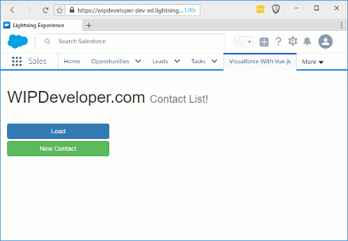

We've been working on getting our Vue.js app working with `@RemoteActions`. [Last time](/2017/04/11/visualforce-with-vue-js-part-6-working-with-bootstrap-in-lightning/) we took a side trip to get the styles working. Now that things are better let's round out the functionality.

## Update Apex

We are going to need to add methods to our Apex class to `update`, `create` and `delete` contacts so let's start by updating our `TryVuejsController` with 3 new methods: `UpdateContact`, `NewContact`, and `DeleteContact`, you'll never guess what each one is supposed to do...

#### New `TryVuejsController` Methods

function updateContact(id, languages) {
  return new Promise((resolve, reject) => {
    callRemote('TryVuejsController.UpdateContact', \[id, languages\], resolve, reject)
  })
}

function newContact(firstName, lastName, languages) {
  return new Promise((resolve, reject) => {
    callRemote('TryVuejsController.NewContact', \[firstName, lastName, languages\], resolve, reject)
  })
}

function deleteContact(id) {
  return new Promise((resolve, reject) => {
    callRemote('TryVuejsController.DeleteContact', \[id\], resolve, reject)
  })
}

Ok maybe you did guess that `UpdateContact` updates a contact, `NewContact` creates a new contact, and `DeleteContact`... well deletes a contact... just like it says on the side of the box.

## Update `sf.service.js`

With our updated contoller we will need to add some calls to the new methods in our JavaScript service. So lets add a `updateContact`, `newContact`, and `deleteContact`. These three methods will call their repsctive counterpart on the server with the required parameters.

#### New `sf.service.js` Methods

function updateContact(id, languages) {
  return new Promise((resolve, reject) => {
    callRemote('TryVuejsController.UpdateContact', \[id, languages\], resolve, reject)
  })
}

function newContact(firstName, lastName, languages) {
  return new Promise((resolve, reject) => {
    callRemote('TryVuejsController.NewContact', \[firstName, lastName, languages\], resolve, reject)
  })
}

function deleteContact(id) {
  return new Promise((resolve, reject) => {
    callRemote('TryVuejsController.DeleteContact', \[id\], resolve, reject)
  })
}

## Update `new-contact.js`

Lets start updating the logic that calls our `sf.service.js` with the `new-contact.js`. For this we will almost remove everything from the `saveContact` method and replace it with the following:

#### Updated `new-contact.js` `saveContact` Method

saveContact: function () {

    sfService.newContact(this.firstName, this.lastName, this.languages)
      .then(() => {
        eventHub.$emit('contacts:load')
        router.push('/')
      })
  }

`edit-contact.js` will be almost the same replacing it's `saveContact` with the following:

#### Updated `edit-contact.js` `saveContact` Method

saveContact: function () {

  sfService.updateContact(this.currentContact.Id, this.currentContact.Languages\_\_c)
  .then(() => {
    
    eventHub.$emit('contacts:load')
    router.push('/')
  })
}

Finally let's update the `deleteContact` method on `contact-detail.js` with this:

#### Updated `contact-detail.js` `deleteContact` Method

deleteContact: function (id) {
  
  sfService.deleteContact(id)
    .then(response => {

      this.showContact = false
      this.currentContact = {}
      eventHub.$emit('contacts:load')
    })
}

Now you should be able to deploy your resource bundle to your org and see everything working.

#### The Whole Shabang!

## Conclusion

We have reached "feature parity" with our Vue.js and ForceJs app. What should we try next? Let me know by leaving a comment below or emailing [brett@wipdeveloper.com](mailto:brett@wipdeveloper.com).
