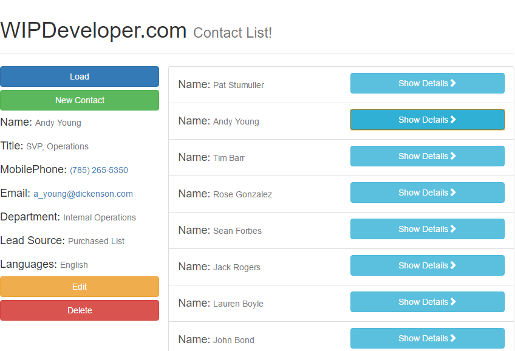

When we left off last things were looking pretty fugly\*. Lets add some styles to make it more pleasant.

## Get Bootstrap

Lets start by downloading a copy of from [GetBootstrap.com](http://getbootstrap.com/getting-started/#download). Once we have that we can create a static resource from it:

#### Static Resource `bootstrap`

Now lets add `apex:stylesheet` on our page to the `bootstrap` Static Resource's min file `/bootstrap-3.3.7-dist/css/bootstrap.min.css`

#### Bootstrap Reference

<apex:stylesheet value="{!URLFOR($Resource.bootstrap, '/bootstrap-3.3.7-dist/css/bootstrap.min.css')}" />

Reload your page and you should see...

#### Not Terribly Better

It looks like we have some conflicting styles going on. If we add a few more attributes to our `apex:page` we can remove Salesforce defaults like styles so lets do that.

#### Bootstrap Reference

<apex:page 
  controller="TryVuejsController" 
  
  doctype="html-5.0" 
  standardStylesheets="false" 
  showChat="false" 
  applyBodyTag="false" 

  showHeader="false" 
  sidebar="false">

Here we add a `doctype` we will use `html-5.0`, `standardStylesheets` sounds like something that may cause a conflict with our styles, `showChat` just to be safe lets set it `false` and the `applyBodyTag` we should have set to false earlier since we included a body tag in our markup.

> And yes, I added page breaks to my `apex:page` tag so I don't have to scroll across the screen to see everything.

#### Much Better

## Conclusion

We have added back the Bootstrap styles we used before but part of me thinks we should change over to using the Lightning Design System, just to we fit in. What do you think? Let me know by leaving a comment below or emailing [brett@wipdeveloper.com](mailto:brett@wipdeveloper.com).

\* fugly is a technical term for really ugly. shhh don't tell our app.
