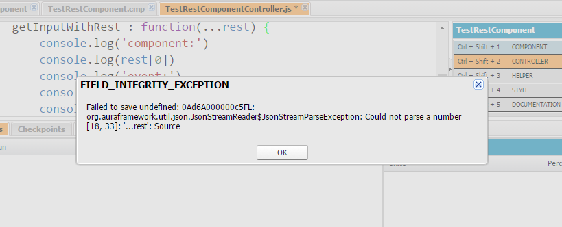

Let's talk about Rest Parameters!

## What?

A [Rest parameter](https://developer.mozilla.org/en-US/docs/Web/JavaScript/Reference/Functions/rest_parameters) is a way to gather all remaining prameters passed to a function into an array. If you are familiar with the `arguments` object this may seem similar. It is the last named parameters in the function and the name starts with 3 periods (`...`).

#### Sample Rest Parameter

function iHaveARestParameter(...rest){
  // TODO: something
}

Unlike the [arguments](https://developer.mozilla.org/en-US/docs/Web/JavaScript/Reference/Functions/arguments) object the rest parameter only contains the parameters that do not already have a name, it is also an actual array not array like, and it lacks some of the `arguments object`'s special functionality.

## Where Can I Use It?

Well, at the time of this writing and according to the popular website [caniuse.com](https://caniuse.com/) if you are not supporting IE or Opera Mini and only have to worry about the last 2 or so versions of the main bowsers, than YES!

#### Can I Use `Rest Parameters`

[Can I Use rest-parameters?](http://caniuse.com/#feat=rest-parameters) Data on support for the rest-parameters feature across the major browsers from caniuse.com.

This means we will be able to use it when working with Frameworks like Angular, Vue.js, Aurelia, and React.

## What About In Lightning?

It does not look like it currently is acceptable for Lightning. If you try and save it in the Developer Console you currently get the following Message:

#### FIELD\_INTEGRITY\_EXCEPTION

It seems the parser Salesforce.com uses when you save the Lightning Controller miss-understands the `...rest` as a number. This means for right now we can not use it with Lightning.

> I tried to get around this with Mavensmate but saving just closed the console and didn't display any error even though I could verify it did not save to Salesforce.com

## What is it Good For?

Well that is up to you. I like to use it in functions that have an unknown number of parameters but follow a pattern. For instance if the first parameter is always a `string` that is the name. With rest params you could name the first parameter and use the rest parameter to gather the remaining parameters.

#### Example With Rest Parameters

function useRestParams(name, ...rest) {
    if (name == 'first') {

        console.log('length should be 0')
        console.log(rest.length)
    } else if (name == 'second') {

        console.log('Should have one object')
        rest.forEach(item => console.log(item))
    } else if (name == 'third') {

        console.log('should have 2 objects and a callback')
        rest.forEach(item => console.log(item))

        rest\[2\]()
    }
}

useRestParams('first')
useRestParams('second', 1)
useRestParams('third', 1, { "two": 2 }, () => console.log('Callback called!!'))

Here is the same thing done with Arguments.

#### Example Using Arguments

function useArguments(name) {
    if (name == 'first') {

        console.log('Will be 1')
        console.log(arguments.length)
    } else if (name == 'second') {

        console.log('Should have one object')
        console.log(arguments\[1\])
    } else if (name == 'third') {

        console.log('should have 2 objects and a callback')
        console.log(arguments\[1\])
        console.log(arguments\[2\])
        console.log(arguments\[3\])
        arguments\[3\]()
    }
}

useArguments('first')
useArguments('second', 1)
useArguments('third', 1, { "two": 2 }, () => console.log('Callback called!!'))

One of the main differences you can see if with Rest Parameters we are able to use the array `forEach`. If we wanted to make use of that using Arguments we would first have to convert the Argumetns object to an array.

This is just one example of how Rest Parameters could be used. PLay around with them and get a feel for their usage. You never know when it may come in handy.

## Conclusion

Once you get an understanding on Rest Parameters can you think of any way you may use them? Let me know by leaving a comment below or emailing [brett@wipdeveloper.com](mailto:brett@wipdeveloper.com).

