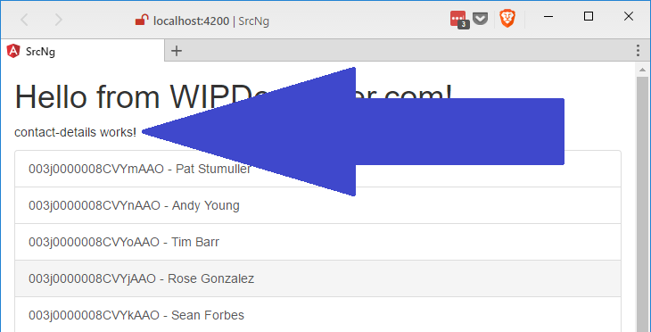

Last time we styled our contact list with Bootstrap. Let's try adding a second component to show the details of a contact when we select one from the list.

## Create New Component

First thing we will need is to create a new component. In the `src-ng` folder use either the `ng g component` or the `ng generate component` with a name for your new component, I going to call mine `contact-details`.

> If you are wondering the `ng g` is an alias for `ng generate`. Basically same command, less typing.

It should look something like this in the terminal:

#### `ng g component contact-details` in Action

PS D:\\Workspace\\Blog\\salesforce\\personal-dev\\src-ng> ng g component contact-details
installing component
  create src\\app\\contact-details\\contact-details.component.css
  create src\\app\\contact-details\\contact-details.component.html
  create src\\app\\contact-details\\contact-details.component.spec.ts
  create src\\app\\contact-details\\contact-details.component.ts
  update src\\app\\app.module.ts

We could add this to out application by putting a tag for it in our `app.component.html`

#### Use `contact-details` Tag

  <h1>
    {{title}}
  </h1>

  <contact-details></contact-details>

  <app-contacts></app-contacts>

Now you can see the **contact-details works!**

#### contact-details works!

Doing this isn't really useful though and we are going to add Routing, so maybe we should do that now.

## Add Routing

In the `app.module.ts` we are going to add an import for `RouterModule`, and `Routes` from the `@angular/router`. We will then define a `routes` object that is of type `Routes`. The `routes` object will be an array of objects that have a `path` and a `component`. The route for out Contact Details component will have a url parameter for `id`, it will have the colon.

#### Import `RouterModule`, and `Routes` and set up `routes`

import { RouterModule, Routes } from '@angular/router';

const routes :Routes=\[
  {
    path: '',
    component: ContactsComponent
  },
  {
    path: 'contact-detail/:id',
    component : ContactDetailsComponent
  }
\]

If you were paying attention you may have noticed we didn't use the `RouterModule` yet. That will be used in our `@NgModule`s `imports` array to set the routes for the root module.

#### Updated `@NgModule` of `app.module.ts`

@NgModule({
  declarations: \[
    AppComponent,
    ContactsComponent,
    ContactDetailsComponent
  \],
  imports: \[
    BrowserModule,
    FormsModule,
    HttpModule,
    RouterModule.forRoot(routes)     // <== Here it is
  \],
  providers: \[
    RemoteActionsService
  \],
  bootstrap: \[AppComponent\]
})
export class AppModule { }

In case you are wondering there is a `RouterModule.forChild` when you are setting the route on a child module.

Now we need to update our view though.

Open your `app.component.html` and replace the `<app-contact-details></app-contact-details>` and `<app-contacts></app-contacts>` with `<router-outlet></router-outlet>`. It should end up looking similar to this:

#### Updated `app.component.html`

  <h1>
    {{title}}
  </h1>

  <router-outlet></router-outlet>

We could manually navigate between the 2 routes we set up but since I'm a little lazy we are going to update our `contacts.component.html` instead.

## Router Links

In `contacts.component.html` we had set up a `list-group` that was `a` tags. Let's add `routerLink="/contact-details/"` to those `a` tags. This actually gives us an error since we defined our route to have an `:id` and we did not provide one.

#### Router Error

ERROR Error: Uncaught (in promise): Error: Cannot match any routes. URL Segment: 'contact-details'
Error: Cannot match any routes. URL Segment: 'contact-details'

To fix this and pass in the id for the contact we are currently on we will use Angular's Property binding.

> Property binding in Angular is applied by the use of square brackets (`[]`) around the name of the property of the html element. It is sometimes referred to as "One Way" data binding as it only allows data to move from the logic to the view.

When Property binding to `routerLink` we will pass in an array of objects. The first object will be the path as a string and the remaining items will be the required and optional parameters. In our case we will have an array with 2 items: the route path, and the `id`. It should look like this:

#### Property binding the `routerLink`

\[routerLink\]="\['/contact-details', c.Id\]"

The whole anchor tag should look like this:

#### Updated Anchor Tag

<a \*ngFor="let c of contacts" \[routerLink\]="\['/contact-details', c.Id\]" class="list-group-item">{{c.Id}} - {{c.Name}}</a>

Now when we select a contact from our list the url should update to something similar to this `http://localhost:4200/contact-details/003j0000008CVYpAAO` with the correct `id` for the contact you selected.

#### YAY Routing!

## Conclusion

We now have some routing set up. How about next time we load the contact details when we go to the contact details page, sound like a plan? Let me know by leaving a comment below or emailing [brett@wipdeveloper.com](mailto:brett@wipdeveloper.com).
