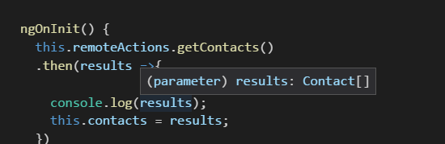

We have things working with our Contacts app so far but we should consider moving all the "definitions" of a contact to one location. Let's do that by creating a `Contact` class and using that in place of interfaces and implied `any` statements.

## Create Contact Class

We will need a place to keep out class so let's add a new folder called `objects` and create a new TypeScript file in it. I called mine `contact.ts`.

`contact.ts` will be a simple class of `Contact` that gets exported with 3 strings: `Id`, `Name`, and `Email`.

#### `contact.ts`

export class Contact{
  Id:string;
  Name:string;
  Email:string;
}

With our new class in hand we can start using it in places.

## Put Contact Class to Work

In the `remote-actions.service.ts` file let's import out `contact.ts`. To do that we will use the file path relative to the `remote-actions.service.ts`. In this case since we are in the `src-ng/src/app/services/` folder and the file we want to import is in the `src-ng/src/app/objects/` folder we will go up a folder `..` and before looking for the `objects/` folder.

#### Import `Contact`

import { Contact } from '../objects/contact';

With access to `Contact` we can add some return types to `getContacts` and `getContact`. In TypeScript return types of a method can be defined with a colon `:` and the type after the closing parenthesis. Since both methods return a `Promise` both will have a return type of `Promise`. `getContacts`'s promise will resolve to an array of `Contact`s or `Contact[]`. `getContact` will resolve to a single `contact`. Nothing else will change.

#### Updated `getContacts` and `getContact` with Return Types

getContacts(): Promise<Contact\[\]> {
  // method body
}

getContact(id: string): Promise<Contact> {
  // method body
}

Without changing anything else you should be able to see improvements where you reference these two methods.

In `contacts.component.ts` if you inspect the `results` of calling `this.remoteActions.getContacts()` it should show as `Contact[]`.

#### `results` with Type

## Update Components

Let's update the `contacts.component.ts` so instead of assigning the results of the `this.remoteActions.getContacts()` to `this.contacts` with a of type `any` we update the type of `this.contacts` to an array of `Contacts`.

Import the `Contact` again like we did in `remote-actions.service.ts` and this time add a type to `contacts`

#### Giving `contacts` a Type

private contacts: Contact\[\]

Nothing should need to be done to the `contact-details.component.ts` at this time as `results` type is determined in the `remote-actions.service.ts`.

## Conclusion

It may not seem like much but adding types to our properties is a giant step in the direction of writing easily maintainable code. What do you think we should do next? Let me know by leaving a comment below or emailing [brett@wipdeveloper.com](mailto:brett@wipdeveloper.com).
