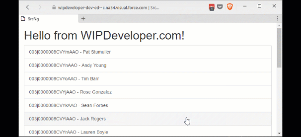

I mentioned the benefit of re-usability when we [started](/2017/05/22/visualforce-and-angular-starting-display-edit-component/) creating our `input-text.component` but we really haven't see it in play yet. Let's see a couple ways to make use of it.

## Display Only

We have some items right now that are display only, even when editing. This doesn't mean we can't use our `input-text.component` to help maintain a consistent look and feel for our display elements. For now, on the `contact-details.component.html`, let's remove all that mark up we have to display the `id`:

#### Old `id` Display Markup

  <label class="col-sm-2 control-label">Id</label>
  
{{ id }}

and replace it with our custom component without the Property binding to `editing`:

#### New `id` Display Markup

<app-input-text \[(textValue)\]="id" \[label\]="'Id'"></app-input-text>

It looks and behaves the same since `input-text.component`'s editing is never set to true it does not allow the user to edit it.

We could do this with the `name` since it's an aggregate field and can not be edited directly but I would rather update our Apex class `TryAngularController`s `GetContact` and `UpdateContact` to work with first and last names

## Update Apex `TryAngularController` Class

In `TryAngularController` class change `GetContact` to get the `FirstName` and `LastName` instead of `Name`

#### Updated `GetContact`

@RemoteAction
public static Contact GetContact(String contactId){        
  Contact contact = \[SELECT Id, FirstName, LastName, Email FROM Contact WHERE Id =: contactId\];
  
  return contact;        
}

Then update the `UpdateContact` to have parameters for `firstName` and `lastName` and set those values before updating the contact.

#### Updated `UpdateContact`

@RemoteAction
public static void UpdateContact(String contactId, String firstName, String lastName, String email){
    Contact contact = \[SELECT Id FROM Contact WHERE Id =: contactId\];

    contact.FirstName = firstName;
    contact.LastName = lastName;
    contact.Email = email;

    update contact;
}

Since we are changing how the contact behaves we should also update our `contact.ts` to have a `FirstName` and `LastName` properties that are both strings.

#### Updated `GetContact`

export class Contact{
  constructor(){}
  Id:string;
  Name:string;
  Email:string;
  FirstName:string;
  LastName:string; 
}

We are going to keep the `Name` for now as it is less work to get the display name for use in our list of contacts than to recreate the display name with the first and last name we could get.

## Add More Fields to Edit

Back in our `contact-details.component.html`, let's remove the mark up for the `name`

#### Old `name` Display Markup

  <label class="col-sm-2 control-label">Name</label>
  
{{ name }}

and add 2 components to edit the `firstName` and the `lastName`

#### New `id` Display Markup

<app-input-text \[(textValue)\]="firstName" \[label\]="'First Name'" \[editing\]="editing"></app-input-text>
<app-input-text \[(textValue)\]="lastName" \[label\]="'Last Name'" \[editing\]="editing"></app-input-text>

This is a lot less markup to add some a field to edit to our form. We went from each input being 4 lines to 1 display only and 3 display and edits being 4 lines.

Now let's update the `onSubmit` of `contact-details.component.ts` to set the `firstName` and `lastName` before calling `service.updateContact`

#### Updated `contact-details.component.ts`'s `onSubmit`

onSubmit() {

  this.editing = false;

  this.originalContact.FirstName = this.firstName;
  this.originalContact.LastName = this.lastName;
  this.originalContact.Email = this.email;

  this.service.updateContact(this.originalContact)
    .then(results => {

      this.ngOnInit()
    });
}

All we need to do now is update `remote-actions.service.ts`'s `updateContact` to pass in the `contact.FirstName`, and `contact.LastName` and then we can see it in action.

#### Updated `remote-actions.service.ts`'s `updateContact`

updateContact(contact: Contact): Promise<{}> {
    console.log('getContact called');

    return new Promise((resolve, reject) => {
      this.callRemote('TryAngularController.UpdateContact', \[contact.Id, contact.FirstName, contact.LastName, contact.Email\], resolve, reject);
    })
}

#### And Action!

## Conclusion

We now have a custom component that can be used in multiple places. This allows us to worry less about if we copied and pasted the Bootstrap example properly each time and focus on delivery value to the project. What do you think we should look at next? Let me know by leaving a comment below or emailing [brett@wipdeveloper.com](mailto:brett@wipdeveloper.com).
