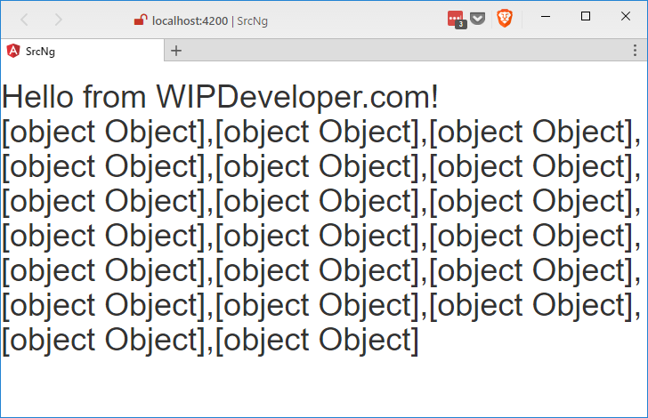
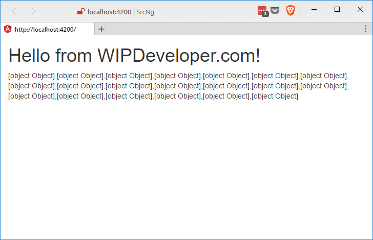
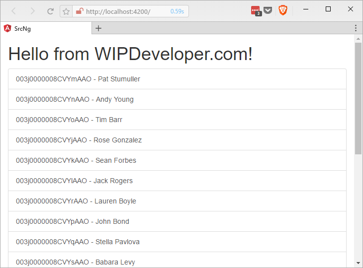
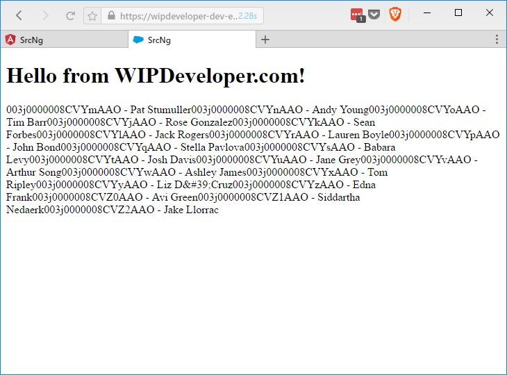
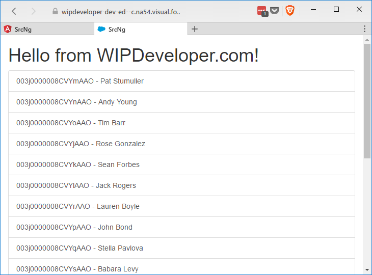

Last time we set up mocking the Remote Action calls so we can work locally. Lets take advantage of that and update the styles.

## Get Bootstrap

We are going to use Bootstrap 3 for styling. We only want to the css file so download it from [here](https://maxcdn.bootstrapcdn.com/bootstrap/3.3.7/css/bootstrap.css). Once you have it put it in your `src-ng/src/assets/` folder and add a reference to it on your `src-ng/src/index.html` `header`:

#### `bootstrap.css` Link

<link rel="stylesheet" href="/assets/bootstrap.css" />

If you had the app running locally with `ng serve` it should have refreshed with the new styles.

#### New Style

Ok, so it's still just a list of `[object Object]` we should work on that next.

## Update `app.component.html`

Open up `src-ng/src/app/app.component.html` it should look like this:

#### `app.component.html`

<h1>
  {{title}}

  <app-contacts></app-contacts>
</h1>

Let's fix this up some. Some one made an `h1` the root element for this component, ok it was me, this means that all those contacts are inside of the `h1`. That is probably not what we want so let's change the `h1` to a `div` with a class of `container-fluid` and then it will be the base for our app. Then wrap the `{{title}}` with an `h1` like was probably originally intended.

#### Updated `app.component.html`

  <h1>
    {{title}}
  </h1>

  <app-contacts></app-contacts>

This will change the look of our app a little.

#### Not Everything is a Header

Now let's work on those `[object Object]`s!

## Update `contacts.component.html`

Open up `src-ng/src/app/contacts/contacts.component.html` and it should look like this:

#### `contacts.component.html`

  

    {{contacts}}
  

Let's give the `div` a class of `list-group` and replace the `p` with a `*ngFor` on an `a` tag. The `*ngFor` syntax will allow us to define a local variable, I will use `c`, from a collection. The collection we will be using is the `contacts` that is defined on the `ContactsComponent` class. The `a` tag should have class of `list-group-item`. For the text of the `a` tag we will use binding syntax and the locally defined `c` to access each contacts `Id` and `Name`. The whole change should look something like this:

#### Updated `contacts.component.html`

  <a \*ngFor="let c of contacts" class="list-group-item">{{c.Id}} - {{c.Name}}</a>

#### Ids and Names

That's it. Our view is ready for prime time on Salesforce.

## Update Salesforce

You can either stop `ng serve` in your current terminal or you can open a new terminal in your `src-ng` folder and run the `ng build` command to get the app ready to send to Salesforce. Once it's built send it to Salesforce then go look at your handy work in action!

On first page load you may think something is not right.

#### Missing Bootstrap

This is because we didn't add a reference to our `bootstrap.css` on our Visualforce page. Let's do that now and reload the page.

#### `bootstrap.css` Link on `TryAngular.page`

<link rel="stylesheet" href="{!URLFOR($Resource.TryAngular, '/assets/bootstrap.css')}" />

#### Working in Salesforce!

There you have it, a not completely ugly list of Id's and Names coming straight from Salesforce.

## Conclusion

Now that we can stand looking at our app maybe we should add a page to edit contacts. What do you think? Let me know by leaving a comment below or emailing [brett@wipdeveloper.com](mailto:brett@wipdeveloper.com).
