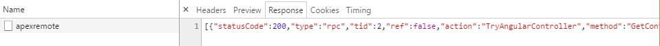
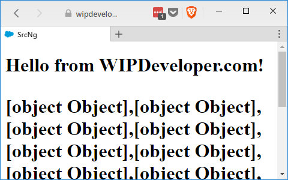

Last time we talked about Visualforce with Angular we got [Remote Actions](/2017/05/01/visualforce-and-angular-remoteaction-in-action/) working. This made it so we could get data from Salesforce but we could no longer develop locally. Let's set up some mocking so we can still develop locally and make more rapid updates to our app.

## Begin Mocking

In your Angular app source folder (`src-ng/src`) let's create a new folder, I will call mine `remoteMocks`. I will also add a new JavaScript file to it called `mock.js`. This will be the main files used to call the mock `@RemoteAction`s and should look like this:

#### `mock.js`

var Visualforce = {
  remoting: {
    Manager: {
      invokeAction: (name, ...rest) => {
        mockRemotes\[name\](...rest)
      }
    }
  }
}

It is defining an object that will be global named `Visualforce` that has a property named `remoting` that is an object that has a property named `Manager` that is also an object that has a property named `invokeAction` that is a function. This function takes a string called `name` and an [Rest Parameter](/2017/05/03/ecmascript-6-rest-parameters/) that is called `rest`. The name is used to find the mock controller and method and the array we expand in place with the [Spread Syntax](/2017/05/04/ecmascript-6-spread-syntax/) to pass in as the parameters to the function.

Simple as that, [turtles all the way down](https://xkcd.com/1416/) to the function call.

Now before we get to far you may be wondering why we are using a JavaScript file and not a TypeScript file, after all we are using TypeScript with all the Angular stuff. Well if we created this and the mock controllers as TypeScript files we would have to transpile them and reference them on the index page since we don't want to bundle them with the Angular app through the CLI. Without transpiling them and adding script tags to them on the `index.html` we would have to import them to our service to use them, they would end up getting bundled, we would have to remember remove the import statements and they could still possibly get bundled with the app.

So let's keep it simple and use JavaScript files here and not worry about accidentally bundling some sample data with our Angular app.

## Mock a Controller

Now we are ready to set up a mock response from an Apex Controller Method. Add a second JavaScript file to the `remoteMocks/` folder called `TryAngularControler.js`. It will look something like this:

#### `TryAngularController.js`

var mockRemotes = mockRemotes || {};

mockRemotes\['TryAngularController.GetContacts'\] = function(callback){

        let resultsText = \`\[{"statusCode":200,"status":true,"type":"rpc","tid":2,"ref":false,"action":"TryAngularController","method":"GetContacts","result":\[{"Id":"003j0000008CVYmAAO","Name":"Pat Stumuller"},{"Id":"003j0000008CVYnAAO","Name":"Andy Young"},{"Id":"003j0000008CVYoAAO","Name":"Tim Barr"},{"Id":"003j0000008CVYjAAO","Name":"Rose Gonzalez"},{"Id":"003j0000008CVYkAAO","Name":"Sean Forbes"},{"Id":"003j0000008CVYlAAO","Name":"Jack Rogers"},{"Id":"003j0000008CVYrAAO","Name":"Lauren Boyle"},{"Id":"003j0000008CVYpAAO","Name":"John Bond"},{"Id":"003j0000008CVYqAAO","Name":"Stella Pavlova"},{"Id":"003j0000008CVYsAAO","Name":"Babara Levy"},{"Id":"003j0000008CVYtAAO","Name":"Josh Davis"},{"Id":"003j0000008CVYuAAO","Name":"Jane Grey"},{"Id":"003j0000008CVYvAAO","Name":"Arthur Song"},{"Id":"003j0000008CVYwAAO","Name":"Ashley James"},{"Id":"003j0000008CVYxAAO","Name":"Tom Ripley"},{"Id":"003j0000008CVYyAAO","Name":"Liz D'Cruz"},{"Id":"003j0000008CVYzAAO","Name":"Edna Frank"},{"Id":"003j0000008CVZ0AAO","Name":"Avi Green"},{"Id":"003j0000008CVZ1AAO","Name":"Siddartha Nedaerk"},{"Id":"003j0000008CVZ2AAO","Name":"Jake Llorrac"}\]}\]\`
        let event = JSON.parse(resultsText);
        callback(event\[0\].result, event\[0\])

}

Here we declare a variable `mockRemotes` and assign `mockRemotes` to it if it already exists, if not we assign an empty object to it. This is a way to share an object between files and not destroy the object if it already exists but extend it. Then we use the controller name and method name to assign a property to the `mockRemotes` object and of course that property is a function. I define a `resultsText` that I assign a value of the remote action I want to mock. In this case I loaded up the page from [last time](/2017/05/01/visualforce-and-angular-remoteaction-in-action/) with the dev tools open to network and copied the response from apex remote. I did have to add `"status":true,` to it and I did this after the `"statusCode":200`.

#### Dev Tools Network Tab

After the results are faked I used `JSON.parse` to create the event object and then call the callback function with the results and the event.

## Update `index.html`

Remember that `index.html` we [copied our Visualforce page](/2017/04/25/visualforce-and-angular-getting-angular-working-in-salesforce/) layout from? Well it has a base template that we can update with `script` tags to our new `mock.js` and `TryAngularControler.js`. This will allow us to load it locally so we can update our app quicker.

Open `src-ng/src/index.html` and add `script` tags for our mocking setup

#### Updated `src-ng/src/index.html`

<!doctype html>
<html>
<head>
  <meta charset="utf-8" />
  <title>SrcNg</title>
  <base href="/" />

  <meta name="viewport" content="width=device-width, initial-scale=1" />
  <link rel="icon" type="image/x-icon" href="favicon.ico" />
</head>
<body>
  <app-root>Loading...</app-root>

  
  
</body>
</html>

## Load it Up!

Now run `ng serve -open` and everything on the page should behave as if it were getting a response from the Apex controller. After all it is, just not a fresh one.

#### Working Mock

## Conclusion

We can now work on updating parts of our app without having to save to Salesforce. This potentially will speed up some parts of development. Where do you think this could be most beneficial? Let me know by leaving a comment below or emailing [brett@wipdeveloper.com](mailto:brett@wipdeveloper.com).
