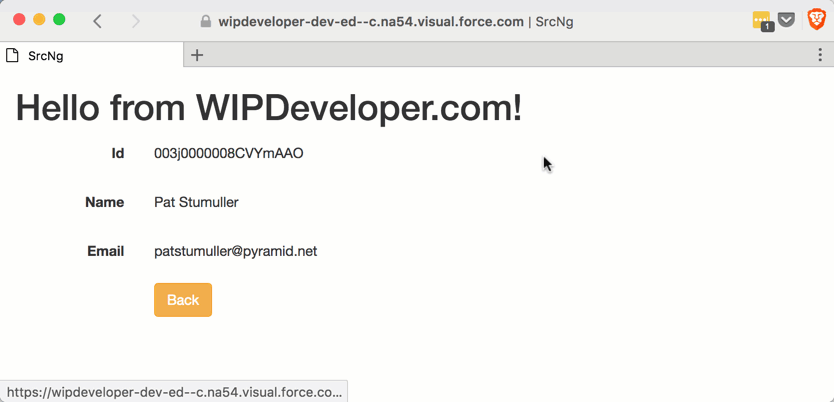

With the routing we have we should get some real data to show on our `contact-details` view. We will do that by loading the contact information after the `routeLink` is clicked.

> ## Important Note: To get the routing to work from last time the `<base href="/"/>` tag in the `head` need to be updated. Using the apex `$page` helper you can get the proper url to use as the base. For example if you page is named `TryAngular` you would use the `$page.TryAngular` to get the proper url, like so `<base href="{! $page.TryAngular }"/>`

## Get Data

Before we can display the data we will need to get it from Salesforce. Let's update our `remote-actions.service.ts` by adding a `getContact` method that takes and `id`, and returnes a Promise. In the Promise we will passes the `id` in the parameters array and we will call `TryAngularController.GetContact` so don't forget to have that as the first parameter in call to `callRemote`.

#### New `getContact` Method

getContact(id: string) : Promise<{Id: string, Name:string, Email:string}> {
  console.log('getContact called');

  return new Promise((resolve, reject) => {
    this.callRemote('TryAngularController.GetContact', \[id\], resolve, reject);
  })
}

Of course we can't get the data if we don't actually call `getContact` so let's do that in `contact-details.component.ts`'s `onNgInit` method. This way it will load the data when the view loads.

To do that we will need to import the `RemoteActionsService` from `../services/remote-actions.service`, pass the service in to the constructor, and add some properties to the class to store the results.

The updated `ContactDetailsComponent` class should look something like this:

#### Updated `ContactDetailsComponent` Class

import { Component, OnInit } from '@angular/core';
import { ActivatedRoute } from '@angular/router';

import { RemoteActionsService } from '../services/remote-actions.service';

@Component({
  selector: 'app-contact-details',
  templateUrl: './contact-details.component.html',
  styleUrls: \['./contact-details.component.css'\]
})
export class ContactDetailsComponent implements OnInit {

  private id :string;
  private name :string;
  private email :string;

  constructor(
    private service: RemoteActionsService,
    private route: ActivatedRoute
  ) { }

  ngOnInit() {
    console.log('ContactDetailsComponent.ngOnInit')

    const id = this.route.snapshot.paramMap.get('id');
    console.log(id);

    this.service.getContact(id)
      .then(results => {

        this.id = results.Id;
        this.name = results.Name;
        this.email = results.Email;
      });
  }
}

Now we just need a view to display it in.

We will update the view to make use of the data we just exposed and add a button to navigate back to the list of contacts. All in all it should look something similar to this:

#### Update `contact-details.component.html`

<form class="form-horizontal">
  

    <label class="col-sm-2 control-label">Id</label>
    
{{ id }}

  

  

    <label class="col-sm-2 control-label">Name</label>
    
{{ name }}

  

  

    <label class="col-sm-2 control-label">Email</label>
    
{{ email }}

  

  

    

      <a routerLink="/" class="btn btn-warning">Back</a>
    

  

</form>

But what does it look like?

#### Routing with live Salesforce Data

## Conclusion

Now we have routes, and prefetching data when a route is activated. What should we add next? Let me know by leaving a comment below or emailing [brett@wipdeveloper.com](mailto:brett@wipdeveloper.com).
