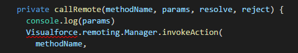
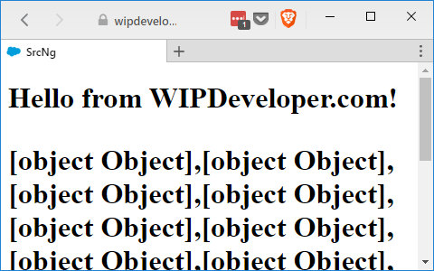
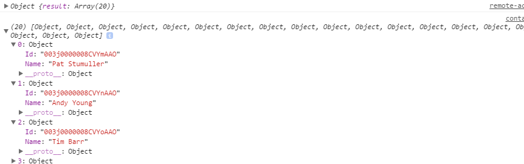

Since [last time](/2017/04/27/visualforce-and-angular-add-a-component-and-service/) we added a component and a service we should probably make that server get some data. We will use the `@RemoteAction`s we defined [earlier](/2017/04/26/visualforce-and-angular-setting-up-an-apex-controller/) for that.

## Add Controller Reference

To use the `@RemoteAction`s on our`TryAngularController` controller we will need to tell the page what controller we are using. On your `TryAngular.page` we will add a `controller` attribute to the `apex:page` tag. The whole `apex:page` tag should look something like the following:

## Add controller to page

<apex:page
    doctype="html-5.0" 
    controller="TryAngularController"
    standardStylesheets="false" 
    showChat="false" 
    applyBodyTag="false" 
    applyHtmlTag="false" 
    showHeader="false" 
    sidebar="false">

Now can can start calling the `@RemoteAction`s.

## Service Update With A `@RemoteAction` Helper

Let's update our `remote-actions.service.ts` so make calls to our Apex controller. First we should probably get rid of the `serviceMessage` since we wont be using it any more. Then let's add a `private` helper method named `callRemote` that accepts a `methodName`, `params`, and the `resolve` and `reject` of a promise. I also have some `console.log` statements in mine but it will look something like this:

#### `callRemote` Method

private callRemote(methodName, params, resolve, reject) {
  console.log(params)
  Visualforce.remoting.Manager.invokeAction(
    methodName,
    ...params,
    function (result, event) {
      console.log({ event })
      console.log({ result })

      if (event.status) {
        resolve(result)
      }
    },
    {
      //Options I am not setting
    }
  );
}

This is almost the same as the `Visualforce.remoting.Manager.invokeAction` that you see in teh Salesforce documention expect we are using an array to pass parameters and the ...spread operator to separate them out for the calls.

If you are using an editor that supports TypeScripts Intellesense feature you may notice it detecting something wrong with using `Visualforce`.

#### TypeScript Error

This is because `Visualforce` is not defined anywhere. Let's do that now.

At the top of your `remote-actions.serice.ts` before `@Injectable()` add the following declaration:

#### Declare Visualforce

declare class Visualforce {
  static remoting: { Manager: { invokeAction: any } };
}

This will allow us to use `Visualforce` in our TypeScript without generating errors. Ideally we would have a definition file (`*.d.ts`) that would provide greater Intelsense but this will work for now and get rid of the error.

## Service Update To `getContacts`

Now let's create a method named named `getContacts`. It will take no parameters but it will retunr a new Promise. That promise is going to call the helper method we created above with a string of `TryAngularController.GetContacts`, an empty array, and the resolve, and reject of the promise. It should look something like this:

### `getContacts` Method

getContacts() {

  return new Promise((resolve, reject) => {
    this.callRemote('TryAngularController.GetContacts', \[\], resolve, reject)
  })

}

With that done we can call it from out component.

## Update `contacts.component.ts`

In `contacts.component.ts` let's remove the line in the constructor that says `this.message = remoteActions.serviceMessage;`. While we are at it let's remove the `{{message}}` from the `contacts.component.html` too and put a `{{contacts}}` in it's place.

#### Updated `contacts.component.html`

  {{contacts}}

Now in `contacts.component.ts` in the `ngOnInit` method we are going to call the `remoteActions.getContacts` and in the promise.then assign the `results` to the `this.contact`. It should look similar to this:

#### Updated `ngOnInit`

ngOnInit() {
  this.remoteActions.getContacts()
  .then(results =>{
    console.log(results);
    this.contacts = results;
  })
  .catch(error => console.log(error));
}

## Test It On Salesforce.com

With those changes done we can run `ng build` and send it to Salesforce to see if we missed anything.

When we load up the page we should see some objects

#### Success!

Of course all those `[object, Object]`s don't really do us any good right now but if you look in the dev tools console for your favorite browser (`f12` chrome for Windows, `command + alt + i` chrome for mac)

#### Console Output

## Conclusion

Now we have a working call to a `@RemoteAction` but we can't developer locally anymore since we have to make calls from our Visualforce page to get the data. How do you think we can get around this? Let me know by leaving a comment below or emailing [brett@wipdeveloper.com](mailto:brett@wipdeveloper.com).
