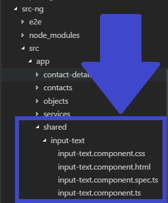
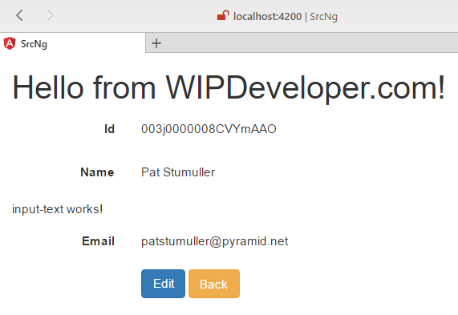
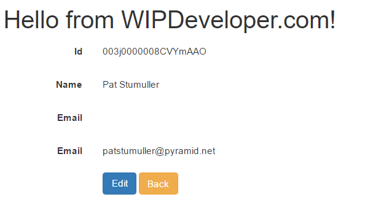
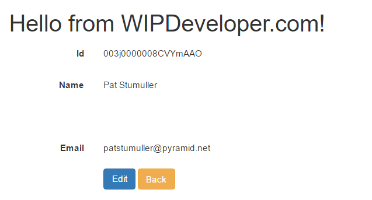
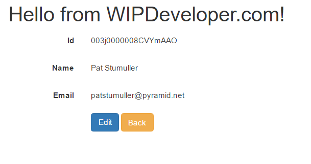

Let time we did a lot of work to set up our form so we could edit a contact. Let put that work to use creating a reusable component that will toggle between display only and editing. Let's start by making it display similar to what we already have.

## Create `inputText` Component

Since we want to create this component to be able to be used in more than one location we will create it in a `shared/` folder. So armed with the Angular-CLI lets create a `inputText` component:

#### Create `inputText` Component

ng g component shared/inputText

This should give us a new `input-text` component folder and associated files:

#### `input-text` Folder and Files

Let's add this to our `contact-details.component.html` after the `form-group` for `name` but before the `form-group` for `email`:

#### Updated `contact-details.component.html`

  <label class="col-sm-2 control-label">Name</label>
  
{{ name }}

<app-input-text></app-input-text>                         <!-- <==== Here it is!  -->

  <label class="col-sm-2 control-label">Email</label>
  
{{ email }}

Now if you run your app and go to any contacts detail page it should look like this:

#### Contact Details with `input-text`

That's great and all but we need it to do something a little _more_.

## Get Component to Display Data

First thing we should get it to do is replace the display functionality we have in `contact-details.component.html` so let's copy the `form-group` for `email` and move it to our `input-text.component.html`. If you reload your page you wont see much in the way of data from the contact but you will see that we have the label in the proper place.

#### `input-text` with `email` Label

We want to be able to set the value for the label otherwise everything we use this component with is going to have the same label, in this case `Email`. We will also want to be able to pass in the value to display. In `input-text.component.ts` we will add `Input` to the import from `@angular/core`.

`Input` is a decorator we will use to declare a property in such a way that Angular will expect it to receave data from template binding to the component's mark up. This means we will pass data one-way into the component through the markup. This is done with the `[propertyName]="value"` syntax, where property name is the name we want the data to go to in our component.

This will probably be easier to understand if we see it.

Let's Update our `input-text.component.ts` to import the `Input` decorator and create 2 properties, one called `label` and one called `textValue` both will have the `@Input()` decorator and both will be `string`'s:

#### Updated `input-text.component.ts`

import { Component, Input } from '@angular/core';

@Component({
  selector: 'app-input-text2',
  templateUrl: './input-text2.component.html',
  styleUrls: \['./input-text2.component.css'\]
})
export class InputText2Component  {

  @Input() label:string;
  @Input() textValue:string;

  constructor() { }

}

> I removed the OnInit stuff since I don't think it is providing value at this point. I could be wrong but generally less code is better.

Now we should update the view to make use of these new properties.

In `input-text.component.html` lets change the text of `Email` in the label to bind to our `label` property. While we are here let's change the binding of the `p` tag from `email` to our new `textValue` property.

#### Updated `input-text.component.html`

  <label class="col-sm-2 control-label">{{ label }}</label>
  
{{ textValue }}

This binding to these properties will allow us to set the values that are displayed here but right now we aren't doing that so it looks like we just lost all our text.

#### Data Binding to Nothing

Let's pass it some data and see what happens.

## Pass Data In

Back in the `contact-details.component.html` we will need to pass data into the `input-text` component. To do that we will add attributes to the tag for the properties we want to assign data to. If we want to set the `label` property of `input-text` component we will use an attribute named `label`. To set the `textValue` we will use an attribute of the same name.

> Since we are binding in the template we have to remember to use the template binding sysntax. In this case put square brackets `[]` around the property name.

Let's update our `app-input-text` tag to have 2 attributes: one for `label` that we pass a value of `'Email'`, yes it has single quotes around it, and one for `textValue` set to `email`.

#### Duo-Email Displays

Of course we don't need or want to display the email twice so let's remove the old one. Giving us a final mark up for the day similar to this:

#### Udpate `contact-details.component.html`

<form class="form-horizontal" (ngSubmit)="onSubmit()" #contactForm="ngForm" novalidate>
  

    <label class="col-sm-2 control-label">Id</label>
    
{{ id }}

  

  <!--<app-input-text \[(textValue)\]="name" \[label\]="'Name'" \[editing\]="editing"></app-input-text>
  <app-input-text \[(textValue)\]="email" \[label\]="'Email'" \[editing\]="editing"></app-input-text>-->
  

    <label class="col-sm-2 control-label">Name</label>
    
{{ name }}

  

  <app-input-text2 \[label\]="'Email'" \[textValue\]="email"></app-input-text2>
  

    

      <button type="button" \*ngIf="!editing" class="btn btn-primary" (click)="edit()">
       Edit
       </button>
      <button type="button" \*ngIf="editing" class="btn btn-danger" (click)="cancelEdit()">
      Cancel
      </button>
      <button type="submit" \*ngIf="editing" class="btn btn-success">
      Save
      </button>
      <a routerLink="/" class="btn btn-warning">Back</a>
    

  

</form>

#### Final Look

## Conclusion

It way seem like we did a lot of work to replace 4 lines of markup with a single line for our component but it will really show it's usefulness once we start adding editing feature. Of course we should probably get a second field to edit, I was thinking the first and last name, what do you think? Let me know by leaving a comment below or emailing [brett@wipdeveloper.com](mailto:brett@wipdeveloper.com).
