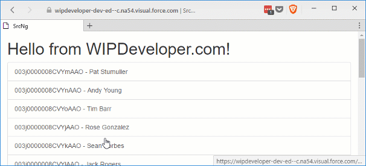

Since we have a component that displays the current value and allows the user to edit at the same time we should probably get it to only display what is appropriate for if we are currently editing or not. We will calling Toggling Edit.

## Add `editing` Property

In our `input-text.component.ts` lets add a property called `editing` of type `boolean` that has the `@Input()` decorator.

#### New Property

@Input() editing:boolean;

We will bind the `editing` property of `contact-details.component` to this in the `contact-details.component.html` using the Angular template [Property binding](https://angular.io/docs/ts/latest/guide/template-syntax.html#!#property-binding) to set the value of our `input-text.component`'s own `editing` property.

#### Property Binding `editing` to `editing`

<app-input-text \[(textValue)\]="name" \[label\]="'Name'" \[editing\]="editing"></app-input-text>

Using the square brackets `[]` here means the data will flow from the `contact-details.component` into `input-text.component` so when we change the `contact-details.component`'s `editing` property with it's `edit()` method that change will flow into our `input-text.component`.

Now to make use of it.

## Do the Toggle

We could bind both the `p` for display and the `input` for editing to separate `*ngIf` directives but I feel since we are really going for an if than else thing we should explicitly state that in our code. To do that we will use an `*ngIf` with a non-inlined than template and an else template.

The `*ngIf` directive will be on a `div` and take the expression it is binding to, in this case our `editing` property, a semi-colon followed by the word `then`, the name of the template when the expression is true, the word `else`, and the name of the template when the expression is false.

#### `*ngIf` `then` `else` with Templates

The templates will be `ng-template` tags and will have an attribute that begins with a pound `#` and ends with the name of the template. The `ng-template` tag will not be rendered so only count on the inner html for structure.

#### Templates

<ng-template #editBlock>
  <input type="text" \[(ngModel)\]="textValue" (input)="textUpdated()" \[name\]="label" \[id\]="label" class="form-control" />
</ng-template>
<ng-template #displayBlock>
  
{{ textValue }}

</ng-template>

This is both templates, one named `editBlock` and one named `displayBlock`.

> For more `*ngIf` fun see the [docs](https://angular.io/docs/ts/latest/api/common/index/NgIf-directive.html) :)

Our Complete `input-text.component.html` should look something like this:

#### Templates

  <label \[for\]="label" class="col-sm-2 control-label">{{label}}</label>
  

    

    <ng-template #editBlock>
      <input type="text" \[(ngModel)\]="textValue" (input)="textUpdated()" \[name\]="label" \[id\]="label" class="form-control" />
    </ng-template>
    <ng-template #displayBlock>
      
{{ textValue }}

    </ng-template>
  

I did add some template property binding to the `label`s `for` attribute and the `input`s `name` and `id`.

Let's see it in action.

#### Toggle Edit In Action!!!

## Conclusion

With our working component we should see how we can reuse it to make the most out out creating it. Do you have any ideas where else we could use it? Let me know by leaving a comment below or emailing [brett@wipdeveloper.com](mailto:brett@wipdeveloper.com).
