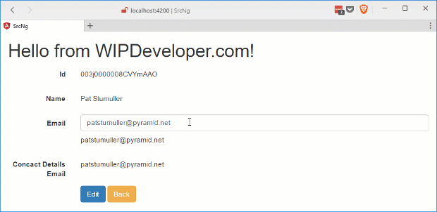
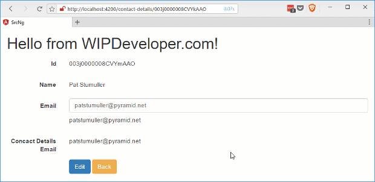

Now that we have the beginnings of our component, if you are just joining us please see the [last post](/2017/05/22/visualforce-and-angular-starting-display-edit-component/) to get up to speed, let's give it the ability to edit.

## Adding Editing

In our `input-text.component.html` let's add and `input` between the `label` and the `p` tags. It will be of type `text` and we will use the `ngModel` to bind the `textValue` to it.

#### Add `input`

<input type="text" \[(ngModel)\]="textValue" class="form-control" />

> I also moved the `col-sm-10` style class from the `p` tag to a `div` that wraps both the `input` and the `p`.

Now if we save and load this in the browser we might think we are close to done as all we have left is to hide the input when not editing or hide the `p` when we are editing. This would be an incorrect assessment though.

> I have re-added the display for `email` on the `contact-details.component.html` with the label `Contact Details Email` to see the data flow back to the parent component for this demo to save use the trouble of saving to Salesforce and wondering where the issue is.

#### Ruh-ro Shaggy

As you can see the changes in the `input-text` component don't flow back to the `contact-details.component`.

There are a few reasons this is happening, or I guess you cold say **not** happening.

Lets take a look at why.

## Fix Two-Way Data Flow

Origianly we only bound the `textValue` with one way data binding syntax that means just the square brackets `[]` in teh markup. To enable changes to flow back up we will need to add paranethesis `()` inside the sqaure brackets. This means that `textValue` will be wrapped with `[()]` or as the [Angular](https://angular.io/docs/ts/latest/guide/template-syntax.html#!#two-way) documentation calls it "banana in a box"

So to fix this part of the issue we will need to change `contact-details.component.html` so that the attribute on `app-input-text` uses the banana in a box

#### Update Binding

<app-input-text \[label\]="'Email'" \[(textValue)\]="email"></app-input-text>

This doesn't fix everything though.

Remember how we had to `import` the `Input` decorator for the parameters to be set from the template binding? Well if we want get an output from our component we will need to `import` the `Output` decorator and the `EventEmitter` to `emit` the changes.

In `input-text.component.ts` lets update the `import` to include the `Output` and `EventEmitter`, we will also be adding a parameters called `textValueChange` that will be decorated with the `@Output()` decorator and we will assign it a `new EventEmitter<string>()` where it is declared.

> The `<string>` part of the `new EventEmitter<string>()` indicates it is for type string.

We will also need a method to call when the text changes so we can call `textValueChange` so let's add that as well. I'm going to call mine `textUpdated` and it will call the `textUpdated.emit` method with the current value of `textValue`.

The updated `input-text.component.ts` should look something like this:

#### Update `input-text.component.ts`

import { Component, Input, Output, EventEmitter } from '@angular/core';

@Component({
  selector: 'app-input-text2',
  templateUrl: './input-text2.component.html',
  styleUrls: \['./input-text2.component.css'\]
})
export class InputText2Component  {

  @Input() label:string;
  @Input() textValue:string;
  @Output() textValueChange = new EventEmitter<string>();

  constructor() { }

  textUpdated(){
    this.textValueChange.emit(this.textValue);
  }
}

With all this done we still wont see changes to the email address in the `contact-details.component` until we bind to the text change event of our `input` to the `textUpdated` method.

#### Update `input-text.component.html`

  <label class="col-sm-2 control-label">{{ label }}</label>
  

    <input type="text" \[(ngModel)\]="textValue" (input)="textUpdated()" class="form-control" />
    
{{ textValue }}

  

## See It In Action

Now we can see changes to the email address flow back to the `contact-details.component`

#### Two-way Data Flow

With this working I can remove the extra `email` display on `contact-details.component.html` since I probably wont need it going forward.

## Conclusion

Now that we have two-way data flow working we should finish up our little component. How do you think it is coming so far? Let me know by leaving a comment below or emailing [brett@wipdeveloper.com](mailto:brett@wipdeveloper.com).
