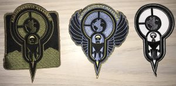

[Armada: A Novel](http://amzn.to/2rrzbu9) by Ernest Cline is a great read about a young man who has no living memory of his father and like most high school kids day dream about something more exciting than class.  Filled with many references to 80's pop culture (music, movies and video games) it tugs at the nostalgic heart strings of children of the 70's and 80's in a similar vein to [Ready Player One](/2017/01/26/ready-player-one/).

## The Setup

While bored in class Zack Lightman looks out the window while day dreaming and sees a UFO from a popular video game. Figuring he is either spending too much time playing video games, loosing his mind or some combination of the two.  He has spent a lot of time reading though his fathers old note books that contain conspiracy theory involving pop culture such as video games, movies and books and the military.  He also works part time at a video game store for a man named Ray.

The day after seeing the UFO from the video game a space shuttle from the Earth Defense Alliance lands on the school grounds with Ray getting out and asking for Zack to come with him.  This begins Zack's trip down that rabbit hole and the story.

## The Meta

As part of a promotion when the book came out a web game was released that you could compete for the high-score on.  It's called  [PHAETON!](http://www.phaetonwasreal.com/game) and you can still play it with all it's pho-vector graphical glory intact.   I just don't think you can get the patches any more.

## What do You Think?

Have a favorite "secretly trained to fight an alien invasion" book you would like to share?  Let me know by leaving a comment below or emailing [brett@wipdeveloper.com](mailto:brett@wipdeveloper.com).
