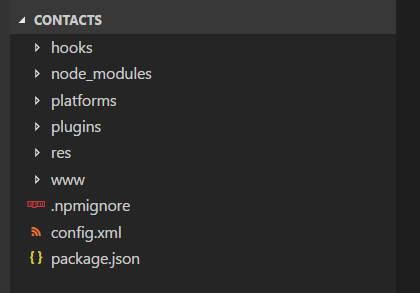
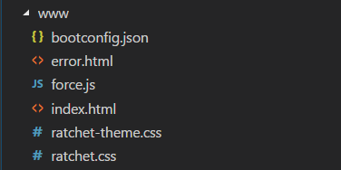
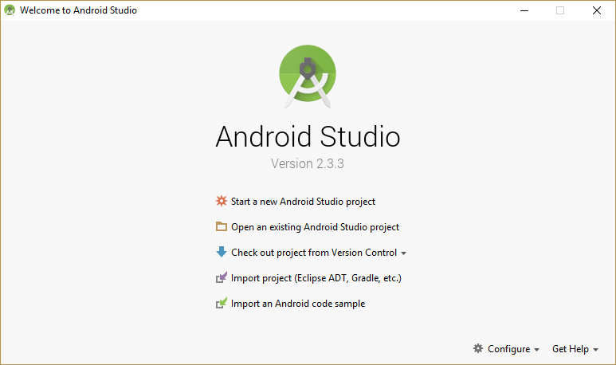
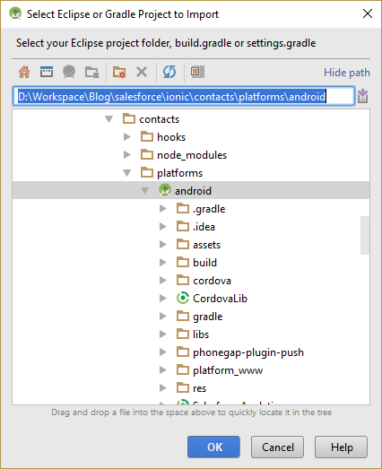
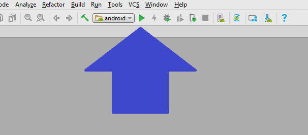
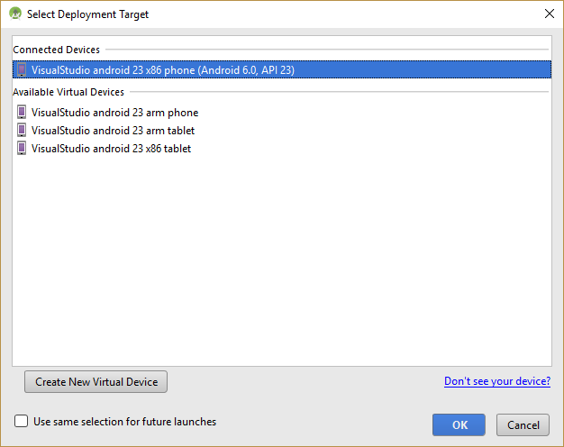
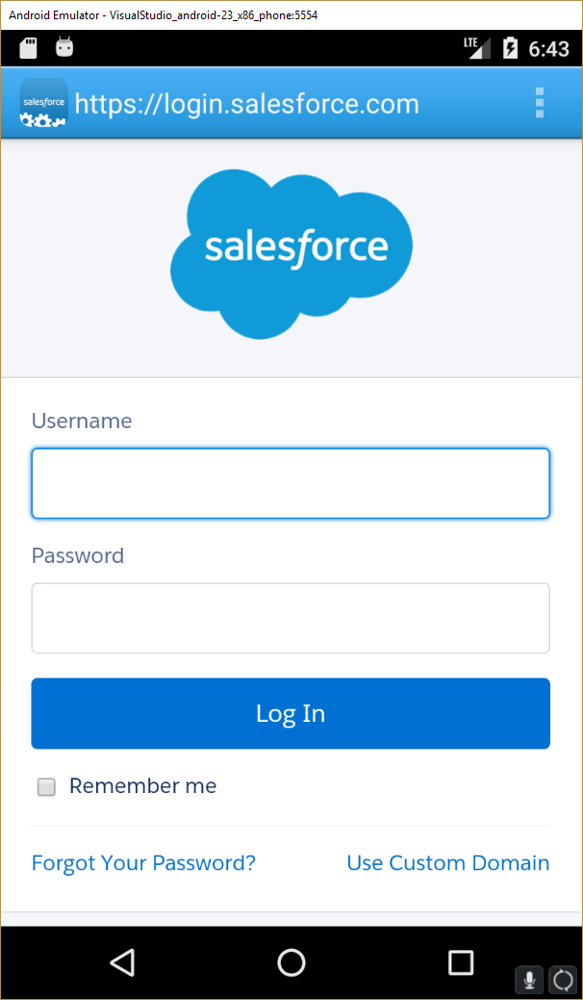
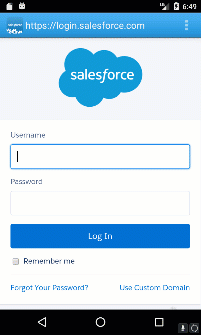

Now that our Org is ready and the basic app has been generated we can see some real progress finally.  Let's set the our Consumer Key and Callback URL in the app and try login in to the Org through the app.

## Config Updates

Open up the app we created [a couple posts ago](https://wipdeveloper.wpcomstaging.com/2017/06/27/saleforce-mobile-sdk-ionic-setup-mobile-sdk/) and your file structure should look something like this:

#### File Structure

If you expand that `www` folder you will see what resembles a web site with an `HTML`, `CSS`, `JavaScript` and even a `JSON` file.

#### `www` Folder

Open up the `bootconfig.json`  and let's update the `remoteAccessConsumerKey` with our `Consumer Key` and update the `oauthRedirectURI` with the `Callback URL` we set in the [Custom App in our Org](https://wipdeveloper.wpcomstaging.com/2017/06/28/saleforce-mobile-sdk-ionic-setup-org/).

#### Updated `bootconfig.json`

{
    "remoteAccessConsumerKey": "2d3V4VzCDw\_tGL61X8r1IJjCEHbIfnbMNCuJwhDt3MVGgdkV6eLhfVGJpQR9fMtPFEAtEoukIs6HKWjbEyXUP",
    "oauthRedirectURI": "wipdeveloper-contacts://success",
    "oauthScopes": \["web", "api"\],
    "isLocal": true,
    "startPage": "index.html",
    "errorPage": "error.html",
    "shouldAuthenticate": true,
    "attemptOfflineLoad": false,
    "androidPushNotificationClientId": ""
}

With that done we can run the app.

## Android Studio

Open up Android Studio and you should see the Welcome screen.

#### Welcome Screen

Choose the `Import project(Eclipse ADT, Gradle, etc.)` option.  This should open up a file navigation for you.  Navigate to your projects `platforms/android` folder.

#### `platforms/android`

Choose OK and wait for it to load.

Now try and run your project.  To do this I usually just press the green triangle that resembles a play button or you could press shift+f10 I hear that may work as well.

#### Run Button

This should launch the `Select Deployment Target` window and you may have to do some setting up at this point.

#### `Select Deployment Target` Window

> It may need to create a device but it seemed to have helpful enough prompts to get things moving in the correct direction.

Now it should be a matter of waiting for the Android emulator to load and the app should appear shortly.

## The Contacts App

Once the app loads you should see a somewhat familiar scene.  A log in screen!

#### 

Go ahead log in, I dare you

#### Logging In

#### 

In case you are wondering once you log in the app that we generated lists the users.

## Conclusion

OK, our App works so far!  Now we just need to integrate the Ionic Framework into it and it should be ready to customize.  How hard can that be?  Let me know by leaving a comment below, emailing [brett@wipdeveloper.com](mailto:brett@wipdeveloper.com) or following and yelling at me on [Twitter/BrettMN](https://twitter.com/BrettMN).
