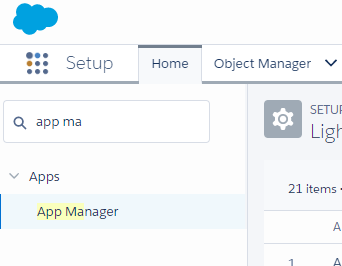
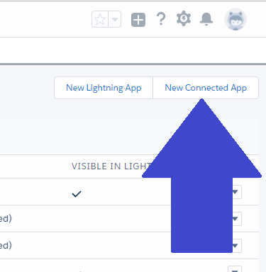
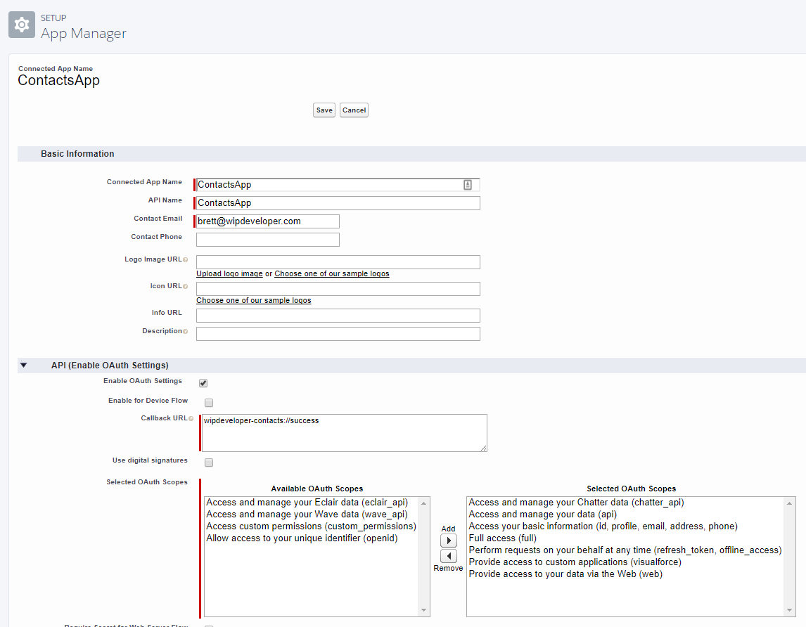
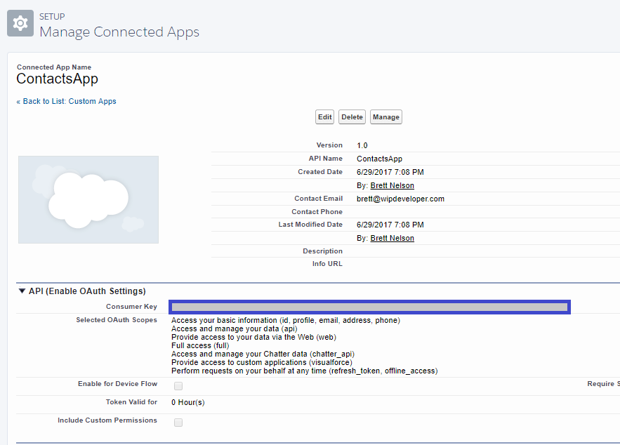

In our quest to make a mobile app that talks to our Salesforce.com Org we will need to add some configuration to our Org to allow the all to work.  Lets head into our Org and do that now.

## Org Setup

Login to your Org and head to Setup.  I am using the Lightning Experiance so I will go to `Apps` > `App Manager` or type `App Manager` in the  Quick Find and choose it.

#### Quick Find

On the "Lightning Experience App Manager" screen choose the `New Connected App` button on the upper right.

#### `New Connected App` Button

On the `New Connected App` Screen Fill in the `Connected App Name`, `API Name`, and `Contact Email`. then In the `API (Enable OAuth Settings)` section select the `Enable OAth Settings` check box and fill out your `Callback URL`and add some of the OAth Scopes.

> For OAth Scopes I am adding seven of them: \`Access and manage your Chatter data (chatter\_api)\`, \`Access and manage your data (api)\`,  \`Access your basic information (id, profile, email, address, phone)\`, \`Full access (full)\`, \`Perform requests on your behalf at any time (refresh\_token, offline\_access)\`, \`Provide access to custom applications (visualforce)\`,  and\`Provide access to your data via the Web (web)\`

It should look something like this.

#### `New Connected App` Screen

Now save it and you be on the detail page for the connected app you just created.  Copy the `Consumer Key` from the `API(Enable OAth Settings)` section

#### Detail Page

> 
> 
> I highlighted where the `Consumer Key` would be in blue in the above screen shot.

With that our Org is ready for our mobile app.

## Conclusion

Now that our Org is ready we need to update our app with the Consumer Key and the Call back Url. Lets take a look at that next time.  Anythingyou want to add?  Let me know by leaving a comment below, emailing [brett@wipdeveloper.com](mailto:brett@wipdeveloper.com) or following and yelling at me on [Twitter/BrettMN](https://twitter.com/BrettMN).
