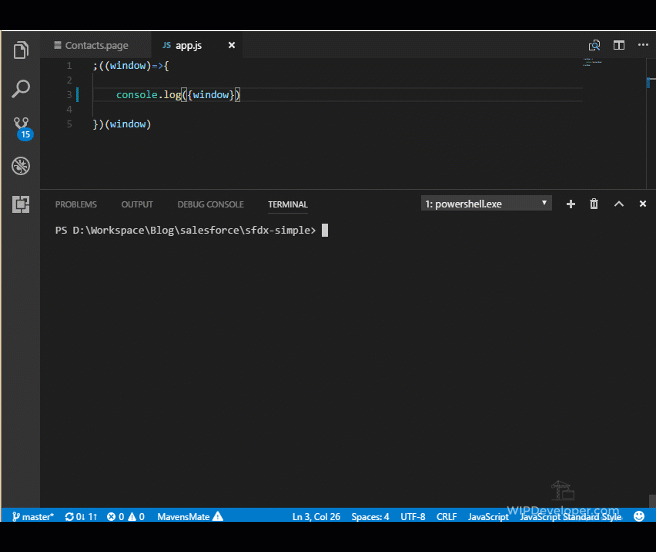

When we first cloned the sample repo it did not contain a `package.json` file.  If we want to start using npm packages we should probably get one set up.  I will be using [Yarn](https://wipdeveloper.wpcomstaging.com/2017/01/26/playing-around-with-yarn/) for this but you could use npm if you would like.

## Add `package.json`

In the root folder of you project open a command line or terminal of your choice and run `yarn init` and answer a few questions.

#### `yarn init`

```
PS D:\Workspace\Blog\salesforce\sfdx-simple> yarn init
yarn init v0.23.2
question name (sfdx-simple):
question version (1.0.0):
question description:
question entry point (index.js):
question repository url (https://github.com/forcedotcom/sfdx-simple.git):
question author (Brett Nelson <Brett@WIPDeveloper.com): 
question license (MIT): Apache2
success Saved package.json
Done in 199.87s.
PS D:\Workspace\Blog\salesforce\sfdx-simple>
```

> In case you are wondering I kept the default for everything except the license.

With our `package.json` all ready to go we can start adding packages.

## Our First Install

We are going to use [Gulp](/tag/gulp/) for our build set up.  So lets start by install, or adding, that.

> In this case the build I am referring to is all the tasks that are related to the front end.

To install Gulp we will use the `yarn global add gulp-cli` command to add Gulp to our globally installed packages.  This will allow us to use in on the command line directly.

#### `yarn global add gulp-cli`

```
PS D:\Workspace\Blog\salesforce\sfdx-simple> yarn global add gulp-cli
yarn global v0.23.2
warning No license field
[1/4] Resolving packages...
[2/4] Fetching packages...
[3/4] Linking dependencies...
[4/4] Building fresh packages...
success Installed "gulp-cli@1.3.0" with binaries:
      - gulp
warning No license field
Done in 1.02s.
PS D:\Workspace\Blog\salesforce\sfdx-simple>
```

We will also need to add it as a development dependencies for our `package.json` with the `yarn add gulp -D` command.

#### `yarn add gulp -D`

```
PS D:\Workspace\Blog\salesforce\sfdx-simple> yarn add gulp -D
yarn add v0.23.2
info No lockfile found.
warning sfdx-simple@1.0.0: License should be a valid SPDX license expression
[1/4] Resolving packages...
warning gulp > vinyl-fs > glob-stream > minimatch@2.0.10: Please update to minimatch 3.0.2 or higher to avoid a RegExp DoS issue
warning gulp > vinyl-fs > glob-watcher > gaze > globule > minimatch@0.2.14: Please update to minimatch 3.0.2 or higher to avoid a RegExp DoS issue
warning gulp > vinyl-fs > glob-watcher > gaze > globule > glob > graceful-fs@1.2.3: graceful-fs v3.0.0 and before will fail on node releases >= v7.0. Please update to gra
ceful-fs@^4.0.0 as soon as possible. Use 'npm ls graceful-fs' to find it in the tree.
[2/4] Fetching packages...
[3/4] Linking dependencies...
[4/4] Building fresh packages...
success Saved lockfile.
success Saved 161 new dependencies.
├─ ansi-regex@2.1.1
├─ ansi-styles@2.2.1
├─ archy@1.0.0
├─ arr-diff@2.0.0
...
...
... More things ...
...
...
├─ which@1.2.14
├─ wrappy@1.0.2
└─ xtend@4.0.1
warning sfdx-simple@1.0.0: License should be a valid SPDX license expression
Done in 2.65s.
PS D:\Workspace\Blog\salesforce\sfdx-simple>
```

For what we have now we are just going to need two Gulp plugins to create Zip file so let's install then while we are at it with `yarn add gulp-zip -D.`

#### `yarn add gulp-zip -D`

```
PS D:\Workspace\Blog\salesforce\sfdx-simple> yarn add gulp-zip -D
yarn add v0.23.2
warning sfdx-simple@1.0.0: License should be a valid SPDX license expression
[1/4] Resolving packages...
[2/4] Fetching packages...
[3/4] Linking dependencies...
[4/4] Building fresh packages...
success Saved lockfile.
success Saved 4 new dependencies.
├─ buffer-crc32@0.2.13
├─ get-stream@3.0.0
├─ gulp-zip@4.0.0
└─ yazl@2.4.2
warning sfdx-simple@1.0.0: License should be a valid SPDX license expression
Done in 1.92s.
PS D:\Workspace\Blog\salesforce\sfdx-simple>
```

We will use `gulp-zip` to zip our static resource files.

And install `gulp-shell` with `yarn add gulp-shell -D`

#### `yarn add gulp-shell -D`

```
PS D:\Workspace\Blog\salesforce\sfdx-simple> yarn add gulp-shell -D
yarn add v0.23.2
warning sfdx-simple@1.0.0: License should be a valid SPDX license expression
[1/4] Resolving packages...
[2/4] Fetching packages...
[3/4] Linking dependencies...
[4/4] Building fresh packages...
success Saved lockfile.
success Saved 5 new dependencies.
├─ async@2.4.1
├─ gulp-shell@0.6.3
├─ gulp-util@3.0.8
├─ lodash@4.17.4
└─ through2@2.0.3
warning sfdx-simple@1.0.0: License should be a valid SPDX license expression
Done in 3.36s.
PS D:\Workspace\Blog\salesforce\sfdx-simple>
```

We will use `gulp-shell` to call `sfdx` commands from Gulp.

With those done we can create our simple sample `gulpfile.js`

## Create `gulpfile.js`

The `gulpfile.js` is where we can define commands to call with Gulp and what those commands do.  For right now we will need a basic `build:js` command and a `watch` command to detect file changes.   So lets crete a gulp file and get it working.

In the root of your project create a file names `gulpfile.js` and it will look something like this:

#### `gulpfile.js`

```
const gulp = require('gulp')
const zip = require('gulp-zip')
const shell = require('gulp-shell')

gulp.task('deploy', ['build'], shell.task('sfdx force:source:push'))

gulp.task('build', () =>{
    console.log('build called')
    return gulp.src('static-resources-src/app/*')
        .pipe(zip('app.resource'))
        .pipe(gulp.dest('force-app/main/default/staticresources/'))
})

gulp.task('watch', () => {
    gulp.watch(`static-resources-src/app/**/*.*`, ['deploy'])
})
```

Real quick, in the gulp file we are importing `gulp`, `gulp-zip`, and `gulp-shell` and creating 3 tasks.  The tasks are called

- "deploy" - this will deploy our code to the scratch org after "build" runs
- "build" -  this is our simple build step and we can build it out more later
- "watch" - this will watch for file changes and call deploy when a change occurs

Now we can run the `gulp watch` command and when we save changes in the `static-resources-src/app` folder they will be deployed to our scratch org automatically.

## File Change Detected



> On the `Contacts.page` I updated the reference to our `app.js` path by removing the extra `app/` that was part of zipping the directory.

Now if we open up our `Contacts.page`, or refresh it if you already have it open, we should see something new happen.

## Refreshed `Contacts.page`


## Conclusion

So there you have it, automating a very simple front end build set up with Gulp and deploying it to Scratch Org with SalesforceDX.  What more could anyone ask for, have any thoughts?  Let me know what you think by leaving a comment below, emailing [brett@wipdeveloper.com](mailto:brett@wipdeveloper.com) or following and yelling at me on [Twitter/BrettMN](https://twitter.com/BrettMN).
