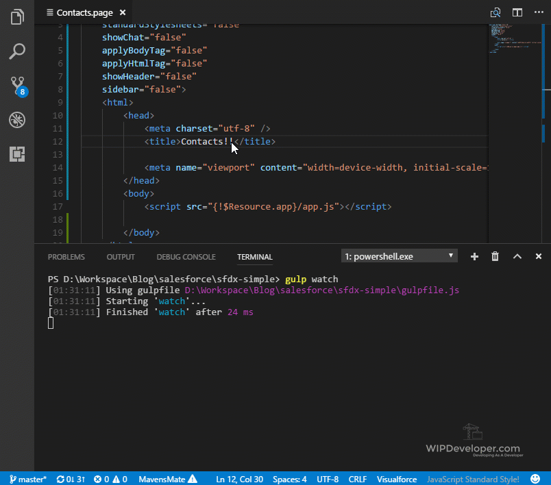

Last time we used Gulp to automate some very basic front end tasks.  Lets modify that some so it will deploy changes to our Apex and Visualforce when we make changes with them as well.

## Modify `gulpfile.js`

To so this we are just going to modify the gulp file in 2 spots.  We will remove the dependency of `build` from the task we used to push to the org.

> I have renamed the `deploy` task to `push` so it is in line with the SalesforceDX names.

The other change will be adding a second `watch` in our `watch` task.  The original `watch` will now call build and the new watch will watch for changes in `force-app/main/default/**/*` and will call the `push` task.

#### Updated `gulpfile.js`

const gulp = require('gulp')
const zip = require('gulp-zip')
const shell = require('gulp-shell')

gulp.task('push', shell.task('sfdx force:source:push'))

gulp.task('build', () => {
    console.log('build called')
    return gulp.src('static-resources-src/app/\*')
        .pipe(zip('app.resource'))
        .pipe(gulp.dest('force-app/main/default/staticresources/'))
})

gulp.task('watch', () => {
    gulp.watch(\`static-resources-src/app/\*\*/\*.\*\`, \['build'\])
    gulp.watch('force-app/main/default/\*\*/\*', \['push'\])
})

Now if we change something in our `force-app/main/default/` folder it should be pushed to the scratch org and since when we build the output is saved to `force-app/main/default/staticresources/` we don't need to add a second step to push changes to our static resource.

## In Action

Let's update our `Contacts.page` to verify things are working properly.  Start buy running `gulp watch` like before.

## `gulp watch`

PS D:\\Workspace\\Blog\\salesforce\\sfdx-simple> gulp watch
\[01:21:28\] Using gulpfile D:\\Workspace\\Blog\\salesforce\\sfdx-simple\\gulpfile.js
\[01:21:28\] Starting 'watch'...
\[01:21:28\] Finished 'watch' after 24 ms

Not too exciting yet.

Now lets update `Contacts.page`.  I am going to build out a pull page and stop usign the defaults for style sheets, html and body tags and what not but keep a reference to our `app.js`

#### Update `Contacts.page`

<apex:page doctype="html-5.0" 
    controller="ContactsController"
    standardStylesheets="false" 
    showChat="false" 
    applyBodyTag="false" 
    applyHtmlTag="false" 
    showHeader="false" 
    sidebar="false">
    <html>
        <head>
            <meta charset="utf-8" />
            <title>Contacts!</title>

            <meta name="viewport" content="width=device-width, initial-scale=1" />
        </head>
        <body>
            

        </body>
    </html>
</apex:page>

Now when we save this is when the magic happens.

#### Save `Contacts.page`

Now we can make changes to more than just our static resources and have it push to Salesforce without switching to the terminal.

## Conclusion

With some automation on our side we could maybe get some work done.  Is there something you would like to see next?  Let me know what you think by leaving a comment below, emailing [brett@wipdeveloper.com](mailto:brett@wipdeveloper.com) or following and yelling at me on [Twitter/BrettMN](https://twitter.com/BrettMN).
