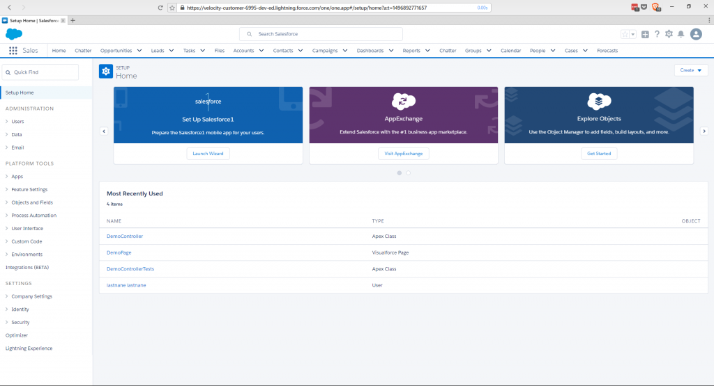
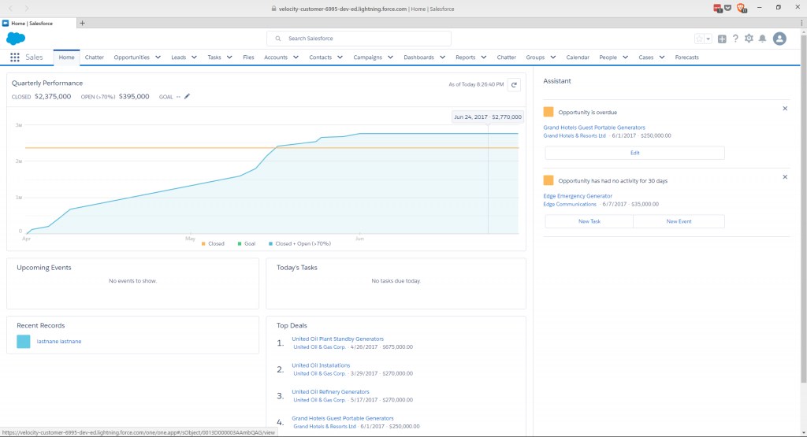
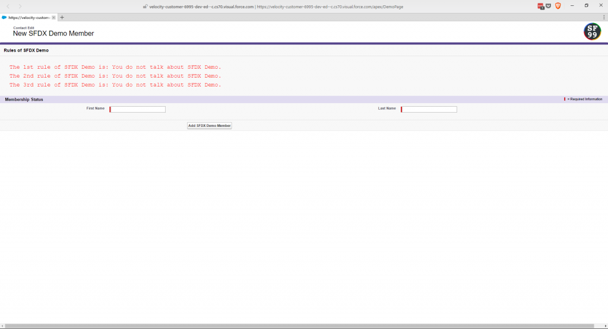
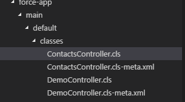
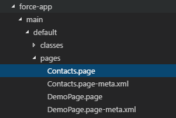
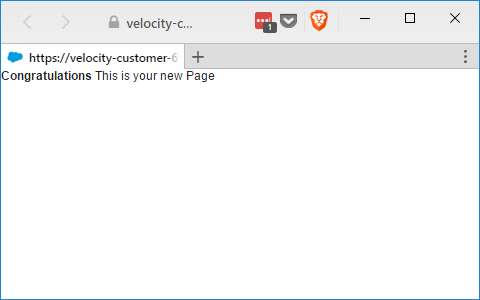

We've just pushed our code to the scratch org in [Salesforce DX – Push to Scratch Org](https://wipdeveloper.wpcomstaging.com/2017/06/06/salesforce-dx-push-to-scratch-org/), as a bonus we ran our test :).  Now let's see what we have by opening our org up.

## Launch the Org

We can launch the org with the `sfdx force:org:open` command and if you don't provide any parameters it will open your default web browser to your org's set up page.

#### Scratch Org Setup

Of r we could follow the example and use the command with `--path one/one.app` as a parameter to open the main Home tab in Lightning.

#### `sfdx force:org:open --path one/one.app`

But we just uploaded a visualforce page called `DemoPage.page` and chances are we want to see that.  For our path let's use `apex/DemoPage` in the command and see what loads up.

#### `sfdx force:org:open --path apex/DemoPage`

Well would you look at that it's our page.

## Create New Apex Class

Lets create a new Apex class so we can use it in a bit.  We will use the `force:apex:class:create` command and specify a name with the `-n` parameter flag,  andthe output directory with the `-d` parameter flag.  For everything else we will leave it at the default.

#### `sfdx force:apex:class:create -n ContactsController -d force-app/main/default/classes`

PS D:\\Workspace\\Blog\\salesforce\\sfdx-simple> sfdx force:apex:class:create -n ContactsController -d force-app/main/default/classes
target dir = D:\\Workspace\\Blog\\salesforce\\sfdx-simple\\force-app\\main\\default\\classes
   create ContactsController.cls
   create ContactsController.cls-meta.xml

> You may be wondering about that path for the output directory.   You can use either absolute paths `c:/something/something/project/......../place for class` or you could use relative to where you ran the command.

You can now see the new `cls` and `csl-meta.xml` in the classes directory.

#### `ContactsController` In Directory

And take a look at our empty class

#### `Empty ContactsController`

public with sharing class ContactsController {
  public ContactsController() {

  }
}

This wont do us much good so I'm just going to add some things to it so it has some use for use later.

#### Implemented `ContactsController`

public with sharing class ContactsController {
  public ContactsController() {

  }

   @RemoteAction
    public static List<Contact> GetContacts(){        
        List<Contact> contacts = \[select id, Name from contact LIMIT 50\];
        
        return contacts;        
    }

    @RemoteAction
    public static Contact GetContact(String contactId){        
        Contact contact = \[SELECT Id, Name, Email FROM Contact WHERE Id =: contactId\];
        
        return contact;        
    }

    @RemoteAction
    public static void UpdateContact(String contactId, String email){
            Contact contact = \[SELECT Id, Name FROM Contact WHERE Id =: contactId\];

            contact.Email = email;

            update contact;
    }

    @RemoteAction
    public static void NewContact(String firstName, String lastName, String email){
        Contact newContact = new Contact(FirstName = firstName, LastName = lastName, Email = email);

        insert newContact;
    }

    @RemoteAction
    public static void DeleteContact(String contactId){
            Contact contact = \[SELECT Id FROM Contact WHERE Id =: contactId\];

            delete contact;
    }
}

## Create Visualforce Page

We are going to need a Visualforce page to access our new controller so let's create one of those as well.  The command is probably going to look familiar since SalesforceDX follows a specific naming convention, `force:visualforce:page:create`, we will also use the `-n` and `-d` parameter flags to specify the name and out put directory again but we will also use the `-l` flag to specify the label for the page

#### `sfdx force:visualforce:page:create -n Contacts -d force-app/main/default/pages`

PS D:\\Workspace\\Blog\\salesforce\\sfdx-simple> sfdx force:visualforce:page:create -n Contacts -d force-app/main/default/pages
 !    Required flag:  -l, --label LABEL
PS D:\\Workspace\\Blog\\salesforce\\sfdx-simple> sfdx force:visualforce:page:create -n Contacts -l Contacts -d force-app/main/default/pages
target dir = D:\\Workspace\\Blog\\salesforce\\sfdx-simple\\force-app\\main\\default\\pages
   create Contacts.page
   create Contacts.page-meta.xml

This gives us the  new Visualforce page

#### `Contacts.page` In Directory

And we can see the if has the defaul page template:

#### `Contacts.page Default Template`

<apex:page>
<!-- Begin Default Content REMOVE THIS -->
<h1>Congratulations</h1>
This is your new Page
<!-- End Default Content REMOVE THIS -->
</apex:page>

Now with one little `sfdx force:source:push` we can see our page in the browser with the `sfdx force:org:open --path apex/Contacts` command.

#### `Contacts` In Action

 

## Conclusion

That wasn't so painful, was it?  Now the big question is, what kind of JavaScript should I use to access all those remote actions?  Let me know what you think by leaving a comment below, emailing [brett@wipdeveloper.com](mailto:brett@wipdeveloper.com) or following and yelling at me on [Twitter/BrettMN](https://twitter.com/BrettMN).
