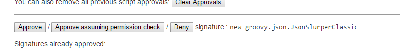
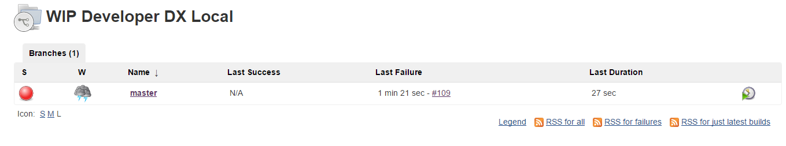

So far we have Jenkins setup to run and configured for our repository from [Salesforce DX – Setup Jenkins](https://wipdeveloper.wpcomstaging.com/2017/06/19/salesforce-dx-setup-jenkins/), added a `Jenkinsfile` to get a the pipeline to run in [Salesforce DX – Setup Jenkins – Jenkinsfile](https://wipdeveloper.wpcomstaging.com/2017/06/20/salesforce-dx-setup-jenkins-jenkinsfile/), and configured our environment variables in [Salesforce DX – Jenkins – Environment Variables](https://wipdeveloper.wpcomstaging.com/2017/06/21/salesforce-dx-setup-jenkins-envrironment-variables/).  So things should build and if you are using a \*nix machine they might be.  Since I'm on Windows it's not going that smoothly.  Let's look at why.

## Jenkinsfile Issues

When we setup the `Jenkinsfile` we used the example at [forcedotcom](https://github.com/forcedotcom)/[sfdx-dreamhouse](https://github.com/forcedotcom/sfdx-dreamhouse) to base it on, and by base it on I mean copy.  I didn't realize this at the time but the pipeline environment for Jenkins is not isolated from the host machine meaning, if you are using a \*nix machine the pipeline is executed in a shell (bash, zsh, csh, whathav eyoush) and if you are on a Windows machine it uses the cmd.exe.

### Why does that matter?

Good questions.  The Windows cmd.exe doesn't have the same commands as a \*nix shell.  All the shell specific commands in the `Jenkinsfile` **don't work** in cmd.exe.

Let's fix the `Jenkinsfile` to work on Windows.

> If you are using a \*nix machine feel free to keep the `Jenkinsfile` they way it came :)

## Update Jenkinsfile

The main things we need to change is all the `sh` commands to `bat` and the way we access the Salesforce DX command line tools.  Since the default install location on Windows (some where in the `Program Files`) causes issues because of the space in the path so we will need a work around for that.

For accessing `sfdx` we can address it in a couple of different ways.

Since we used `C:\Program Files\sfdx\bin` as the path to the cli we can add quotes around the call to `sfdx` by escaping them with backslashes `\"` so line `24`:

rc = sh returnStatus: true, script: "${toolbelt}/sfdx force:auth:jwt:grant --clientid ${CONNECTED\_APP\_CONSUMER\_KEY} --username ${HUB\_ORG} --jwtkeyfile ${jwt\_key\_file} --setdefaultdevhubusername"

would be updated to:

rc = sh returnStatus: true, script: "\\"${toolbelt}/sfdx\\" force:auth:jwt:grant --clientid ${CONNECTED\_APP\_CONSUMER\_KEY} --username ${HUB\_ORG} --jwtkeyfile ${jwt\_key\_file} --setdefaultdevhubusername"

This is a little verbose those and probably more prone to errors than I would prefer.

Another way to address this would be to change our  `toolkit` custom tool path to `"C:\Program Files\sfdx\bin\sfdx"` and use `${toolkit}` all by it's self.

rc = sh returnStatus: true, script: "${toolbelt} force:auth:jwt:grant --clientid ${CONNECTED\_APP\_CONSUMER\_KEY} --username ${HUB\_ORG} --jwtkeyfile ${jwt\_key\_file} --setdefaultdevhubusername"

I will be doing this so I have less to type.  And less typing means less chance for errors.

Now commit the changes to your `Jenkinsfile` and get Jenkins to re-run, I use the `Scan Multibranch Pipeline Now` button inside the job.

## Build Error

When it runs you may have a build error that reads like the following:

org.jenkinsci.plugins.scriptsecurity.sandbox.RejectedAccessException: Scripts not permitted to use method groovy.lang.GroovyObject invokeMethod

To resolve this go to  Manage Jenkins => In-process Script Approval and approve the script.

#### Approval Button

 

Try it again.

and see it....

#### Still Fail

ok so mine is still erroring out because I have too many Scratch Orgs already.

 

## Conclusion

ok, at this point you may be wondering how many posts I can drag this out.   Shall we find out?  Let me know by leaving a comment below, emailing [brett@wipdeveloper.com](mailto:brett@wipdeveloper.com) or following and yelling at me on [Twitter/BrettMN](https://twitter.com/BrettMN).
