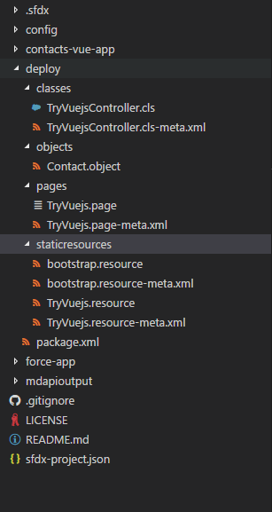
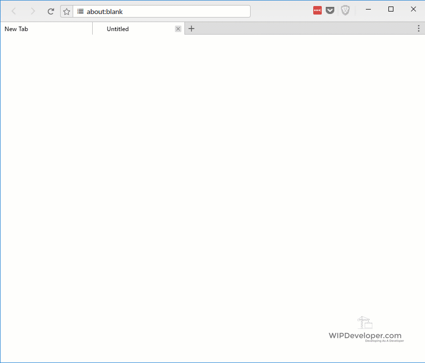

In [Salesforce DX – Using Existing Source](https://wipdeveloper.wpcomstaging.com/2017/06/14/salesforce-dx-using-existing-source/) we moved code from an org that was not set up for Salesforce DX to a code base and pushed it to a scratch org.  And since we verified that it worked in the scratch org it is time to deploy it to our Development Hub or Dev Hub.

## Dev Hub?

Yes, our Dev Hub.  According to the Developer Guide the Dev Hub "is a central location for Salesforce DX because it allows you to create, delete, and manage your Salesforce scratch orgs."  What does that mean to you?  Well it's the central place where all the changes are culminating towards, in other words **Production.** At least, that is the way I interpret it.  Feel free to correct me if I am incorrect :)

Since the Dev Hub is a different kind or org we are not able to push source code to it with the `force:soruce:push` command they way we did with the scratch org.   And if you're like me you're probably thinking "WTH? I was just getting to like this CLI thing!"  But fear not there's the `force:mdapi:deploy` command for just such a case.

We used the `force:mdapi:retrieve` and `force:mdapi:convert` when we  move our code from the existing org [last time](https://wipdeveloper.wpcomstaging.com/2017/06/14/salesforce-dx-using-existing-source/) so it would make sense that the same namespace, `mdapi`, would have what we need to deploy to a non-scratch org.

## Convert

Before we can deploy our source code we will need to convert it to a format that the Metadata Api can use.  To accomplish that we will use the `force:source:convert` command.   It has 2 optional parameters: `-r` for specifying the root directory to convert, and `-d` to specify the output directory.  I'm only going to convert the `contacts-vue-app` and have it output to a `deploy` directory at the root of the project, I'm sure in the long run I will want a more organized way to do this but for now it will work.

#### Run `force:source:convert`

PS D:\\Workspace\\Blog\\salesforce\\dx\\wip-org\\wipdeveloper-org> sfdx force:source:convert -r contacts-vue-app -d deploy
Source was successfully converted to metadata api format and written to the location: D:\\Workspace\\Blog\\salesforce\\dx\\wip-org\\wipdeveloper-org\\deploy
PS D:\\Workspace\\Blog\\salesforce\\dx\\wip-org\\wipdeveloper-org>

Now if you look in the `deploy` directory you can see what the output.

#### `force:source:convert` Output

Now it's ready to deploy!

## Deploy

So we are going to use the `force:mdapi:deploy` command to deploy our Metadata Api code to our Dev Hub.   It has a few parameters for us to be concerned with as we get started:

- `-d` - the deploy directory, this is the ode we want to deploy
- `-u` - the username for the org we want to deploy to.  This will allow us to deploy to an org that is not currentlyu  set as our default org.

So let's do that!

#### Start Deployment

PS D:\\Workspace\\Blog\\salesforce\\dx\\wip-org\\wipdeveloper-org> sfdx force:mdapi:deploy -d deploy -u brett@wipdeveloper.com
466464 bytes written to C:\\Users\\bmn13\\AppData\\Local\\Temp\\deploy.zip using 86.105ms
Deploying C:\\Users\\bmn13\\AppData\\Local\\Temp\\deploy.zip...

=== Status
Status:  InProgress
jobid:  0Af4600000nvIOBCAZ
Component errors:  0
Components deployed:  0
Components total:  7
Tests errors:  0
Tests completed:  0
Tests total:  0
Check only: false

The deploy request did not complete within the specified wait time \[0 minutes\].
To check the status of your deployment, run "sfdx force:mdapi:deploy --jobid 0Af4600000nvIOBCAZ --targetusername brett@wipdeveloper.com"
PS D:\\Workspace\\Blog\\salesforce\\dx\\wip-org\\wipdeveloper-org>

You may have noticed where it says how to check the status of the deployment with the following command `sfdx force:mdapi:deploy --jobid 0Af4600000nvIOBCAZ --targetusername brett@wipdeveloper.com`.  Why not give that a try and see how things are going.

#### Status Check

PS D:\\Workspace\\Blog\\salesforce\\dx\\wip-org\\wipdeveloper-org> sfdx force:mdapi:deploy --jobid 0Af4600000nvIOBCAZ --targetusername brett@wipdeveloper.com

Deployment finished in 2000ms

=== Result
Status:  Succeeded
jobid:  0Af4600000nvIOBCAZ
Completed:  2017-06-16T03:09:08.000Z
Component errors:  0
Components deployed:  7
Components total:  7
Tests errors:  0
Tests completed:  0
Tests total:  0
Check only: false

PS D:\\Workspace\\Blog\\salesforce\\dx\\wip-org\\wipdeveloper-org>

Looks like it's done, let's open up the Dev Hub with the `force:org:open` command using the `-u` parameter to specify the username for the Dev Hub and use the `--path` so we don't have to navigate to the

#### Check It

PS D:\\Workspace\\Blog\\salesforce\\dx\\wip-org\\wipdeveloper-org> sfdx force:org:open --path apex/tryvuejs -u brett@wipdeveloper.com
Access org 00D46000000q4KqEAI as user brett@wipdeveloper.com with the following URL: https://na40.salesforce.com/secur/frontdoor.jsp?sid=00D46000000q4Kq!ARIAQL
CCuh\_RJCNYjcSXPgopJE4GC9nWPMJme5F70lsP4f0NmfwHZZm.AkAgT38ahJEQbk6Wxs5jX1geeOSmeVZWZnyD8qJh&retURL=apex%2Ftryvuejs
PS D:\\Workspace\\Blog\\salesforce\\dx\\wip-org\\wipdeveloper-org>

And just like that we can see our code running on NA40

#### Now Live!

And with that all our changes are live!

## Conclusion

Wasn't that fun?   But there has to be an easier way to deploy to the Hub Org so there are fewer manual steps.  Have any suggestions?  Let me know what you think by leaving a comment below, emailing [brett@wipdeveloper.com](mailto:brett@wipdeveloper.com) or following and yelling at me on [Twitter/BrettMN](https://twitter.com/BrettMN).
