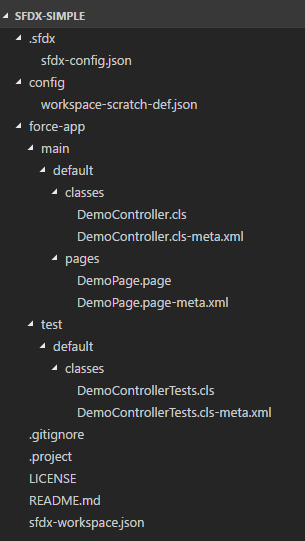
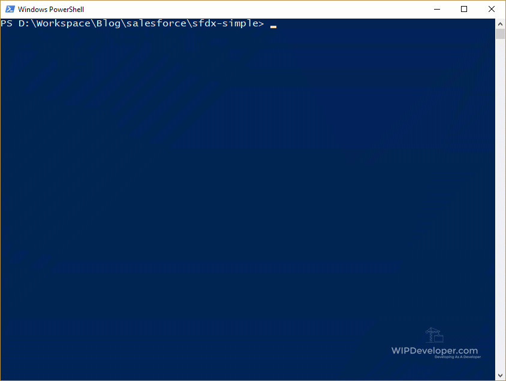
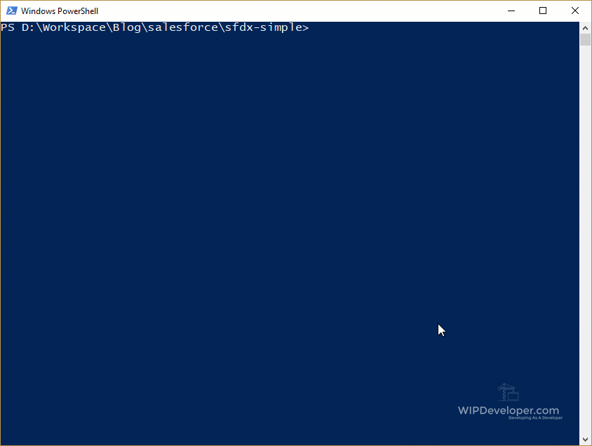

 

During [Salesforce DX – Setup](https://wipdeveloper.wpcomstaging.com/2017/06/05/salesforce-dx-setup/) I mentioned using the readme.md at [sfdx-simple.](https://github.com/forcedotcom/sfdx-simple) Lets take the sample code and push it to the org we created last time.  But first let's see what it has how the sample app is structured.

## Structure

The repo has 3 main directories:

1. `.sfdx` - the SalesforceDX config is in here and the directory and config were added when we were doing our setup.
2. `config`  - this contains our workspace scratch org definition json file that we used with the `sfdx force:org:create` command.
3. `force-app` - This folder is where all our code lives.  Production code in `force-app/main/default` and Test code in `force-app/test/default`.   This is specified in the `sfdx-workspace.json` in the root of the folder structure.

> The dev guide says that project workspace can be set up at the in a flexible manner with the only exception being Lightning components needing to be in a directory named `aura`.  We'll see how flexible later :)

The repo also has the `.gitignore`, a `.project`, the `LICENSE`, the `README.md`, and the previously mentioned `sfdx-workspace.json`.  Let's talk about them:

- `.gitignore` - This is a way to tell the source control, in this case git, to not track changes on files or directories.  Reasons you may not want to track changes include: files contain sensitive material such as api keys, usernames, passwords, middle names and what have you; it's `npm_modules`, you don't track changes to the `npm_modules` folder since these changes are tracked in a `package.json` file;
- `.project` - This looks like it defines the project, currently it just has a value for `name`.
- `LICENSE` - This is a copy of the license.  It's Apache V2.0 in case you were wondering.
- `README.md` - Commonly used to describe how to use a project or elaborate any special information.  Lives up to it's name because you are suppose to Read it.
- `sfdx-workspace.json` -  Defines our workspace.  Package directories, namespace, api version.

The actual working files (`apex`, `visualforce`) can be seen as well.  Here is the complete file structrue:

#### File Structure

## Push It

Let's push this code to our scratch org using the sfdx force:source:push  command and see what happens:

#### `sfdx force:source:push` Command

As you can see it sent the Apex Classes, both of them, and the Visualforce page with the meta xml files.

Now that we have something in our org we can run tests using the

`sfdx force:apex:test:run` command:

#### `sfdx force:apex:test:run` Command

Here you can see it returns the test id along with the `sfdx` command to run to see the results `force:apex:test:report -i 7073D000000Ib8wtes`.  So lets see what our tests result was.

#### `sfdx force:apex:test:report -i 7073D000000Ib8wtes` Command

There you have it One test passed, YAY!

## Conclusion

We now have pushed the `sfdx-simple` sample to our scratch org and ran some tests.  Pretty exciting so far!  Have something you would like to add?  Let me know by leaving a comment below, emailing [brett@wipdeveloper.com](mailto:brett@wipdeveloper.com) or following and yelling at me on [Twitter/BrettMN](https://twitter.com/BrettMN).
