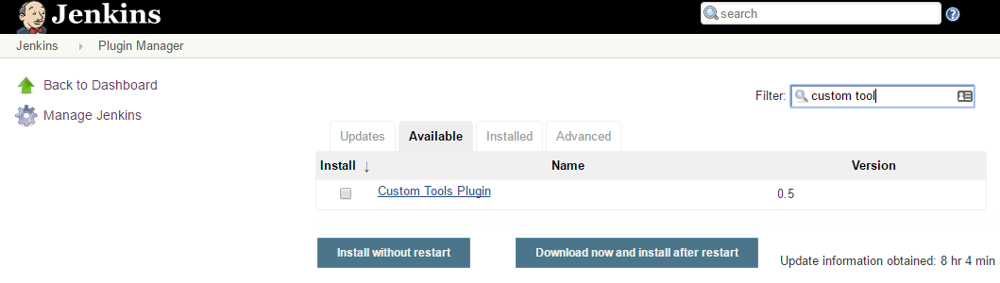
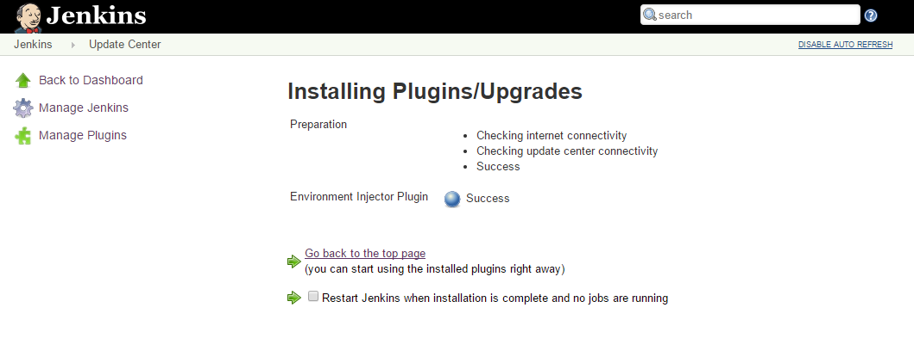
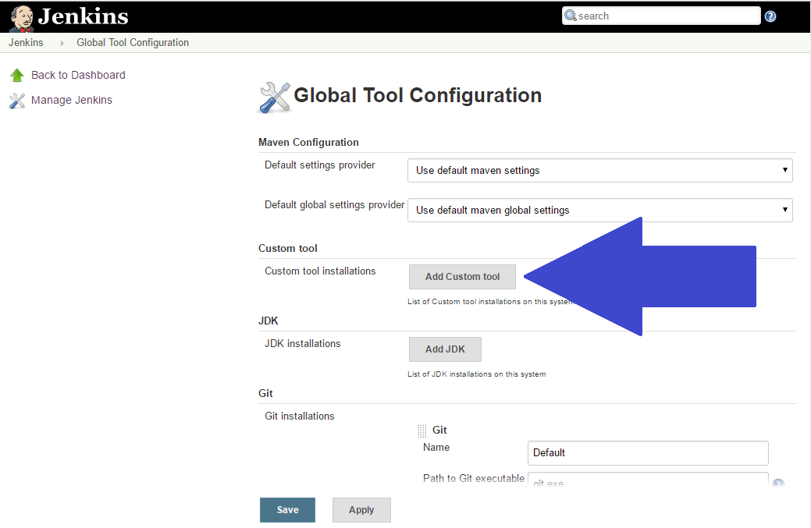
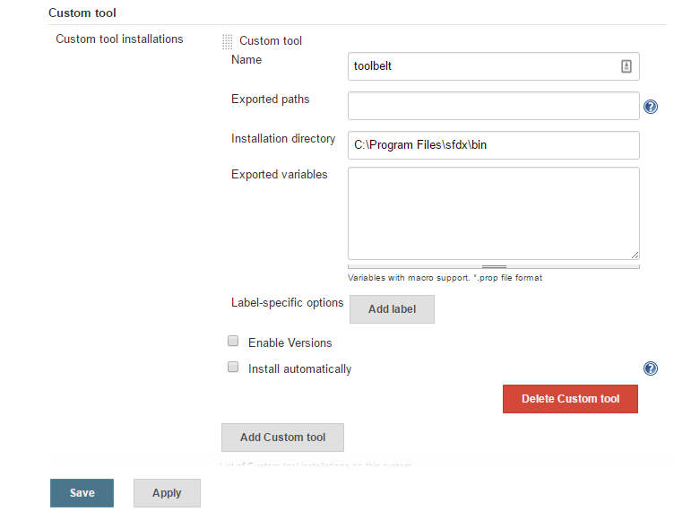
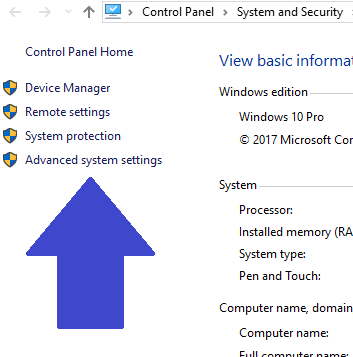
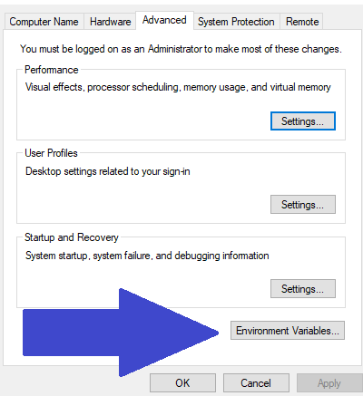

We should almost have everything set up to run Jenkins with Salesforce DX.  The last thing we need to do is configure our environment variables that we "used" in [Salesforce DX – Setup Jenkins – Jenkinsfile](https://wipdeveloper.wpcomstaging.com/2017/06/20/salesforce-dx-setup-jenkins-jenkinsfile/).  To do that we will need to be able to specify environment variable lets get to work on that.

## Install Plugins

We will use the [Custom Tools Plugin](https://wiki.jenkins-ci.org/display/JENKINS/Custom+Tools+Plugin). to access the SFDX CLI from inside build pipeline.   To install it  from the main Jenkins page use the navigation to go to Manage Jenkins => Manage Plugins and then the Available tab and use the search box.

#### Available Tab

Mark the check box next to the plugin and try installing it without restarting.

#### Success!

Now let's repeat the process with the

## Add Custom Tool

Now go back to Manage Jenkins then Global Tool Configuration.  It should have a section called `Custom Tool` choose the `Add Custom Tool` button.

#### `Add Custom Tool` Button

#### 

I'm going to un-check the `Install Automatically` option  since I have it installed already.   Then choose the `Custom Tool Configurations...` button and fill in the path to the `Installation Directory`

> On Windows it's at `C:\Program Files\sfdx\bin` and on Mac it's at `/usr/local/bin` (I think, not sure, I using Windows for this. )

#### Custom Tool

Now save it.

## Set Environment Variables

In Windows you can set an environment variable from the Control Panel => System and Security => System screen or paste `Control Panel\System and Security\System` in a file explorer windows address bar to just go straight there.

Open the Advanced System Settings on the Left

#### Advanced System Settings

Choose the `Environment Variables...` button near the bottom.

#### `Environment Variables...` button

And use the `New...` Button under `System variables` near the bottom of the Environment Variables screen to add each of the following:

- `HUB_ORG_DH` - Username for the Dev Hub org.
- `SFDC_HOST_DH` - Login Url for Salesforce instance
- `JWT_CRED_ID_DH` -  The Id of the Secret File that has our JWT private key file in Jenkins
- `CONNECTED_APP_CONSUMER_KEY_DH` - Consumer Key from our Salesforce Connected app

> If you are using Jenkins on a \*Nix machine you should probably look up how to set them for your variety of \*Nix

With those values added we should be able to access them from inside the Jenkins Pipeline once we get the `Jenkinsfile` set up properly.

## Conclusion

Last this we need to do it adjust the `Jenkinsfile` to work with the system we are running on.  Think it will be easy?  Let me know by leaving a comment below, emailing [brett@wipdeveloper.com](mailto:brett@wipdeveloper.com) or following and yelling at me on [Twitter/BrettMN](https://twitter.com/BrettMN).
