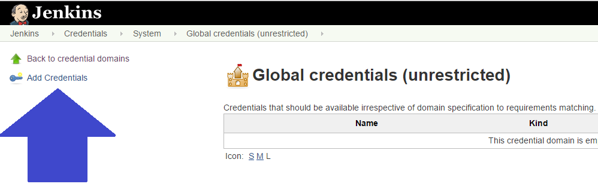
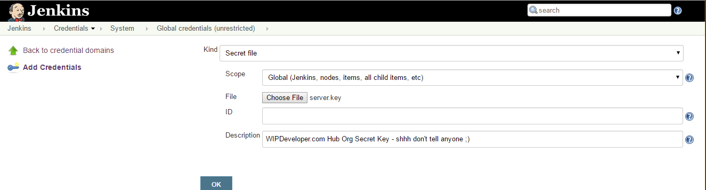
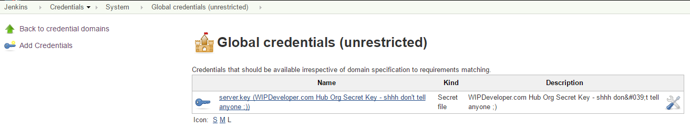
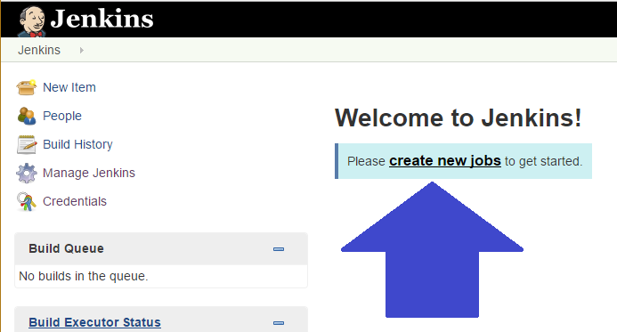
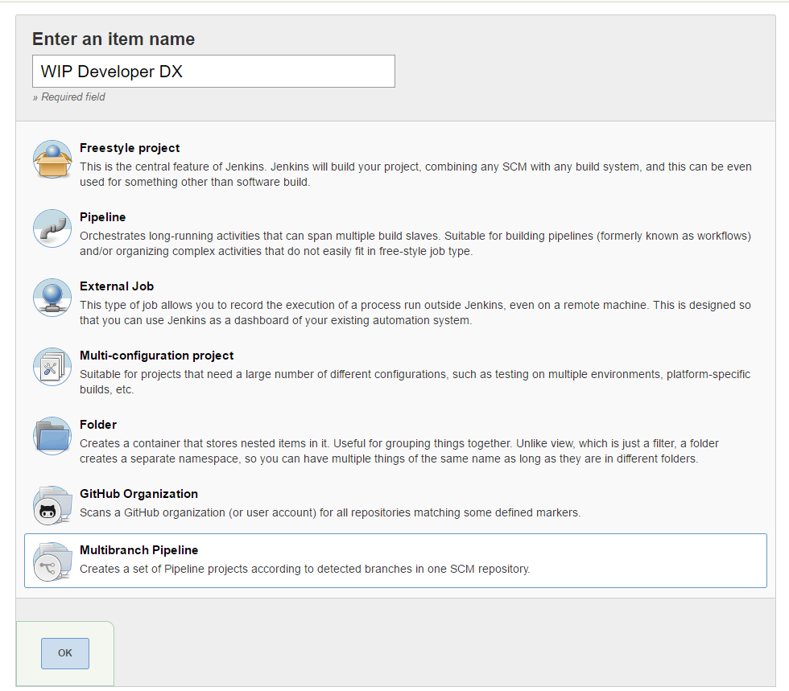
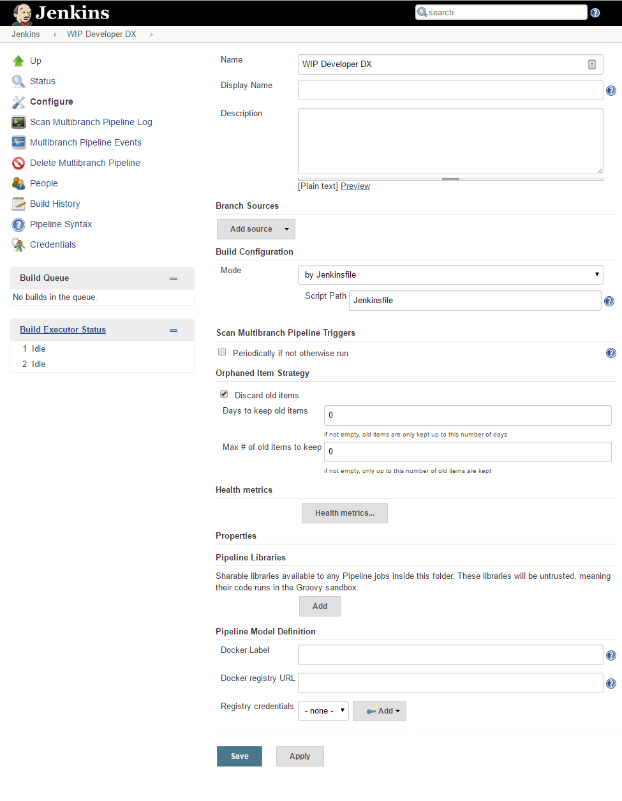
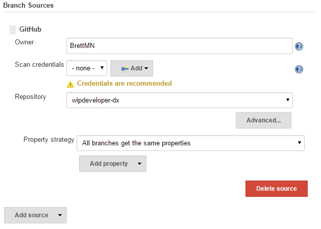
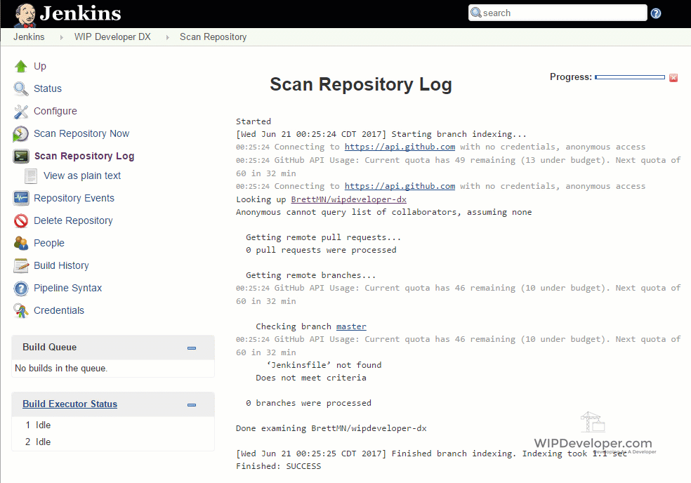
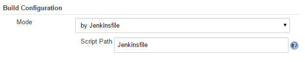

We've done all the steps to push changes from a scratch org to the Hub Org, and there were a few, wouldn't it be nice if we could automate the process so we can focus on important things like playing [Zelda](http://amzn.to/2tHQq88)?   Well good news, we can!  Let's set up Jenkins, an "open source automation server" with "hundreds of plugins to support building, deploying and automating any project", to work with Salesforce DX.

> I'm not planning on explaining how to set up Jenkins here they have a pretty good walk through for that at [Jenkins.io](https://jenkins.io)

## Setting Up Private Key

Before we can get started we will need to create a connected app with authentication configured to use OAuth JWT Flow.   There are a few steps that need to be done get to a starting point with the Oauth JWT Flow.  Luckily [Wade Wegner](https://twitter.com/WadeWegner) has built a plugin for SFDX to help cut those steps down to be more manageable but it's not working for me.  However his [**steps**](http://www.wadewegner.com/2017/04/using-the-oauth-2-jwt-bearer-flow-to-support-the-salesforcedx-cli/) to set up are clearer than the current documentation :)

> For all the OpenSSL stuff it was easier on Windows to use the Linux Subsystem or Bash on Ubuntu on Windows than it was to use the Windows install of OpenSSL

Once you follow Wades instructions you are at the point where you will need to store the JWT private key file as a secret file in Jenkins.

> To store a file as a secret file in Jenkins you will need the [Credentials Binding Plugin](https://wiki.jenkins-ci.org/display/JENKINS/Credentials+Binding+Plugin) my setup of Jenkins came with it but if yours did not you can add it in Manage Jenkins => Plugin Manager then search for it on the Available tab.

Go to the Credentials Menu and for the purposes of this demo I will be adding the secret file to the Jenkins Scope Global Credentials so select the `Jenkins` Store then the `Global credentials (unrestricted)`  Then finally `Add Credentials`

#### `Add Credentials`

This will open a form to add a credential and we will need to change the `kind` to  `Secret File` select the `server.key` we generated when we did thoes JWT steps, leave the `ID` blank so it can be populated by Jenkins, and provide an optional description.

#### Add Secret File

#### 

You can now see this as a `Global credentials (unrestricted)`

#### Global Credentials

#### 

Now that we have our `private.key` stored we can move on to adding our build job.

## Create New Job

Back on the main page you should see the **Welcome to Jenkins!** and almost nothing else, let's fix that.   Choose **create new jobs** to start the process.

#### `create new jobs`

I will be using the **Multibranch Pipeline** so I can use a git flow workflow but feel free to choose a different project style if you would like.

#### Name Project

Select the `ok` button and we will be at the **configure** page.

#### `configure` Page

 

Lets start filling this out.

Since I pushed all my orgs code to [Github.com/BrettMN/wipdeveloper-dx](https://github.com/BrettMN/wipdeveloper-dx) under **Branch Sources** I will select `GitHub` from the `Add Source` drop down.   This will expand an area to fill out for the repository.  I will enter the `Owner` of `BrettMN` and choose `wipdeveloper-dx` from the `Repository` drop down

#### Source Added

> I'm not going to add `Scan credentials` since I am using a public repository and wont need to sign in to Github to access it.   Your situation may be different :)

I'm going to save this now and see what happens.

#### What Happened?

#### 

Nothing, nothing happened.

Ok that's not entirely true.  See it says **'Jenkinsfile' not found** this is because we left the **Build Configuration** mode as `by Jenkinsfile` but we did not add one to our repository.

#### **Build Configuration**

 

Let's add the `Jenkinsfile` this next time and get things building.

## Conclusion

We are getting Jenkins set up to work with Salesforce in an officially supported way, what more could one ask for?  Let me know by leaving a comment below, emailing [brett@wipdeveloper.com](mailto:brett@wipdeveloper.com) or following and yelling at me on [Twitter/BrettMN](https://twitter.com/BrettMN).
