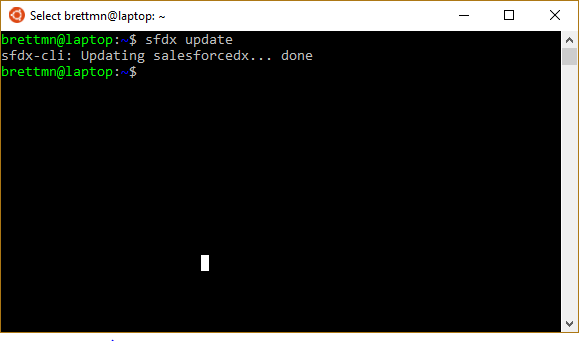
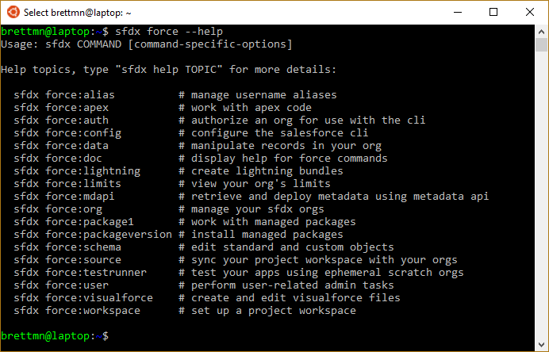
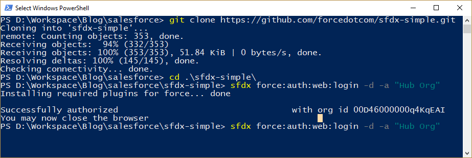
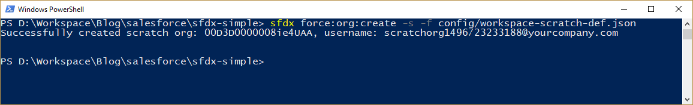
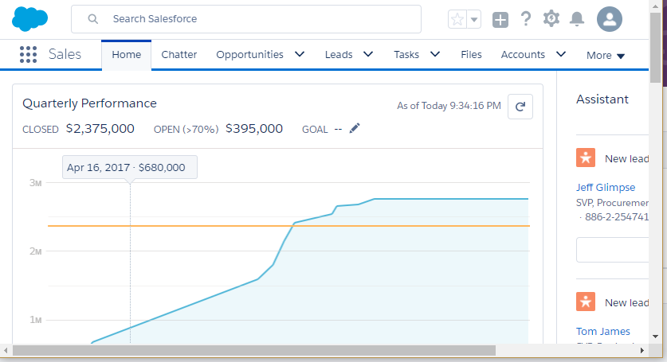

I have the honor of being a part of the Salesforce DX Pilot and I feel like I have been neglecting my duties by not exploring it, so here goes.

## Salesforce DX

Announced at Dreamforce 2016 ([hey, I saw that](/2016/10/14/dreamforce-2016-recap/#salesforcedx)) it was touted as "Source Driven Development" this means that the source of truth for the code is in the source control not the org.  Coming from a .NET background this is a welcome change to me since it will help encourage the use of source control.

So what do they call it now?

> Salesforce DX gives Salesforce developers an entirely new way to manage and develop Salesforce apps.

 

## Install

Salesforce DX is built on top of the Heroku CLI so for the pilot we had to remove that before I could run the installer.   You also need Node.js​ (version 6.2+) installed, fortunately I already have that :)

Other than that the Installer is an MSI instller that you run and it will install the SFDC CLI, add it to the `PATH` and you could probly get started.

> The instructions recommend using the default cmd.exe for Windows but there is a wholes section on using the Windows Subsystem for Linux so I'll will try using that.

If you follow the directions eventually you run into a portion where you run `sfdx update:`

#### `sfdx update`

Followed by `sfdx force -help`

#### `sfdx force --help`

So with that we know that `sfdx` is installed properly and we can see what the

> So after a few failed attempts with the Windows Subsystem for Linux I gave up on that and switched to PowerShell and things started to work.  It seems the Linux Subsystem was getting hung up on the \`Installing required plugins for force... done\` part before attempting the web login.

#### It's Alive... er... Working!

> When this ran it popped open my default browser to salesforce.com and asked me to authorize it to access my org.

At this point I can create a scratch org.  Since I am following the readme.md available for **[sfdx-simple](https://github.com/forcedotcom/sfdx-simple)** this means I will use the `sfdx force:org:create` command:

#### `sfdx force:org:create` command

It returns the scratch org id and user name once it's completed.

I can now use the `sfdx force:org:open` command to open the org in the web browser and it will load into the `Setup` menu.  It also has the option to specify a path so `sfdx force:org:open --path one/one.app` will take you to the  Home tab like when you first log in.

#### Home

And with that we will be able to start pushing code next time.

## Conclusion

Aside from a little hiccup with using the Windows Subsystem for Linux things went smoothly so far.  Is there an aspect of SalesforceDX you would like to see? Let me know by leaving a comment below, emailing [brett@wipdeveloper.com](mailto:brett@wipdeveloper.com) or following and yelling at me on [Twitter/BrettMN](https://twitter.com/BrettMN).
