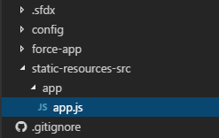
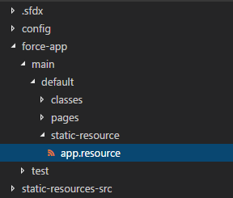
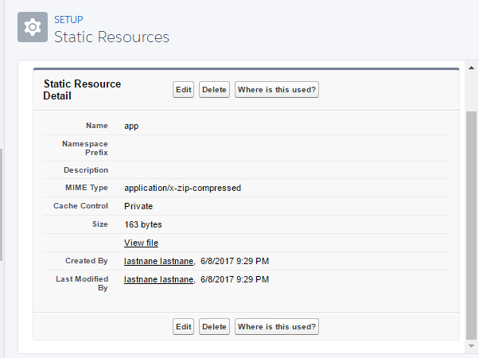
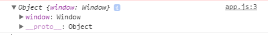

We have been able to create an Apex class and a Visualforce page so far.  Let's try to add a static resource.

## Create the Source

Before we can create a static resource we should have something to put in it.   For that purpose I have created a folder at the root of the `sfdx-simple` project called `static-resources-src` and if you guessed that I plan on keeping all the source files for my static resources there you would be correct, good job!

Why didn't I create this within the `force-app` folder you may be wondering.  It causes an error.  Having a `.js` file in a `PackageDirectory` causes the following error when you check the status:

#### `sfdx force:source:status`

 

PS D:\\Workspace\\Blog\\salesforce\\sfdx-simple> sfdx force:source:status
ERROR running force:source:status: Unexpected file found in package directory: D:\\Workspace\\Blog\\salesforce\\sfdx-simple\\force-app\\app.js.
PS D:\\Workspace\\Blog\\salesforce\\sfdx-simple>

This is probably because there is no standalone `.js` file extensions in Salesforce.

In  `static-resources-src`  I created a folder with the ever so original name of `app` and in the `app` folder I added a JavaScript file called `app.js` this will be where I keep all my app code for now.

#### `app.js`

> In case you are wondering I have decided to use plain JavaScript for this since the choice of framework in revilement if you can't send it to the server.

For the `app.js` I'm just going to create an Immediately-Invoked Function Expression ([IIFE](https://en.wikipedia.org/wiki/Immediately-invoked_function_expression)) that passes the `window` object in and logs it to the console.

#### `app.js`

;((window)=>{
console.log({window})
})(window)

Since I am on Windows and I don't have any build pipe line in place at the momment I am going to manually zip the `app` folder, changes the file extension from `.zip` to `.resource` and move in to a folder in the `force-app/main/default/static-resources`.

#### `app.resource`

Now if we check the status we see that the there are 2 local adds.

#### `sfdx force:source:status` Take II

PS D:\\Workspace\\Blog\\salesforce\\sfdx-simple> sfdx force:source:status
State Full Name Type Workspace Path
───────── ───────── ────────────── ────────────────────────────────────────────────────────────
Local Add app StaticResource force-app\\main\\default\\static-resource\\app.resource-meta.xml
Local Add app StaticResource force-app\\main\\default\\static-resource\\app.resource
PS D:\\Workspace\\Blog\\salesforce\\sfdx-simple>

Let's push it and see what happens.

## Push It

Let's try the `sfdx force:source:push` command to push our static resource to the scratch org.

`sfdx force:source:push`

 

PS D:\\Workspace\\Blog\\salesforce\\sfdx-simple> sfdx force:source:push
ERROR running force:source:push: ENOENT: no such file or directory, lstat 'D:\\Workspace\\Blog\\salesforce\\sfdx-simple\\force-app\\main\\default\\static-resource\\app.resource-m
eta.xml'.
PS D:\\Workspace\\Blog\\salesforce\\sfdx-simple>

So that doesn't look like it is going to work.

Lets go to our org with the `sfdx force:org:open` command and add a static resource in the setup menu for now.

#### `app` Static Resource Details

#### 

ok, so I used a zip file I created from our app source folder but this is suppose to be **source driven development** and uploading from the Setup menu is going to get old.   Theres also that `sfdx force:source:push` thing that should be doing this work for us.  If only we could get the generated `app.resource-meta.xml` to use.

## Pull It

No, I'm not talking about my finger.  We are going to use the `sfdx force:source:pull` command to get any changes that happened in our org back into our local source code.

#### `sfdx force:source:pull`

 

PS D:\\Workspace\\Blog\\salesforce\\sfdx-simple> sfdx force:source:pull
State Full Name Type Workspace Path
─────── ───────── ────────────── ────────────────────────────────────────────────────────────
Changed app StaticResource force-app\\main\\default\\staticresources\\app.resource-meta.xml
Changed app StaticResource force-app\\main\\default\\staticresources\\app.resource
PS D:\\Workspace\\Blog\\salesforce\\sfdx-simple>

It pulled everything down into the default folder at `force-app\main\default\staticresources\`.  This seems like a good enough place to me so I'm going to remove my  oh so dramatically differently named `static-resources` folder.

## Check the App

Now we know we have our static resource in Salesforce lets add a script reference to it on our `Contacts.page` and verify it is logging the `window` when the page loads.

First the reference, just add it on the `Contacts.page`.

#### `app.js` reference

 

 

Now push once more time.

#### Last `sfdx force:source:push`

 

PS D:\\Workspace\\Blog\\salesforce\\sfdx-simple> sfdx force:source:push
State Full Name Type Workspace Path
─────── ───────── ──────── ───────────────────────────────────────────────────
Changed Contacts ApexPage force-app\\main\\default\\pages\\Contacts.page-meta.xml
Changed Contacts ApexPage force-app\\main\\default\\pages\\Contacts.page

Now open up the `Contats.page` with `sfdx force:org:open --path apex/Contacts` and look at the console.

#### `Contacts` Console

There you have it, our `window`  object.

## Conclusion

Uploading the `app` static resource was a but annoying but I think we can make it a little easier with something like NPM Scripts, or Gulp Tasks or something.  What would you prefer to try?  Let me know what you think by leaving a comment below, emailing [brett@wipdeveloper.com](mailto:brett@wipdeveloper.com) or following and yelling at me on [Twitter/BrettMN](https://twitter.com/BrettMN).
