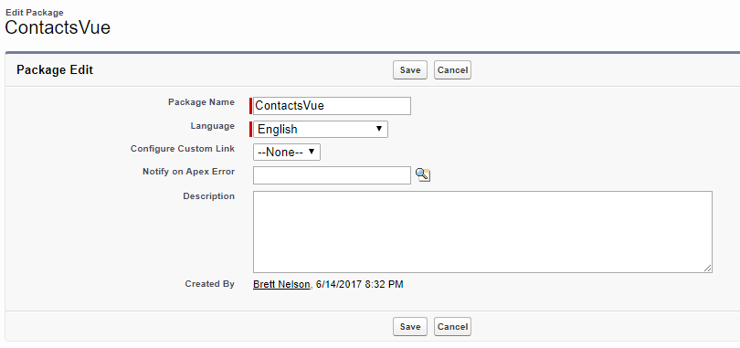
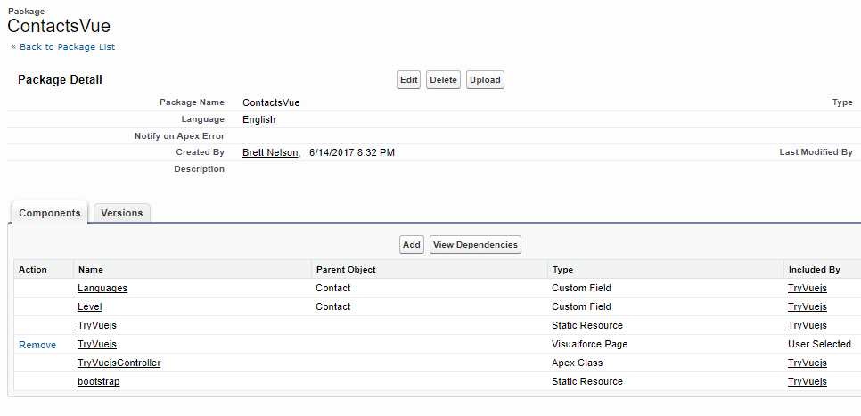
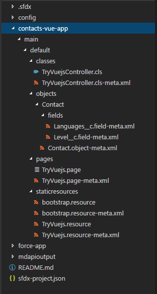
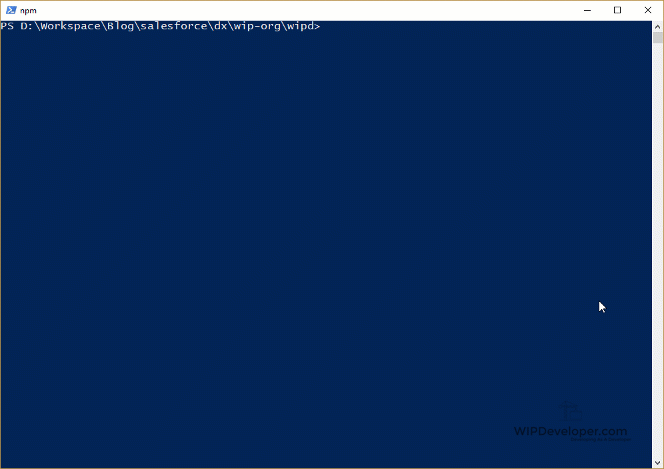

So far we have only looked at using Salesforce DX with example projects set up by the team, thanks SFDX team! or by creating an empty workspace.  But what if you already have an org that contains code?  Lets try to transfer all the code necessary for the [Visualforce with Vue.js](https://wipdeveloper.wpcomstaging.com/2017/03/30/visualforce-with-vue-js/) that was a project we built previously.

## Create Workspace

We are going to try this with a new space just so I don't mess up anything I have previously done.  Don't forget to set your `defaultusername` for the scratch org you want to use  or set the username parameter `-u` on every call.

Pick a nice comfortable location on your disk for where you want to create this workspace and open up your terminal of choice,  I will be using Powershell for now.   We will start by using the `sfdx force:project:create` command with setting the name (`-n`) parameter to `wipd`, you may want to use a different name :)

#### Run `sfdx force:project:create`

PS D:\\Workspace\\Blog\\salesforce\\dx\\wip-org> sfdx force:project:create -n wipd
target dir = D:\\Workspace\\Blog\\salesforce\\dx\\wip-org
   create wipd\\sfdx-project.json
   create wipd\\README.md
   create wipd\\config\\project-scratch-def.json

PS D:\\Workspace\\Blog\\salesforce\\dx\\wip-org>

This should have created a new directory called `wipd`.  Let's  go into that and create a new directory to hold our Metadata API output,  I am going to call mine `mdapioutput`.

#### Create Directory to Put Existing metadata In

PS D:\\Workspace\\Blog\\salesforce\\dx\\wip-org\\wipd> mkdir mdapioutput

Following the SFDX Developer Guide for `Retrieve Unpackage Source By Creating a Temporary Unmanaged Package`, it's on page 20 of the version I am using but that may change in the future,  open the org you want to transfer things out of and go to the Package Manager in Setup.   Create a new Package with the name of your choice.  Since I am transferring everything for the Contacts app build with Vue.js I will call mine  `ContactsVue`

#### Create New Package

Then in the Package detail add the components you want to transfer.  Just like a change set you will need to add each type of item separately.   I grabbed the `TryVuejs.page` first so it added everything that was a dependency too so I should have everything now.

#### All Components Added

Now we go back to our local file system where we created out new workspace and the folder to hold the meta data api and retrieve the `ContactsVue` Package.

## Download New Package

We are goign to download that package you just created from your old org so we can use it with SFDX.  Before we can do that we will need to authorize SFDX to access the old org.  so use the  `sfdx force:auth:web:login` and approve that app...

#### Run Web Auth

PS D:\\Workspace\\Blog\\salesforce\\dx\\wip-org\\wipd> sfdx force:auth:web:login
Successfully authorized Brett@WIPDeveloper.com with org id \*\*\*\*\*\*\*\*\*\*\*\*\*\*\*\*\*\*
You may now close the browser
PS D:\\Workspace\\Blog\\salesforce\\dx\\wip-org\\wipd>

Once authorize we can run the `sfdx force:mdapi:retrieve` command with the directory we created to save it to, the username we just authorized and the name of the package we just created.

PS D:\\Workspace\\Blog\\salesforce\\dx\\wip-org\\wipd> sfdx force:mdapi:retrieve -s -r ./mdapioutput -u brett@WIPDeveloper.com -p ContactsVue
Retrieving source...

=== Status
Status:  InProgress
jobid:  09S0a000I002np6EAE

=== Result
Status:  Succeeded
jobid:  09S0a000I002np6EAE

Wrote retrieve zip to D:\\Workspace\\Blog\\salesforce\\dx\\wip-org\\wipd\\mdapioutput\\unpackaged.zip.
PS D:\\Workspace\\Blog\\salesforce\\dx\\wip-org\\wipd>

Now in out `mdapioutput` directory we should have a file called `unpackaged.zip`.   Let's unzip that and we can delete the original zip file if we want, I'll probably hold onto it until we are done, and now it's time to convert our Metedata API Source to the Salesforce DX workspace format.

 

## Convert Metedata API to SFDX Workspace

To convert the Metedata API Source we should start by verifying that the `packageDirectories`  in the `sfdx-project.json` set as default is where we want to add the package too.  I'm going to add a second package directory and set it to default.  I think I will give it the path of `contacts-vue-app.`

#### Updated  `sfdx-project.json`

{
  "packageDirectories": \[
    {
      "path": "force-app"
    },
    {
      "path": "contacts-vue-app",
      "default": true
    }
  \],
  "namespace": "",
  "sfdcLoginUrl": "https://login.salesforce.com",
  "sourceApiVersion": "40.0"
}

Now we can run the `sfdx force:mdapi:convert` command  specifying `mdapioutput`

#### Run `sfdx force:mdapi:convert`

PS D:\\Workspace\\Blog\\salesforce\\dx\\wip-org\\wipd> sfdx force:mdapi:convert --rootdir mdapioutput
State  Full Name           Type            Project Path
─────  ──────────────────  ──────────────  ────────────────────────────────────────────────────────────────
Add    TryVuejsController  ApexClass       contacts-vue-app\\main\\default\\classes\\TryVuejsController.cls
Add    Contact             CustomObject    contacts-vue-app\\main\\default\\objects\\Contact.object-meta.xml
Add    TryVuejs            ApexPage        contacts-vue-app\\main\\default\\pages\\TryVuejs.page
Add    TryVuejs            StaticResource  contacts-vue-app\\main\\default\\staticresources\\TryVuejs.resource
Add    bootstrap           StaticResource  contacts-vue-app\\main\\default\\staticresources\\bootstrap.resource
PS D:\\Workspace\\Blog\\salesforce\\dx\\wip-org\\wipd>

Now you can see our new `contacts-vue-app` folder and all the Apex, Visualforce, Custom Fields, and Static Resources we brought over.

#### `contacts-vue-app` Directories

 

Now let's push this to a scratch org

#### `sfdx force:source:push`

PS D:\\Workspace\\Blog\\salesforce\\dx\\wip-org\\wipd> sfdx force:source:push
State  Full Name             Type            Project Path
─────  ────────────────────  ──────────────  ────────────────────────────────────────────────────────────────────────────────
Add    TryVuejsController    ApexClass       contacts-vue-app\\main\\default\\classes\\TryVuejsController.cls-meta.xml
Add    TryVuejsController    ApexClass       contacts-vue-app\\main\\default\\classes\\TryVuejsController.cls
Add    Contact               CustomObject    contacts-vue-app\\main\\default\\objects\\Contact\\Contact.object-meta.xml
Add    Contact.Languages\_\_c  CustomField     contacts-vue-app\\main\\default\\objects\\Contact\\fields\\Languages\_\_c.field-meta.xml
Add    Contact.Level\_\_c      CustomField     contacts-vue-app\\main\\default\\objects\\Contact\\fields\\Level\_\_c.field-meta.xml
Add    TryVuejs              ApexPage        contacts-vue-app\\main\\default\\pages\\TryVuejs.page-meta.xml
Add    TryVuejs              ApexPage        contacts-vue-app\\main\\default\\pages\\TryVuejs.page
Add    bootstrap             StaticResource  contacts-vue-app\\main\\default\\staticresources\\bootstrap.resource-meta.xml
Add    bootstrap             StaticResource  contacts-vue-app\\main\\default\\staticresources\\bootstrap.resource
Add    TryVuejs              StaticResource  contacts-vue-app\\main\\default\\staticresources\\TryVuejs.resource-meta.xml
Add    TryVuejs              StaticResource  contacts-vue-app\\main\\default\\staticresources\\TryVuejs.resource
PS D:\\Workspace\\Blog\\salesforce\\dx\\wip-org\\wipd>

Yay!  Our old Vue.js app should now be in our new scratch org ready to run.

## Check It Out

Let's open up our scratch org to the `TryVuejs.page`

#### Load It Up

Yay! It works!

## Conclusion

This has been cool so far.  What do you think we should look at next for Salesforce DX?  Let me know by leaving a comment below, emailing [brett@wipdeveloper.com](mailto:brett@wipdeveloper.com) or following and yelling at me on [Twitter/BrettMN](https://twitter.com/BrettMN).

 

 

## Update: September 10, 2017

Fixed a spelling error, thanks to **A Salesforce Developer** for pointing it out.
