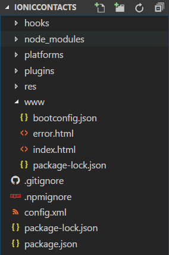
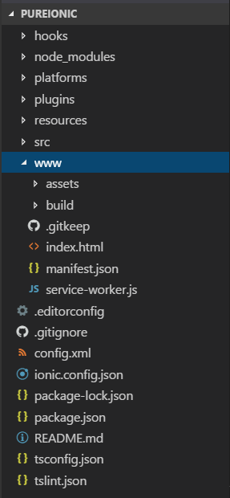
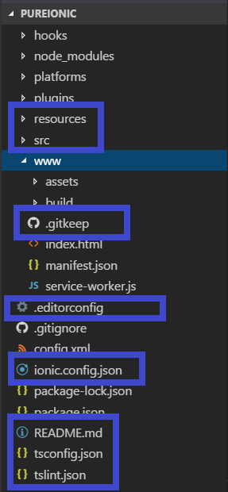
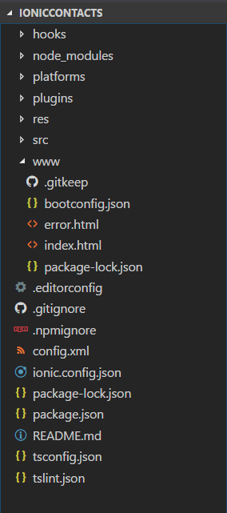

With our goal of using the Salesforce Mobile SDK with the Ionic Framework in mind we have [started the process](https://wipdeveloper.wpcomstaging.com/2017/07/04/saleforce-mobile-sdk-and-ionic-adding-ionic-to-mobile-sdk-part-i/) of adding Ionic into an app generated with `forcedroid`.   Let's continue that now but copying the necessary files and folders over.

## What's The Diff?

If you look at the app we have from [last time](https://wipdeveloper.wpcomstaging.com/2017/07/04/saleforce-mobile-sdk-and-ionic-adding-ionic-to-mobile-sdk-part-i/) you will see in the folder structure a few things are different then what is in the pure Ionic app.

> I have expanded the `www` folder since we will need to copy some of that as well.

#### Salesforce Mobile SDK Generated File Structure

#### Ionic Framework Generated File Structure

#### 

At first glance you may notice that the Ionic app has more files and folders.  So here's what we will do.  Let's copy the following folders from the Ionic app to the Salesforce Mobile SDK app:  `resoruces`, and `src`. Then in the `www` folder copy the `.gitkeep` over.  Finally we will need to copy the `.editorconfig`, `ionic,config.json`, `README.md`, `tsconfig.json`, and the `tslint.json`.

#### Files and Folders to Copy

#### 

The final results of our little copying spree should look something like this.

#### Final Results

#### 

And you may think we are done and ready to `npm install` this app and we are close but not quite there.

## Update `config.xml`

One more thing and we should be ready to run this app.  I'm not going to show the Ionic `config.xml` as it's 100 lines long but the `forcedroid` generated one starts out looking like this.

#### `forcedroid` Generated `config.xml`

<?xml version='1.0' encoding='utf-8'?>
<widget id="com.wipdeveloper.contacts" version="1.0.0" xmlns="http://www.w3.org/ns/widgets" xmlns:cdv="http://cordova.apache.org/ns/1.0">
    <name>contacts</name>
    <description>
        A sample Apache Cordova application that responds to the deviceready event.
    </description>
    <author email="dev@cordova.apache.org" href="http://cordova.io">
        Apache Cordova Team
    </author>
    <content src="index.html" />
    <plugin name="cordova-plugin-whitelist" spec="1" />
    <access origin="\*" />
    <allow-intent href="http://\*/\*" />
    <allow-intent href="https://\*/\*" />
    <allow-intent href="tel:\*" />
    <allow-intent href="sms:\*" />
    <allow-intent href="mailto:\*" />
    <allow-intent href="geo:\*" />
    <platform name="android">
        <allow-intent href="market:\*" />
    </platform>
    <platform name="ios">
        <allow-intent href="itms:\*" />
        <allow-intent href="itms-apps:\*" />
    </platform>
</widget>

We will be copying some `preference`s over along with `icon`s and `splash` definitions for both `android` and `ios`and of course `plugin`.   Our final `config.xml` should look something like this.

#### Final `config.xml`

<?xml version='1.0' encoding='utf-8'?>
<widget id="com.wipdeveloper.contacts" version="1.0.0" xmlns="http://www.w3.org/ns/widgets" xmlns:cdv="http://cordova.apache.org/ns/1.0">
    <name>Ionic Contacts</name>
    <description>
        A sample Salesforce Mobile SDK app that integrates with the Ionic Framework and displays some contacts.
    </description>
    <author email="brett@wipdeveloper.com" href="http://wipdeveloper.wpcomstaging.com">
        Apache Cordova Team
    </author>
    <content src="index.html" />
    <plugin name="cordova-plugin-whitelist" spec="1" />

    <plugin name="ionic-plugin-keyboard" spec="~2.2.1"/>
    <plugin name="cordova-plugin-console" spec="1.0.5"/>
    <plugin name="cordova-plugin-statusbar" spec="2.2.2"/>
    <plugin name="cordova-plugin-device" spec="1.1.4"/>
    <plugin name="cordova-plugin-splashscreen" spec="~4.0.1"/>

    <access origin="\*" />
    <allow-intent href="http://\*/\*" />
    <allow-intent href="https://\*/\*" />
    <allow-intent href="tel:\*" />
    <allow-intent href="sms:\*" />
    <allow-intent href="mailto:\*" />
    <allow-intent href="geo:\*" />

    <preference name="webviewbounce" value="false"/>
    <preference name="UIWebViewBounce" value="false"/>
    <preference name="DisallowOverscroll" value="true"/>
    <preference name="android-minSdkVersion" value="16"/>
    <preference name="BackupWebStorage" value="none"/>
    <preference name="SplashMaintainAspectRatio" value="true"/>
    <preference name="FadeSplashScreenDuration" value="300"/>

    <!--
      Change these to configure how the splashscreen displays and fades in/out.
      More info here: https://github.com/apache/cordova-plugin-splashscreen
    -->
    <preference name="SplashShowOnlyFirstTime" value="false"/>
    <preference name="SplashScreen" value="screen"/>
    <preference name="SplashScreenDelay" value="3000"/>

    <platform name="android">
        <allow-intent href="market:\*" />
        <icon src="resources/android/icon/drawable-ldpi-icon.png" density="ldpi"/>
        <icon src="resources/android/icon/drawable-mdpi-icon.png" density="mdpi"/>
        <icon src="resources/android/icon/drawable-hdpi-icon.png" density="hdpi"/>
        <icon src="resources/android/icon/drawable-xhdpi-icon.png" density="xhdpi"/>
        <icon src="resources/android/icon/drawable-xxhdpi-icon.png" density="xxhdpi"/>
        <icon src="resources/android/icon/drawable-xxxhdpi-icon.png" density="xxxhdpi"/>
        <splash src="resources/android/splash/drawable-land-ldpi-screen.png" density="land-ldpi"/>
        <splash src="resources/android/splash/drawable-land-mdpi-screen.png" density="land-mdpi"/>
        <splash src="resources/android/splash/drawable-land-hdpi-screen.png" density="land-hdpi"/>
        <splash src="resources/android/splash/drawable-land-xhdpi-screen.png" density="land-xhdpi"/>
        <splash src="resources/android/splash/drawable-land-xxhdpi-screen.png" density="land-xxhdpi"/>
        <splash src="resources/android/splash/drawable-land-xxxhdpi-screen.png" density="land-xxxhdpi"/>
        <splash src="resources/android/splash/drawable-port-ldpi-screen.png" density="port-ldpi"/>
        <splash src="resources/android/splash/drawable-port-mdpi-screen.png" density="port-mdpi"/>
        <splash src="resources/android/splash/drawable-port-hdpi-screen.png" density="port-hdpi"/>
        <splash src="resources/android/splash/drawable-port-xhdpi-screen.png" density="port-xhdpi"/>
        <splash src="resources/android/splash/drawable-port-xxhdpi-screen.png" density="port-xxhdpi"/>
        <splash src="resources/android/splash/drawable-port-xxxhdpi-screen.png" density="port-xxxhdpi"/>
    </platform>
    <platform name="ios">
        <allow-intent href="itms:\*" />
        <allow-intent href="itms-apps:\*" />
        <icon src="resources/ios/icon/icon.png" width="57" height="57"/>
        <icon src="resources/ios/icon/icon@2x.png" width="114" height="114"/>
        <icon src="resources/ios/icon/icon-40.png" width="40" height="40"/>
        <icon src="resources/ios/icon/icon-40@2x.png" width="80" height="80"/>
        <icon src="resources/ios/icon/icon-40@3x.png" width="120" height="120"/>
        <icon src="resources/ios/icon/icon-50.png" width="50" height="50"/>
        <icon src="resources/ios/icon/icon-50@2x.png" width="100" height="100"/>
        <icon src="resources/ios/icon/icon-60.png" width="60" height="60"/>
        <icon src="resources/ios/icon/icon-60@2x.png" width="120" height="120"/>
        <icon src="resources/ios/icon/icon-60@3x.png" width="180" height="180"/>
        <icon src="resources/ios/icon/icon-72.png" width="72" height="72"/>
        <icon src="resources/ios/icon/icon-72@2x.png" width="144" height="144"/>
        <icon src="resources/ios/icon/icon-76.png" width="76" height="76"/>
        <icon src="resources/ios/icon/icon-76@2x.png" width="152" height="152"/>
        <icon src="resources/ios/icon/icon-83.5@2x.png" width="167" height="167"/>
        <icon src="resources/ios/icon/icon-small.png" width="29" height="29"/>
        <icon src="resources/ios/icon/icon-small@2x.png" width="58" height="58"/>
        <icon src="resources/ios/icon/icon-small@3x.png" width="87" height="87"/>
        <splash src="resources/ios/splash/Default-568h@2x~iphone.png" width="640" height="1136"/>
        <splash src="resources/ios/splash/Default-667h.png" width="750" height="1334"/>
        <splash src="resources/ios/splash/Default-736h.png" width="1242" height="2208"/>
        <splash src="resources/ios/splash/Default-Landscape-736h.png" width="2208" height="1242"/>
        <splash src="resources/ios/splash/Default-Landscape@2x~ipad.png" width="2048" height="1536"/>
        <splash src="resources/ios/splash/Default-Landscape@~ipadpro.png" width="2732" height="2048"/>
        <splash src="resources/ios/splash/Default-Landscape~ipad.png" width="1024" height="768"/>
        <splash src="resources/ios/splash/Default-Portrait@2x~ipad.png" width="1536" height="2048"/>
        <splash src="resources/ios/splash/Default-Portrait@~ipadpro.png" width="2048" height="2732"/>
        <splash src="resources/ios/splash/Default-Portrait~ipad.png" width="768" height="1024"/>
        <splash src="resources/ios/splash/Default@2x~iphone.png" width="640" height="960"/>
        <splash src="resources/ios/splash/Default~iphone.png" width="320" height="480"/>
    </platform>
</widget>

> I did take this time as a chance to update the `author` information along with the `name`, and `description`.  You don't have to do this unless you really like to personalize things :)

I've highlighted what I added to the `config.xml` so if you like you can look at the one generated with the Ionic to see what we used.

With that we are done copying and pasting.... for now... mwahahaha  ok, no really we should be done.

## Conclusion

We are on the verge of running our Salesforce Mobile SDK app with the Ionic Framework.  Come back next time to see how it goes!

Don't forget to sign up for [**The Weekly Stand-Up!**](https://wipdeveloper.wpcomstaging.com/newsletter/) to receive free the [WIP Developer.com](https://wipdeveloper.wpcomstaging.com/) weekly newsletter every Sunday!
