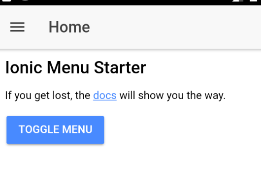

Over the last few posts we have integrated our Ionic Framework app into our Salesforce Mobile SDK app.  All that's left now is to run it.... after a few more things

## NPM Install

You may be thinking this should go without saying as we [added dependencies](https://wipdeveloper.wpcomstaging.com/2017/07/04/saleforce-mobile-sdk-and-ionic-adding-ionic-to-mobile-sdk-part-i/) to the `package.json` file but are going to need to run `npm install` so let's get started by doing that now.

#### `npm install`

```
PS D:\Workspace\Blog\salesforce\ionic\ionicContacts> npm install
npm WARN deprecated object-keys@0.2.0: Please update to the latest object-keys

> node-sass@4.5.3 install D:\Workspace\Blog\salesforce\ionic\ionicContacts\node_modules\node-sass
> node scripts/install.js

Cached binary found at C:\Users\brettmn\AppData\Roaming\npm-cache\node-sass\4.5.3\win32-x64-48_binding.node

> node-sass@4.5.3 postinstall D:\Workspace\Blog\salesforce\ionic\ionicContacts\node_modules\node-sass
> node scripts/build.js

Binary found at D:\Workspace\Blog\salesforce\ionic\ionicContacts\node_modules\node-sass\vendor\win32-x64-48\binding.node
Testing binary
Binary is fine
npm WARN optional SKIPPING OPTIONAL DEPENDENCY: fsevents@1.1.2 (node_modules\fsevents):
npm WARN notsup SKIPPING OPTIONAL DEPENDENCY: Unsupported platform for fsevents@1.1.2: wanted {"os":"darwin","arch":"any"} (current: {"os":"w
in32","arch":"x64"})

added 810 packages in 68.14s
PS D:\Workspace\Blog\salesforce\ionic\ionicContacts>
```

## Install Plugins

In the `config.xml` some of the values we copied over from the pure Ionic were for plugins.  Lets add each of the following plugins through the CLI.

- `ionic-plugin-keyboard`
- `cordova-plugin-console`
- `cordova-plugin-statusbar`
- `cordova-plugin-device`
- `cordova-plugin-splashscreen`

For each plugin use the `cordova plugin add {{plugin name here}}` command to add it to the app.

#### Example Plugin Add

```
PS D:\Workspace\Blog\salesforce\ionic\ionicContacts> cordova plugin add cordova-plugin-console
Fetching plugin "cordova-plugin-console@1.0.5" via npm
Installing "cordova-plugin-console" for android
PS D:\Workspace\Blog\salesforce\ionic\ionicContacts>
```

Just do that for each plugin and when you are done we will remove the Salesforce plugin with the `cordova plugin remove com.salesforce` command.

#### Remove Salesforce Mobile SDK Plugin

```
PS D:\Workspace\Blog\salesforce\ionic\ionicContacts> cordova plugin remove com.salesforce
Uninstalling 1 dependent plugins.
Uninstalling phonegap-plugin-push from android
Subproject Path: CordovaLib
Uninstalling com.salesforce from android
Removing "com.salesforce"
PS D:\Workspace\Blog\salesforce\ionic\ionicContacts>
```

With that gone we will re-add the Salesforce plugin with the `cordova plugin add https://github.com/forcedotcom/SalesforceMobileSDK-CordovaPlugin --force` command.

#### Add Salesforce Mobile SDK Plugin

```
PS D:\Workspace\Blog\salesforce\ionic\ionicContacts> cordova plugin add https://github.com/forcedotcom/SalesforceMobileSDK-CordovaPlugin --force
Fetching plugin "https://github.com/forcedotcom/SalesforceMobileSDK-CordovaPlugin" via git clone
Repository "https://github.com/forcedotcom/SalesforceMobileSDK-CordovaPlugin" checked out to git ref "master".
Installing "com.salesforce" for android
Dependent plugin "cordova-plugin-whitelist" already installed on android.
Dependent plugin "cordova-plugin-device" already installed on android.
Fetching plugin "https://github.com/phonegap/phonegap-plugin-push" via git clone
Repository "https://github.com/phonegap/phonegap-plugin-push" checked out to git ref "1.5.0".
Installing "phonegap-plugin-push" for android
Subproject Path: CordovaLib
--force is used. edit-config will overwrite conflicts if any. Conflicting plugins may not work as expected.
Running SalesforceMobileSDK plugin android post-install script
Moving Salesforce libraries to the correct location
Fixing Gradle dependency paths in Salesforce libraries
Fixing root level Gradle file for the generated app
include ":SalesforceAnalytics"

include ":SalesforceSDK"

include ":SmartStore"

include ":SmartSync"

include ":SalesforceHybrid"

Moving Gradle wrapper files to application directory
Fixing application build.gradle
Done running SalesforceMobileSDK plugin android post-install script
PS D:\Workspace\Blog\salesforce\ionic\ionicContacts>
```

With that we should be done with all the set up stuff.

## Prepare and Run

We are at the point were we are ready to run the `build` script.  At this point we could add the ios platform to our app if we were using a mac.  The command to add ios is `cordova platform add ios@4.3.0`

Lets run the Ionic build script with `npm run build`.

#### `npm run build` in Action

```
PS D:\Workspace\Blog\salesforce\ionic\ionicContacts> npm run build

> com.wipdeveloper.ioniccontacts@1.0.0 build D:\Workspace\Blog\salesforce\ionic\ionicContacts
> ionic-app-scripts build

[23:41:06]  ionic-app-scripts 1.3.12
[23:41:06]  build dev started ...
[23:41:07]  clean started ...
[23:41:07]  clean finished in 2 ms
[23:41:07]  copy started ...
[23:41:07]  transpile started ...
[23:41:09]  transpile finished in 2.21 s
[23:41:09]  preprocess started ...
[23:41:09]  deeplinks started ...
[23:41:09]  deeplinks finished in 11 ms
[23:41:09]  preprocess finished in 13 ms
[23:41:09]  webpack started ...
[23:41:09]  copy finished in 2.39 s
[23:41:16]  webpack finished in 7.31 s
[23:41:16]  sass started ...
[23:41:17]  sass finished in 787 ms
[23:41:17]  postprocess started ...
[23:41:17]  postprocess finished in 4 ms
[23:41:17]  lint started ...
[23:41:17]  build dev finished in 10.36 s
[23:41:25]  lint finished in 8.03 s
PS D:\Workspace\Blog\salesforce\ionic\ionicContacts>
```

With that done let's run `cordova prepare`.  This will copy the files needed for the platforms to build.

After the `cordova prepare` runs it's time to open each platform in their respective IDE to build and run.  We did this for [android here.](https://wipdeveloper.wpcomstaging.com/2017/06/29/saleforce-mobile-sdk-ionic-first-run/)

Once the app opens up it should look familiar if you followed along with [Saleforce Mobile SDK and Ionic – Setup the Ionic Framework](https://wipdeveloper.wpcomstaging.com/2017/07/03/saleforce-mobile-sdk-ionic-setup-ionic-framework/)

#### Ionic Contacts First Run



Yay, it's an app!

## Conclusion

Now we have an app that has both the Salesforce Mobile SDK and the Ionic Framework.  We should do something to get data out of Salesforce next to see if we messed anything up.

Don’t forget to sign up for [**The Weekly Stand-Up!**](https://wipdeveloper.wpcomstaging.com/newsletter/) to receive free the [WIP Developer.com](https://wipdeveloper.wpcomstaging.com/) weekly newsletter every Sunday!
