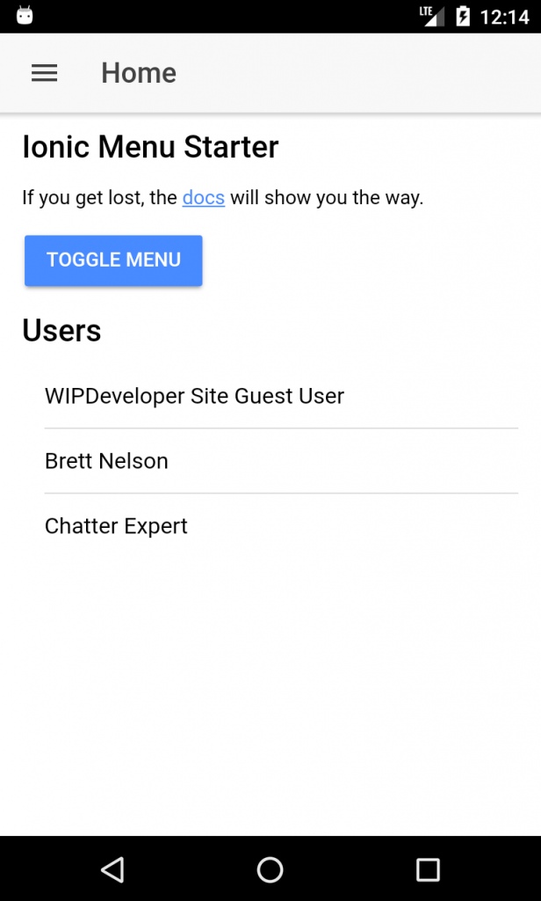

We have an app that has both the Salesforce Mobile SDK and the Ionic Framework and it [runs](https://wipdeveloper.wpcomstaging.com/2017/07/06/saleforce-mobile-sdk-ionic-adding-ionic-mobile-sdk-part-iii/)!  Before we can really call it a success we should get it to list the users for the Org similar to the app [created with just `forcedroid`](https://wipdeveloper.wpcomstaging.com/2017/06/29/saleforce-mobile-sdk-ionic-first-run/).  How about we add the user list to display on the home page?

## Add ForceJS

The Salesforce Mobile SDK app starts out with a version of [ForceJS](https://github.com/ccoenraets/forcejs).  Since we didn't keep that copy and we want to be able to use TypeScript `import` statements we will be adding ForceJS through NPM.

#### `npm install forcejs --save`

PS D:\\Workspace\\Blog\\salesforce\\ionic\\ionicContacts> npm install forcejs --save
npm WARN optional SKIPPING OPTIONAL DEPENDENCY: fsevents@1.1.2 (node\_modules\\fsevents):
npm WARN notsup SKIPPING OPTIONAL DEPENDENCY: Unsupported platform for fsevents@1.1.2: wanted {"os":"darwin","arch":"any"} (current: {"os":"win
32","arch":"x64"})

+ forcejs@2.0.5
added 115 packages in 9.448s
PS D:\\Workspace\\Blog\\salesforce\\ionic\\ionicContacts>

> If you want to know more about ForceJS there are some post available were we used it with previous topics [**here**](https://wipdeveloper.wpcomstaging.com/tag/forcejs/).

With ForceJS installed we can start updating our TypeScript

## Update `home.ts`

First thing we will need to do is import the `OAuth` and `DataService` from ForceJS.   We will do this at the top of the `home.ts` so we can access the them later in the body of our class.

#### Import Statement

import { OAuth, DataService } from 'forcejs';

In the `HomePage` class we will need to add a property to save the users to, let's add one called `users` of type `any`.

#### Define `users`

users: any;

We will also a method to load the users, I think I will call it `loadUsers` but if you have a better name feel free to use that :)  This method will create an OAuth instance, call login on that instance.   Then in the promise results of that `login` we will create an instance of the `DataService` by passing in the results of the oauth login.  We will then be able to use this service to execute a query that will return a promise that results should contain the users. we queried for.

Sound complicated yet?

#### `loadUsers` Method

loadUsers() {
  let oauth = OAuth.createInstance();

  oauth.login()
    .then(oauthResult => {
      let service = DataService.createInstance(oauthResult);

      service.query('SELECT Id, Name FROM User LIMIT 10')
        .then(response => {

          this.users = response.records;
        });
    });
}

This is storing the results on our `user` property we defined on line `11` so we will need to update `home.html` as well if we want to see anything.  First though, let's add a call to `this.loadUsers()` in the constructor so that we load the users when ever the page is opened.

#### Updated `constructor`

constructor(public navCtrl: NavController) {
  this.loadUsers()
}

## Update `home.html`

With the controller update we will need to update the html for the Home tab to display the users.

This will be somewhat easy.  I'm going to add an `h3` to have a heading for the user list then an `ion-list` that contains a div with an `ion-ion` that has an `*ngFor` on it to repeat over the users.  Then we will bind the `user.Name` as the text on the repeated `ion-item.` Something like lines `19` - `24` bellow.

####  Update `home.html`

<ion-header>
  <ion-navbar>
    <button ion-button menuToggle>
      <ion-icon name="menu"></ion-icon>
    </button>
    <ion-title>Home</ion-title>
  </ion-navbar>
</ion-header>

<ion-content padding>
  <h3>Ionic Menu Starter</h3>

  

    If you get lost, the <a href="http://ionicframework.com/docs/v2">docs</a> will show you the way.
  

  <button ion-button secondary menuToggle>Toggle Menu</button>

  <h3>Users</h3>
  <ion-list>
    <ion-item \*ngFor="let user of users">
      {{user.Name}}
    </ion-item>
  </ion-list>

</ion-content>

Now we should be ready to see our user list again.

## Run The App

Now you should be just a quick `npm run build` and `cordova prepare` away from being able to run this in Android Studio.

#### Use List on Home Page

 

## Conclusion

All that work and we just got back the feature we started with.  Now we can start adding new things, like our Contacts Page!

Don’t forget to sign up for [**The Weekly Stand-Up!**](https://wipdeveloper.wpcomstaging.com/newsletter/) to receive free the [WIP Developer.com](https://wipdeveloper.wpcomstaging.com/) weekly newsletter every Sunday!
