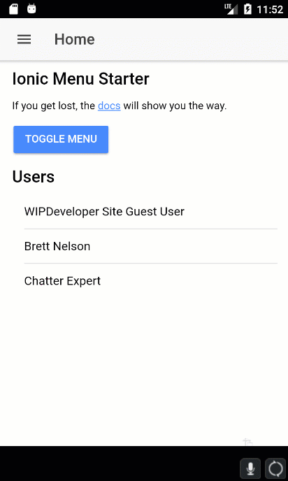

We now have a [working app that can get data from Salesforce](https://wipdeveloper.wpcomstaging.com/2017/07/10/saleforce-mobile-sdk-ionic-adding-ionic-mobile-sdk-part-iv/)!  Let's start customizing it to suit our needs.  In this case that means we will load up a list of Contacts.  Since Contacts seems like it should be it's own thing let's start by adding a new page just for our Contacts.

## Create Page

The Ionic CLI provides us with a way to add, or generate, new portions of our app.  This frees us from worrying if we copied and pasted it correctly or __gasp__ remember the proper structure to type it out by hand.

Since I like repeatable and consistency over artisan handcrafted I will use the Ionic CLI's `generate` command.  The structure of the command is pretty simple `ionic generate <type> <name>`.  It can be used without specifying the `type` or the `name` if done this way you will be prompted to select the `type` and provide the `name`.    Types that can be generated are: `component`, `directive`, `page`, `pipe`, `provider`, `tabs.`

Since we know we want to create a Contacts page lets just cut to the chase with `ionic generate page contacts`.

#### `ionic generate page contacts`

PS D:\\Workspace\\Blog\\salesforce\\ionic\\ionicContacts> ionic generate page contacts
\[OK\] Generated a page named contacts!
PS D:\\Workspace\\Blog\\salesforce\\ionic\\ionicContacts>

Now if we load the all back up we wont see our new page on the menu.   Lets fix that.

## Add Page to Menu

Open up your `src/app/app.component.ts` and look for lines `6` and `7`.   The components for `home` and `list` are being imported here.  We will need to do the same with our `contacts` component on line `8.`

#### Updated Component Imports

import { HomePage } from '../pages/home/home';
import { ListPage } from '../pages/list/list';
import { ContactsPage } from '../pages/contacts/contacts';

With that imported we will need add it to the pages array that is at lines `24` - `27`.

#### Updated Pages Array

this.pages = \[
  { title: 'Home', component: HomePage },
  { title: 'List', component: ListPage },
  { title: 'Contacts', component: ContactsPage }
\];

Now let's reload our app and see if we get our Contacts page as a menu option.

If you were to use the `Contacts` menu item you would get an error about not having a `entryComponent` defined.  I didn't get a screen shot of it but let's deal with it anyway,

Open up your `src/app/app.module.ts` and add an import statement for our `Contacts` component on line `8` like we did on the `src/app/app.component.ts`.  We will then add this to the `declarations` array at line `18` and the `entryComponents` array at line `29`.

#### Updated `app.module.ts`

import { BrowserModule } from '@angular/platform-browser';
import { ErrorHandler, NgModule } from '@angular/core';
import { IonicApp, IonicErrorHandler, IonicModule } from 'ionic-angular';

import { MyApp } from './app.component';
import { HomePage } from '../pages/home/home';
import { ListPage } from '../pages/list/list';
import { ContactsPage } from '../pages/contacts/contacts';

import { StatusBar } from '@ionic-native/status-bar';
import { SplashScreen } from '@ionic-native/splash-screen';

@NgModule({
  declarations: \[
    MyApp,
    HomePage,
    ListPage,
    ContactsPage
  \],
  imports: \[
    BrowserModule,
    IonicModule.forRoot(MyApp),
  \],
  bootstrap: \[IonicApp\],
  entryComponents: \[
    MyApp,
    HomePage,
    ListPage,
    ContactsPage
  \],
  providers: \[
    StatusBar,
    SplashScreen,
    {provide: ErrorHandler, useClass: IonicErrorHandler}
  \]
})
export class AppModule {}

Now if we run the app things should go a little more smoothly.

#### Contacts Page In Action

## Conclusion

We now have a page to start adding our Contacts content to and it even loads!

Don’t forget to sign up for [**The Weekly Stand-Up!**](https://wipdeveloper.wpcomstaging.com/newsletter/) to receive free the [WIP Developer.com](https://wipdeveloper.wpcomstaging.com/) weekly newsletter every Sunday!
