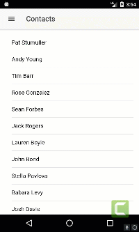

So far we have a big [list of contacts](https://wipdeveloper.wpcomstaging.com/2017/07/18/saleforce-mobile-sdk-ionic-display-contacts/) but what if we wanted to display just the details for one contact?  Most of what is required we have already done but I don't want to just magically _poof_ the page into existence so lets add it real quick.

## Update `ContactsServiceProvider`

In the `ContactsServiceProvider` lets add a new method called `getContact` that has one parameter named `id` of type `string`.   It will be almost the same as `loadContacts` but the query will ask for more detail and include a `WHERE` clause to get just the one contact with the `id` that is passed in.  Get it?

#### `getContact(id:string)`

getContact(id:string) {
  let oauth = OAuth.createInstance();

  return oauth.login()
    .then(oauthResult => {
      let service = DataService.createInstance(oauthResult);

      return service.query(\`SELECT Id, FirstName, LastName, Name, Email, MobilePhone FROM Contact WHERE Id = '${id}'\`);

    });
}

This returns a promise so lets add the a `ContactDetails` page to call it and make use of the promise.

## Add `ContactDetails` Page

To add a `ContactDetails` page we will add a page like we did when we [added the `Contacts` page](https://wipdeveloper.wpcomstaging.com/2017/07/11/saleforce-mobile-sdk-ionic-create-contacts-page/).  The main difference will be we will call it `ContactDetails` and not `Contacts`.  So let's use Generate and add it now with `ionic generate page contactDetails`.

> Don't forget to `import` the `ContactDetailsPage` from `'../pages/contact-details/contact-details'` and add it to the `declarations` and `entryComponents` in the `src/app/app.module.ts` like we did with the [`contacts` page](https://wipdeveloper.wpcomstaging.com/2017/07/11/saleforce-mobile-sdk-ionic-create-contacts-page/).

In the `contact-details.ts` file we will need to import the `ContactsServiceProvider` and inject it into the `constructor` as `private` with a name of `service` ([sound familiar?](https://wipdeveloper.wpcomstaging.com/2017/07/18/saleforce-mobile-sdk-ionic-display-contacts/)).  Then we can create a method that calls the `this.service.getContact` method, let's call it `getContact` and have it take one parameters named `id` of type `string`.  The `id` we will pass to the `service.getContact` method and then we will handle the promise by storing the first item from the `results.records` on a property called `contact`.

> BTW you should create a property called `contact` of type `any`.

We will need to call the new method from the `ionViewDidLoad` method.  To get the id we will get it from the `navParams.data` by passing in the name we expect the parameter to be like this `this.navParams.data['id']`.

#### Complete `contact-details.ts`

import { Component } from '@angular/core';
import { IonicPage, NavController, NavParams } from 'ionic-angular';

import { ContactsServiceProvider } from '../../providers/contacts-service/contacts-service';

@IonicPage()
@Component({
  selector: 'page-contact-details',
  templateUrl: 'contact-details.html',
})
export class ContactDetailsPage {

  contact:any;

  constructor(public navCtrl: NavController, public navParams: NavParams, private service: ContactsServiceProvider) {
  }

  ionViewDidLoad() {
    console.log('ionViewDidLoad ContactDetailsPage');

    this.getContact(this.navParams.data\['id'\]);
  }
  
  getContact(id:string){
    this.service.getContact(id)
    .then(results =>{
      
      this.contact = results.records\[0\];
    })
  }
}

> I removed the comments about it being a generated class to would take up less space

Now we will need to update the html template to make use of the contact that we load when the view loads.   We will use the `Name` from the `contact` in the `ion-header` an use an `ion-icon` to give it a little _flair_.  Then

#### Complete `contact-details.html`

<ion-header>
  <ion-navbar>
    <button ion-button menuToggle>
      <ion-icon name="menu"></ion-icon>
    </button>
    <ion-title>
      <ion-icon name="contact"></ion-icon> {{contact.Name}}</ion-title>
  </ion-navbar>
</ion-header>

<ion-content padding>
  

    <h3>First Name</h3>
    
{{contact.FirstName}}

    <h3>Last Name</h3>
    
{{contact.LastName}}

    <h3>Email</h3>
    
{{contact.Email}}

    <h3>Mobile Phone</h3>
    
{{contact.MobilePhone}}

  

</ion-content>

> If you are wondering about the `*ngIf="contact"` we only want to show the elements that require the contacts properties when it's been populated so we don't get an error.   There may be a better way to handle this but for now it works :)

Now we just need to be able to navigate to our `contactDetails` page.

## Update `Contacts` Page

To add a way to navigate to the `contactDetails` page we are going to add a method to our `ContactsPage` class.  If will be called something along the lines of `selectContact` and take one parameter named `id` of type `string`.   It will then use `this.navCtrl` that was stored with the `constructor` to `push` a `ContactDetailsPage` onto the Navigation Stack along with an object that has a property of `"id"` that we give the value of the `id` that was passed in.  This is where the `id` that is used to load the contact on the `contactDetails` page is specified.

> We will need to `import` the `ContactDetailsPage`  from `'../contact-details/contact-details'` to get access to it.

#### `selectContact` Method

selectContact(id:string){
  this.navCtrl.push(ContactDetailsPage, {"id": id} );
}

The last thing we need to do is bind the `selectContact` method to the `click` event of the `ion-item` in the html template while passing in the current `contact`'s `Id`.

#### Updated HTML Template `ion-item`

<ion-item \*ngFor="let contact of contacts" (click)="selectContact(contact.Id)">
  {{ contact.Name }} 
</ion-item

That's it!

Let's see it in action!

#### Action!

#### 

## Conclusion

Now we can see individual detail for each contact, isn't that nice?

Don’t forget to sign up for [**The Weekly Stand-Up!**](https://wipdeveloper.wpcomstaging.com/newsletter/) to receive free the [WIP Developer.com](https://wipdeveloper.wpcomstaging.com/) weekly newsletter every Sunday!

Looking for the code and want to follow along?  Find it on [GitHub.com/BrettMN/salesforce-sdk-mobile-with-ionic-starter](https://github.com/BrettMN/salesforce-sdk-mobile-with-ionic-starter)
