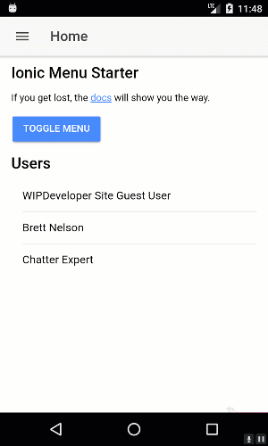

Since we can now [query Salesforce to get an array of `contacts`](https://wipdeveloper.wpcomstaging.com/2017/07/17/saleforce-mobile-sdk-ionic-query-contacts/) we should probably make use of them on our Contacts page.

## Update Contacts Component

Open up your `ContactsPage` class.  We are going to import the `ContactsServiceProvider` from `'../../providers/contacts-service/contacts-service'`.  Then we will add parameter to the `constructor` that that is `private` named `service` and has a type of `ContactsServiceProvider`.

> The `private` keyword is a way to tell TypeScript to store the variable on the class as privately accessible without having to do the extra work of declaring the variable to hold the object or assign it ourselves.

With access to the service we will need a  method named something along the lines of `loadContacts` that will call the `service.loadContacts` and handle the resulting promise.  In this case we will just store the `records` of the `results` on an array of objects called `contacts`.  Now would be a good time to add an property named `contacts` that has a type of `Array<{ Id: string, Name: any }>` this means that each item in the array should have an `Id` that is a `string` and a `Name` that is a `string`.

The whole class should look like this:

#### Updated `src/pages/contacts/contacts.ts`

import { Component } from '@angular/core';
import { IonicPage, NavController, NavParams } from 'ionic-angular';

import { ContactsServiceProvider } from '../../providers/contacts-service/contacts-service';

/\*\*
 \* Generated class for the ContactsPage page.
 \*
 \* See http://ionicframework.com/docs/components/#navigation for more info
 \* on Ionic pages and navigation.
 \*/
@IonicPage()
@Component({
  selector: 'page-contacts',
  templateUrl: 'contacts.html',
})
export class ContactsPage {

  contacts: Array<{ Id: string, Name: any }>;

  constructor(public navCtrl: NavController, public navParams: NavParams, private service: ContactsServiceProvider) {
  }

  ionViewDidLoad() {
    console.log('ionViewDidLoad ContactsPage');

    this.loadContacts();
  }

  loadContacts() {
    this.service.loadContacts()
      .then(results => {
        console.log(results)
        this.contacts = results.records
      })
  }

}

Now we should update the html template to display those contacts.

## Update Contacts Html Template

To display those `contacts` we just queried Salesforce for we are going to for `*ngFor` to loop through the array and display the name for each contact but first let's add the navigation menu to the ion-header so we can leave the page at some point.

In the `ion-header` add a `button` with `ion-button` and `menuToggle` attributes.  Inside the `button` use an `ion-icon` with a name of menu.   The updated `ion-header` should look like this:

#### Update ion-header

<ion-header>
  <ion-navbar>
    <button ion-button menuToggle>
      <ion-icon name="menu"></ion-icon>
    </button>
    <ion-title>Contacts</ion-title>
  </ion-navbar>
</ion-header>

> ok I also capitalized the C in Contacts, you caught me.

Ok In the `ion-content` element let's add an `ion-list` that has an `ion-item` with an `*ngFor` that declares an `contact` for each `contacts.`  The `ion-item` will then use the `contact` to display it's `Name`.  If this looks familiar it's what we did to [verify things were working](https://wipdeveloper.wpcomstaging.com/2017/07/10/saleforce-mobile-sdk-ionic-adding-ionic-mobile-sdk-part-iv/) with the `users`.

#### Updated ion-content

<ion-content padding>

  <ion-list>
    <ion-item \*ngFor="let contact of contacts">
      {{ contact.Name }}
    </ion-item>
  </ion-list>

</ion-content>

Now we should be able to rebuild our app and see our Contacts.

#### Contacts In Action

## Conclusion

With this method in place lets update our Contacts page component and html template next time.

Don’t forget to sign up for [**The Weekly Stand-Up!**](https://wipdeveloper.wpcomstaging.com/newsletter/) to receive free the [WIP Developer.com](https://wipdeveloper.wpcomstaging.com/) weekly newsletter every Sunday!

Looking for the code and want to follow along?  Find it on [GitHub.com/BrettMN/salesforce-sdk-mobile-with-ionic-starter](https://github.com/BrettMN/salesforce-sdk-mobile-with-ionic-starter)
