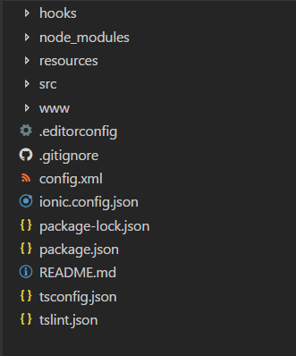
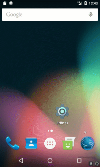

So far we have [setup our Org](https://wipdeveloper.wpcomstaging.com/2017/06/28/saleforce-mobile-sdk-ionic-setup-org/) and [ran a sample Salesforce Mobile SDK app](https://wipdeveloper.wpcomstaging.com/2017/06/29/saleforce-mobile-sdk-ionic-first-run/) against it.   Now it didn't look too pretty and things might get a little un-organized if we stick with what the Mobile SDK came with out of the box.  That's where the Ionic Framework is going to help us.  As stated in the [intro post](https://wipdeveloper.wpcomstaging.com/2017/06/26/saleforce-mobile-sdk-ionic-intro/) the Ionic Framework helps developer Native looking apps with Angular.  This will help us with both the look of the app and the way the code is organized.

## Install Ionic

The install is pretty easy `npm install ionic -g`, lets see how it would go.

#### `npm install ionic -g`

PS D:\\Workspace\\Blog\\salesforce\\ionic\\ionic-sfdc> npm install ionic -g
C:\\Users\\brettmn\\AppData\\Roaming\\npm\\ionic -> C:\\Users\\brettmn\\AppData\\Roaming\\npm\\node\_modules\\ionic\\bin\\ionic
+ ionic@3.4.0
added 128 packages in 7.281s
PS D:\\Workspace\\Blog\\salesforce\\ionic\\ionic-sfdc>

ok so far so painless.  Now what can we do?

## Info

If you want to see what you can do with the Ionic cli just run `ionic` with no commands or parameters and get a brief overview.

#### `ionic`

PS D:\\Workspace\\Blog\\salesforce\\ionic\\ionic-sfdc> ionic
   \_             \_
  (\_)           (\_)
   \_  \_\_\_  \_ \_\_  \_  \_\_\_
  | |/ \_ \\| '\_ \\| |/ \_\_|
  | | (\_) | | | | | (\_\_
  |\_|\\\_\_\_/|\_| |\_|\_|\\\_\_\_|  CLI 3.4.0

  Usage:

    $ ionic <command> \[--help\] \[--verbose\] \[--quiet\] \[<args>\] \[options\]
    $ ionic \[--confirm\] \[--no-interactive\] \[--yarn\] \[--no-timeout\]

  Global Commands:

    docs ..................... Open the Ionic documentation website
    info ..................... Print system/environment info
    login .................... Login with your Ionic ID
    signup ................... Create an Ionic account
    start .................... Create a new project
    telemetry ................ Opt in and out of telemetry

  Project Commands:

    generate ................. Generate pipes, components, pages, directives, providers, and
                               tabs (ionic-angular >= 3.0.0) (alias: g)
    link ..................... Connect your local app to Ionic
    serve .................... Start a local dev server for app dev/testing
    upload ................... Upload a new snapshot of your app
    cordova build ............ Build (prepare + compile) an Ionic project for a given platform
    cordova compile .......... Compile native platform code
    cordova emulate .......... Emulate an Ionic project on a simulator or emulator
    cordova platform ......... Manage Cordova platform targets
    cordova plugin ........... Manage Cordova plugins
    cordova prepare .......... Transform metadata to platform manifests and copies assets to
                               Cordova platforms
    cordova resources ........ Automatically create icon and splash screen resources
    cordova run .............. Run an Ionic project on a connected device
    package build ............ Start a package build
    package download ......... Download your packaged app
    package info ............. Get info about a build
    package list ............. List your cloud builds

PS D:\\Workspace\\Blog\\salesforce\\ionic\\ionic-sfdc>

Of cource full documentation can be found at the website at [ionicframework.com/docs/](http://ionicframework.com/docs/)

Now let's create something.

## Create an Ionic App

In the directory you want to create the app folder we are going to run `ionic start myApp sidemenu` and what this is going to do is create a new folder that contains your app.  That folder will be called `myApp`.  Ionic will use a template called `sidemenu` to create the app.  The `sidemenu` template looks had a menu that slides out from the side.  You have probably seen numerous apps that use this style of layout.

#### Run `ionic start myApp sidemenu`

PS D:\\Workspace\\Blog\\salesforce\\ionic> ionic start myApp sidemenu
✔ Creating directory .\\myApp - done!
\[INFO\] Fetching app base (https://github.com/ionic-team/ionic2-app-base/archive/master.tar.gz)
✔ Downloading - done!
\[INFO\] Fetching starter template sidemenu
       (https://github.com/ionic-team/ionic2-starter-sidemenu/archive/master.tar.gz)
✔ Downloading - done!
✔ Updating package.json with app details - done!
✔ Creating configuration file ionic.config.json - done!
\[INFO\] Installing dependencies may take several minutes!
> npm install
✔ Running command - done!
> npm install --save-dev --save-exact @ionic/cli-plugin-ionic-angular@latest
✔ Running command - done!
> git init
✔ Running command - done!
> git add -A
✔ Running command - done!
> git commit -m "Initial commit" --no-gpg-sign
✔ Running command - done!

♬ ♫ ♬ ♫  Your Ionic app is ready to go! ♬ ♫ ♬ ♫

Run your app in the browser (great for initial development):
  ionic serve

Run on a device or simulator:
  ionic cordova run ios

Test and share your app on a device with the Ionic View app:
  http://view.ionic.io

? Link this app to your Ionic Dashboard to use tools like Ionic View? No

Go to your newly created project: cd .\\myApp

After running the command the only interaction was before it finished it asked if I wanted to like the app to my Ionic Dashboard.  I chose no,  feel free to choose differently.

Now we can go into the folder and see the app we have created.

## Our New App

The folder structure should look familiar if you [created the Mobile SDK](https://wipdeveloper.wpcomstaging.com/2017/06/27/saleforce-mobile-sdk-ionic-setup-mobile-sdk/) app with us previously.

#### Folder Structure

And we should be able to add a platform with `ionic cordova platform add android` and run it with `ionic cordova run android` or you can build it with `ionic cordova build android` and open the `platform/android` folder with Android Studio with the `Import project (Eclipse ADT,  Gradle, ect)` method.  This will allow you to run it from Android Studio.

Either way you should end up with something like this in your Android Emulator or Device.

#### myApp Running

## Conclusion

We now have a sample app made with Ionic and one made from the Salesforce Mobile SDK.  Our next step will be to see what we need to do to combine the two.  Then we will have an app that can use the Mobile SDK styled by the Ionic Framework.

Be sure you sign up for [**The Weekly Stand-Up!**](https://wipdeveloper.wpcomstaging.com/newsletter/) to receive free the WIP Developer.com weekly newsletter every Sunday!
