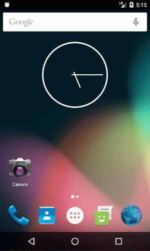

The other day they released a new update for the Salesforce Mobile SDK.   Let' take a look at what it takes to update versions.

## Install Updated Forcedroid

First thing we should do is upgrade our Forcedroid by using NPM .

#### Upgrade Forcedroid Command

PS D:\\Workspace\\Blog\\salesforce\\ionic\\ionicContacts> npm install forcedroid -g
C:\\Users\\brettmn\\AppData\\Roaming\\npm\\forcedroid -> C:\\Users\\brettmn\\AppData\\Roaming\\npm\\node\_modules\\forcedroid\\forcedroid.js
+ forcedroid@5.2.0
updated 15 packages in 2.466s
PS D:\\Workspace\\Blog\\salesforce\\ionic\\ionicContacts>

Now is the fun part of working with the Salesforce Mobile SDK.

## Create a New Forcedroid App

We can't do an in-place upgrade of the our app with the Salesforce Mobile SDK plugin installed so we will have to create a new app.

#### `forcedroid create --apptype=hybrid_local --appname=contacts --packagename=com.wipdeveloper.contacts --organization="WIP Developer.com" --outputdir=ionicContacts-updated`

PS D:\\Workspace\\Blog\\salesforce\\ionic> forcedroid create --apptype=hybrid\_local --appname=contacts --packagename=com.wipdeveloper.contacts --organization="WIP Developer.com" --outputdir=ionicContacts-updated

\*\*\*\*\*\*\*\*\*\*\*\*\*\*\*\*\*\*\*\*\*\*\*\*\*\*\*\*\*\*\*\*\*\*\*\*\*\*\*\*\*\*\*\*\*\*\*\*\*\*\*\*\*\*\*\*\*\*\*\*\*\*\*\*\*\*\*\*\*\*\*\*\*\*\*\*\*\*\*\*
\*
\*   Creating android hybrid\_local application using Salesforce Mobile SDK
\*     with app name:        contacts
\*          package name:    com.wipdeveloper.contacts
\*          organization:    WIP Developer.com
\*
\*     in:                   ionicContacts-updated
\*
\*     from template repo:   https://github.com/forcedotcom/SalesforceMobileSDK-Templates#v5.2.0
\*          template path:   HybridLocalTemplate
\*          plugin repo:     https://github.com/forcedotcom/SalesforceMobileSDK-CordovaPlugin#v5.2.0
\*
\*\*\*\*\*\*\*\*\*\*\*\*\*\*\*\*\*\*\*\*\*\*\*\*\*\*\*\*\*\*\*\*\*\*\*\*\*\*\*\*\*\*\*\*\*\*\*\*\*\*\*\*\*\*\*\*\*\*\*\*\*\*\*\*\*\*\*\*\*\*\*\*\*\*\*\*\*\*\*\*

Creating a new cordova project.
D:\\Workspace\\Blog\\salesforce\\ionic\\ionicContacts-updated D:\\Workspace\\Blog\\salesforce\\ionic
+ shelljs@0.7.0
added 16 packages in 2.278s
D:\\Workspace\\Blog\\salesforce\\ionic
D:\\Workspace\\Blog\\salesforce\\ionic\\ionicContacts-updated D:\\Workspace\\Blog\\salesforce\\ionic
Using cordova-fetch for cordova-android@6.2.3
Adding android project...
Creating Cordova project for the Android platform:
        Path: platforms\\android
        Package: com.wipdeveloper.contacts
        Name: contacts
        Activity: MainActivity
        Android target: android-25
Subproject Path: CordovaLib
Android project created with cordova-android@6.2.3
Discovered plugin "cordova-plugin-whitelist" in config.xml. Adding it to the project
Installing "cordova-plugin-whitelist" for android

               This plugin is only applicable for versions of cordova-android greater than 4.0. If you have a previous platform version, you do \*not\* need this plugin since the whitelist will be built in.

Adding cordova-plugin-whitelist to package.json
Saved plugin info for "cordova-plugin-whitelist" to config.xml
--save flag or autosave detected
Saving android@~6.2.3 into config.xml file ...
D:\\Workspace\\Blog\\salesforce\\ionic
D:\\Workspace\\Blog\\salesforce\\ionic\\ionicContacts-updated D:\\Workspace\\Blog\\salesforce\\ionic
Installing "com.salesforce" for android
Plugin dependency "cordova-plugin-whitelist@1.3.2" already fetched, using that version.
Dependent plugin "cordova-plugin-whitelist" already installed on android.
Installing "cordova-plugin-device" for android
Installing "phonegap-plugin-push" for android
Subproject Path: CordovaLib
--force is used. edit-config will overwrite conflicts if any. Conflicting plugins may not work as expected.
Running SalesforceMobileSDK plugin android post-install script
Moving Salesforce libraries to the correct location
Fixing Gradle dependency paths in Salesforce libraries
Fixing root level Gradle file for the generated app
include ":SalesforceAnalytics"

include ":SalesforceSDK"

include ":SmartStore"

include ":SmartSync"

include ":SalesforceHybrid"

Moving Gradle wrapper files to application directory
Fixing application build.gradle
Done running SalesforceMobileSDK plugin android post-install script
Adding com.salesforce to package.json
Saved plugin info for "com.salesforce" to config.xml
D:\\Workspace\\Blog\\salesforce\\ionic
D:\\Workspace\\Blog\\salesforce\\ionic\\ionicContacts-updated\\www D:\\Workspace\\Blog\\salesforce\\ionic
npm notice created a lockfile as package-lock.json. You should commit this file.
up to date in 0.92s
mv: no such file or directory: node\_modules/SalesforceMobileSDK-Shared/libs/force.js
mv: no such file or directory: node\_modules/ratchet/dist/css/ratchet.min.css
mv: no such file or directory: node\_modules/ratchet/dist/css/ratchet-theme-android.min.css
D:\\Workspace\\Blog\\salesforce\\ionic
D:\\Workspace\\Blog\\salesforce\\ionic\\ionicContacts-updated D:\\Workspace\\Blog\\salesforce\\ionic
D:\\Workspace\\Blog\\salesforce\\ionic

\*\*\*\*\*\*\*\*\*\*\*\*\*\*\*\*\*\*\*\*\*\*\*\*\*\*\*\*\*\*\*\*\*\*\*\*\*\*\*\*\*\*\*\*\*\*\*\*\*\*\*\*\*\*\*\*\*\*\*\*\*\*\*\*\*\*\*\*\*\*\*\*\*\*\*\*\*\*\*\*
\*
\*   Next steps:
\*
\*   Your application project is ready in ionicContacts-updated.
\*   To use your new application in Android Studio, do the following:
\*      - open ionicContacts-updated\\platforms\\android in Android Studio
\*      - build and run
\*   Before you ship, make sure to plug your OAuth Client ID and Callback URI, and OAuth Scopes into ionicContacts-updated\\www\\bootconfig.json
\*
\*\*\*\*\*\*\*\*\*\*\*\*\*\*\*\*\*\*\*\*\*\*\*\*\*\*\*\*\*\*\*\*\*\*\*\*\*\*\*\*\*\*\*\*\*\*\*\*\*\*\*\*\*\*\*\*\*\*\*\*\*\*\*\*\*\*\*\*\*\*\*\*\*\*\*\*\*\*\*\*

PS D:\\Workspace\\Blog\\salesforce\\ionic>

From this point on we will do almost the same steps as we did when we first set up our app except instead of copying from a new Ionic App we will copy from the app we want to update.

Steps can be found in the following posts:

- [Saleforce Mobile SDK and Ionic – Adding Ionic to Mobile SDK – Part I](https://wipdeveloper.wpcomstaging.com/2017/07/04/saleforce-mobile-sdk-and-ionic-adding-ionic-to-mobile-sdk-part-i/)
- [Saleforce Mobile SDK and Ionic – Adding Ionic to Mobile SDK – Part II](https://wipdeveloper.wpcomstaging.com/2017/07/05/saleforce-mobile-sdk-ionic-adding-ionic-mobile-sdk-part-ii/)
- [Saleforce Mobile SDK and Ionic – Adding Ionic to Mobile SDK – Part III](https://wipdeveloper.wpcomstaging.com/2017/07/06/saleforce-mobile-sdk-ionic-adding-ionic-mobile-sdk-part-iii/)
- [Saleforce Mobile SDK and Ionic – Adding Ionic to Mobile SDK – Part IV](https://wipdeveloper.wpcomstaging.com/2017/07/10/saleforce-mobile-sdk-ionic-adding-ionic-mobile-sdk-part-iv/)

## Build It

Ok, maybe build it is a little early but after you run `npm install` you should be able to run `ionic-app-scripts build && cordova prepare` and open it up in Android Studio

#### `ionic-app-scripts build && cordova prepare`

PS D:\\Workspace\\Blog\\salesforce\\ionic\\ionicContacts-updated> npm run dev

> com.wipdeveloper.ioniccontacts@1.0.0 dev D:\\Workspace\\Blog\\salesforce\\ionic\\ionicContacts-updated
> ionic-app-scripts build && cordova prepare

\[00:04:27\]  ionic-app-scripts 1.3.12
\[00:04:27\]  build dev started ...
\[00:04:27\]  clean started ...
\[00:04:27\]  clean finished in 5 ms
\[00:04:27\]  copy started ...
\[00:04:27\]  transpile started ...
\[00:04:29\]  transpile finished in 2.31 s
\[00:04:29\]  preprocess started ...
\[00:04:29\]  deeplinks started ...
\[00:04:29\]  deeplinks finished in 39 ms
\[00:04:29\]  preprocess finished in 41 ms
\[00:04:29\]  webpack started ...
\[00:04:29\]  copy finished in 2.50 s
\[00:04:36\]  webpack finished in 7.49 s
\[00:04:36\]  sass started ...
\[00:04:37\]  sass finished in 885 ms
\[00:04:37\]  postprocess started ...
\[00:04:37\]  postprocess finished in 4 ms
\[00:04:37\]  lint started ...
\[00:04:37\]  build dev finished in 10.76 s
\[00:04:48\]  lint finished in 11.13 s
PS D:\\Workspace\\Blog\\salesforce\\ionic\\ionicContacts-updated>

> If you followed along with adding a service before this you may need to remove some references to `HTTP` in the `src/providers/contacts-service/contacts-service.ts` to get rid of a error about no `HTTP` provider.

Now open it in Android Studio and run it

#### Run It

## Conclusion

With our our app updated we will be able to get back to our regularly scheduled posts.

Don’t forget to sign up for [**The Weekly Stand-Up!**](https://wipdeveloper.wpcomstaging.com/newsletter/) to receive free the [WIP Developer.com](https://wipdeveloper.wpcomstaging.com/) weekly newsletter every Sunday!
