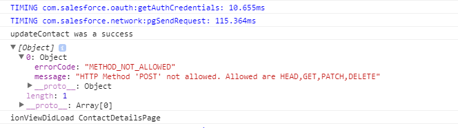
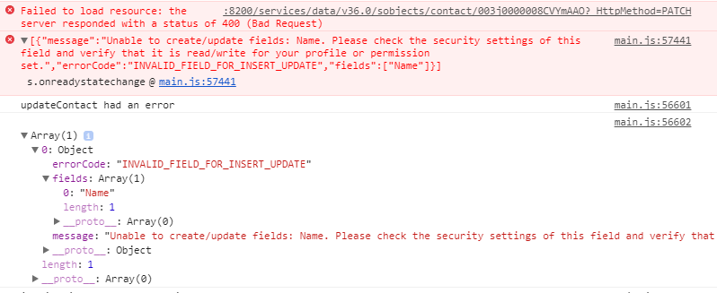
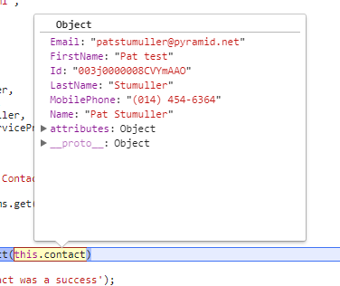
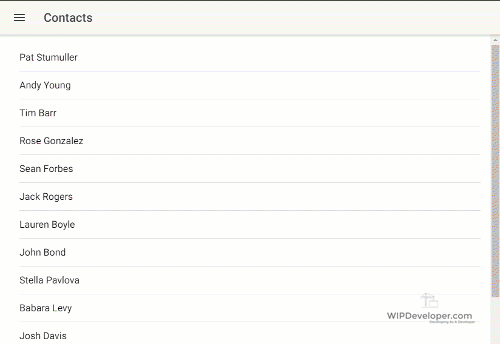
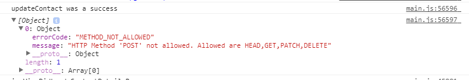

Since we figured out [how to access the debugger for Android apps](https://wipdeveloper.wpcomstaging.com/2017/07/26/salesforce-mobile-sdk-ionic-debugging-part/) let's take a look and see where our issue is.

## The Issue

When we same an edit to a contact it does not save but it does not cause an error.  To see the error we have to look at the results from the `update` method that the `ForceJS` `DataService` provided.

#### The "Error" Message

I say it's an "error" because the call did not return an error status so if we change the `updateContact` in  `contacts-edit.ts` to have  a `catch` it will not be triggered.  In fact, let's add a `catch` now for the promise returned from `udpateContact` of  `contacts-service.ts`.

#### Updated `updateContact` in  `contacts-edit.ts`

updateContact() {
  this.service.updateContact(this.contact)
    .then(results => {
      console.log('updateContact was a success');
      console.log(results);
      this.navCtrl.push(ContactDetailsPage, { "id": this.contact.Id });
    })
    .catch(error =>{
      console.log('updateContact had an error');
      console.log(error);
    })
}

Now let's run it and see what shows up in the console.

#### Still Not an Error

#### 

As you can see, we did not trigger the `catch` statement.

Let's see if this happens if we run our app with the `force-server` proxy server.

## `force-server`

For is a development server created by [Christophe Coenraets](https://twitter.com/ccoenraets) that allows us to test our code separate of the Salesforce Mobile SDK.   Let's install it.

#### Install `force-server`

npm install force-server -g

now go into your `www` folder on the command line and start it up with `force-server`

#### Start `force-server`

PS D:\\workspace\\Blog\\salesforce\\ionic\\ionicContacts-updated> cd www
PS D:\\workspace\\Blog\\salesforce\\ionic\\ionicContacts-updated\\www> force-server
force-server listening on port 8200
Root: .

Now you can open up a web browser and see it like you would any other web page.

A few things that may seem anoying, for me at least.  Everytime I do something in the app that requires a call to Salesforce.com I have to approve it.  This is probably because of how the service is structured and we can deal with it later.

## Edit Again

Navigate to a contact and try editing it.  Then take a look in the console.

#### Useful Error

Here you can see 2 things.

First there is an error that occurred and was logged to the console.

#### Error

\[{"message":"Unable to create/update fields: Name. Please check the security settings of this field and verify that it is read/write for your profile or permission set.","errorCode":"INVALID\_FIELD\_FOR\_INSERT\_UPDATE","fields":\["Name"\]}\]

Second, the `catch` for the `updateContact` was triggered.

## Resolution

If you read the `error` message from the exception or the `message` from promise `catch` error object you will see that we are trying to update the `Name` field.   And while we didn't change the `Name` or change it, the object we sent to be updated had a `Name` property on it and Salesforce is saying we can't include that in an update.

#### Saved Object

> It has the `Name` property since we are using the same object on the edit view as we do on the details view.  This wouldn't be an issue if we just used the `FirstName` and `LastName` desperately used them inplace of `Name` on the `contactDetails` html template.

To fix this let's `delete` the `Name` property from the `contact` object before we send it to Salesforce to save in `updateContact` on `contacts-service.ts`.   Since we defined the type of object `contact` was as a parameter we should add one more propterty to it called `Name` of type `string`.  Then we can `delete` it in the method and TypeScript wont have an issue with it.

####  Update `updateContact` on \`ContactsServiceProvider\`

updateContact(
  contact:
    {
      Id: string,
      FirstName: string,
      LastName: string,
      Email: string,
      MobilePhone: string,
      Name: string
    }
) {
  let oauth = OAuth.createInstance();

  delete contact.Name;

  return oauth.login()
    .then(oauthResult => {
      let service = DataService.createInstance(oauthResult);

      return service.update('contact', contact);

    });
}

Now let's run `ionic-app-scripts build` refresh our page and see if we can edit a Contact.

#### Works on My Machine

Now let's run it `cordova prepare`  so we can see if we resolved out issue.

#### Results: Nope

So that didn't resolve this issue.

## Conclusion

So it doesn't look like we are out of the woods yet on updating a Contact.  Let's take another crack at it next time.

Don’t forget to sign up for [**The Weekly Stand-Up!**](https://wipdeveloper.wpcomstaging.com/newsletter/) to receive free the [WIP Developer.com](https://wipdeveloper.wpcomstaging.com/) weekly newsletter every Sunday!

Looking for the code and want to follow along?  Find it on [GitHub.com/BrettMN/salesforce-sdk-mobile-with-ionic-starter](https://github.com/BrettMN/salesforce-sdk-mobile-with-ionic-starter)
