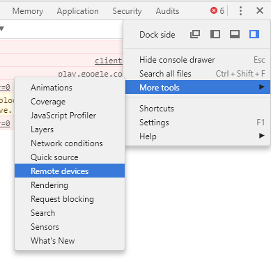
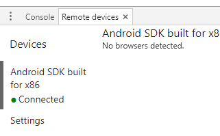
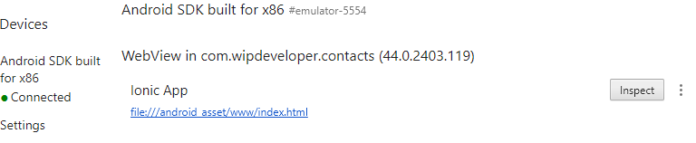
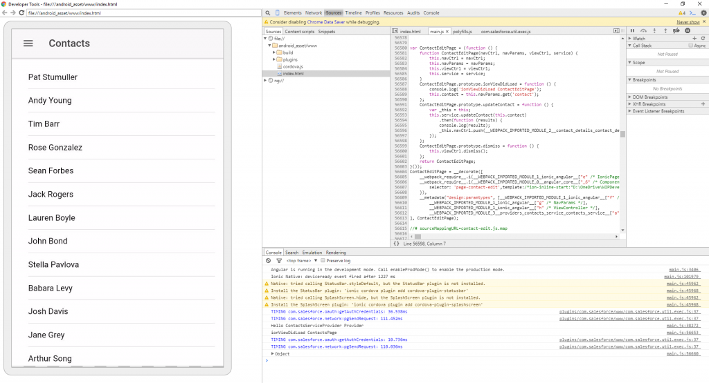
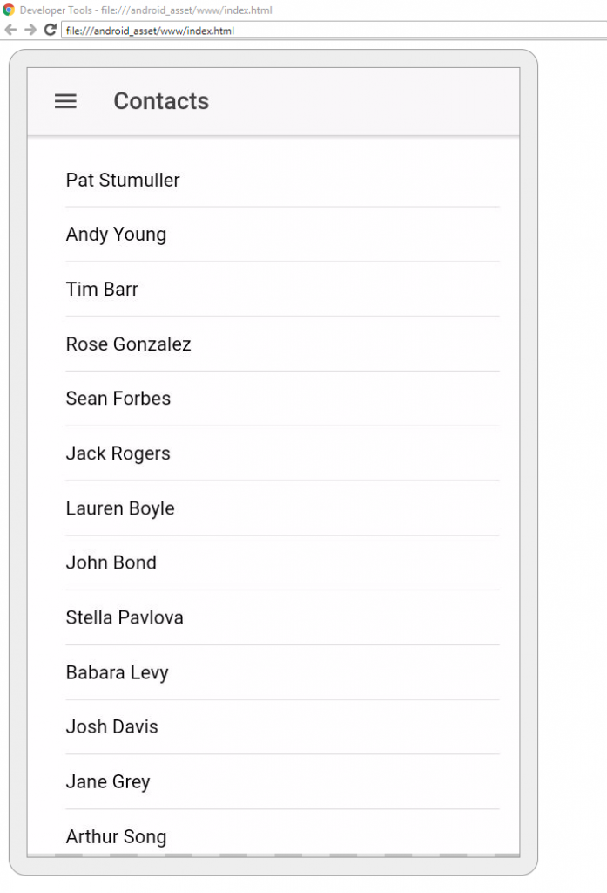
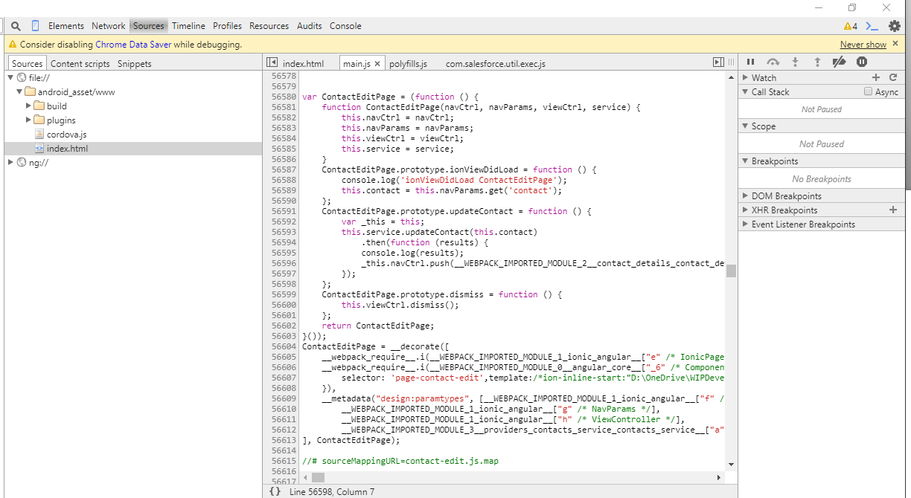
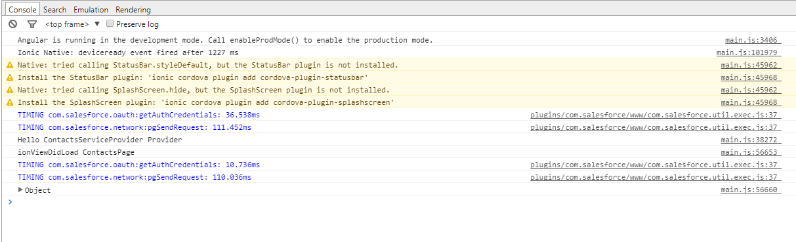

When last we left our intrepid little Contacts App [it couldn't edit a Contact](https://wipdeveloper.wpcomstaging.com/2017/07/25/salesforce-mobile-sdk-ionic-edit-contact-part-iii/).  Lets take a look at what is happening and see if we can figure out how to resolve it.

> Keep in mind we are only doing Android right now so if you are using an iPhone we will have to get to that later.

## Debug

First thing we will need to do is enable USB Debugging on your device.   On the device go to Settings > Developer Options > Enable USB Debugging then plug your device into you computer with a USB cable.  Now open up Chrome's Developer Tools, `f12` on Windows or `command + options + i` on Mac, and go to the menu drop down => More Tools => Remote devices.

> If you are using an emulator you may not need to Enable USB Debugging

#### Access Remote Devices

Now you should have a new tab open named `Remote devices`.

#### Remote Devices Tab

When you have the app running you will see a list of pages you can inspect.  We are going to want to inspect the one that is titles with our app name, in this case "Ionic App".  We can inspect it with the "inspect" button on the right hand side.

#### List of Inspect-able Pages

Once we inspect our app things will probably look familiar to people who have done web development before.

#### Inspected App

Now we can see the app view on the left had side and interact with the app through it.

#### App View

You can also see the same tabs you have when inspecting a webpage in Chrome.  So we can look at the source files, set breakpoints, view the DOM and so on just as we would on a regular web page.

#### Chrome Tools

We also have the console.

#### Console

While developing I often log things to the console so I can see how things are progressing without using breakpoints.  The console messages also include a link to the location in the source so you can quickly find where the message came from.

## Conclusion

Now that we know how to look at what is happening we will be able to see what is going on next time.

Don’t forget to sign up for [**The Weekly Stand-Up!**](https://wipdeveloper.wpcomstaging.com/newsletter/) to receive free the [WIP Developer.com](https://wipdeveloper.wpcomstaging.com/) weekly newsletter every Sunday!

Looking for the code and want to follow along?  Find it on [GitHub.com/BrettMN/salesforce-sdk-mobile-with-ionic-starter](https://github.com/BrettMN/salesforce-sdk-mobile-with-ionic-starter)
