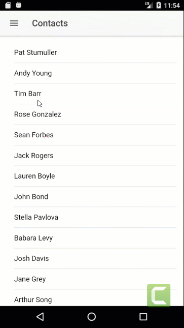
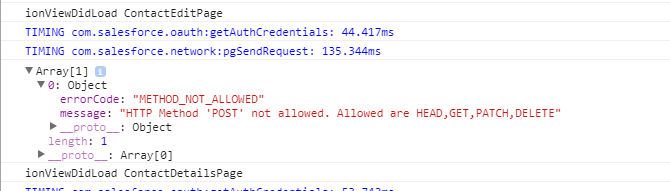

We've [completed the `EditContactPage` component](https://wipdeveloper.wpcomstaging.com/2017/07/24/salesforce-mobile-sdk-ionic-edit-contact-part-ii/).  Now we should add a way to open it in a modal from the `ContactDetailsPage` component.

## Update `ContactDetailsPage` Component

In the `ContactDetailsPage` component we are going to want a button to select to open a modal to edit the contact.  This means we will need a button on the html template.  And logic in the component class to handle the `click` event.

The button will be pretty straight forward.  We will add an html `button` with a `ion-button` component on it that uses the Angular event binding for the click event, `(click)`, to call the `updateContact` method on the controller passing in the `contact`.

#### Edit Contact Button

<button ion-button (click)="updateContact(contact)">Edit</button>

Now for the fun part.  We will need to import a couple more things.  From `ionic-angular` we will need to add the `ModalController`.  This can be done as part of the other imports from `ionic-angular` on line `2`.  We will also need to import the `ContactEditPage` controller.

#### Update `Import`s

import { IonicPage, NavController, NavParams, ModalController } from 'ionic-angular';

import { ContactEditPage } from '../../pages/contact-edit/contact-edit';

To get access to the `ModalController` we will need to add it to the constructor so that it can be injected properly.

#### Updated `constructor`

constructor(
  public navCtrl: NavController,
  public navParams: NavParams,
  public modalCtrl: ModalController,
  private service: ContactsServiceProvider
) { }

Now we will need to add a method called `updateContact` to create a modal with the `modalCtrl` that we have access to and the reference to the `ContactEditPage` component.  This method will accept a `contact` of type `any` and use that as the value of the property named `contact` in the object passed in the to `modalCtrl.create` method.   Then we `present` the modal.

#### `updateContact` Modal

updateContact(contact: any) {
  let editModal = this.modalCtrl.create(ContactEditPage, { contact: contact });

  editModal.present();
}

Now we should be ready to run it.

## Run it

Now if we run it we should see something...

#### Edit Complete?

 

No.  It's not complete.  It looks like everything is working properly but it's not saving to Salesforce.

If we inspect the console we can see the error.

#### Console Error

Ok, so it's not really an error it's the results of the update call.  We'll take a look into this next time and see where things went wrong.

## Conclusion

Sometimes things don't go right and we have to dig in a little more.  Let's see if we can straighten this out next time.

Don’t forget to sign up for [**The Weekly Stand-Up!**](https://wipdeveloper.wpcomstaging.com/newsletter/) to receive free the [WIP Developer.com](https://wipdeveloper.wpcomstaging.com/) weekly newsletter every Sunday!

Looking for the code and want to follow along?  Find it on [GitHub.com/BrettMN/salesforce-sdk-mobile-with-ionic-starter](https://github.com/BrettMN/salesforce-sdk-mobile-with-ionic-starter)
