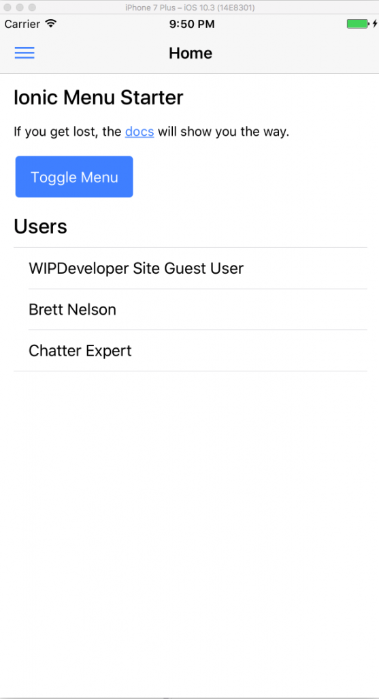
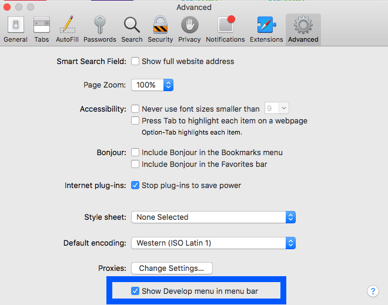
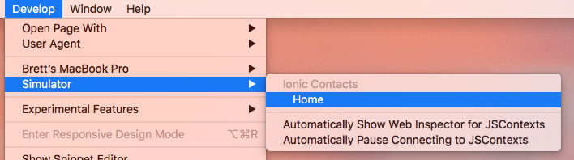
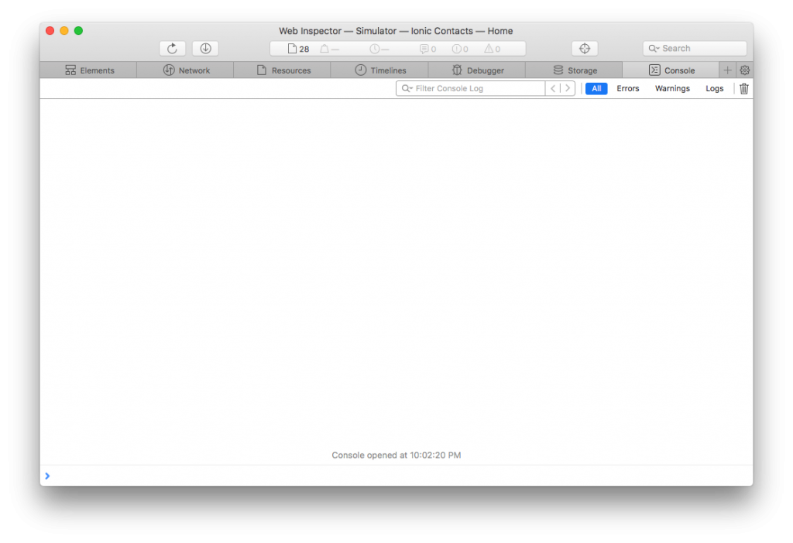

Since we managed to get our [app running on iOS last time](https://wipdeveloper.wpcomstaging.com/2017/07/31/salesforce-mobile-sdk-ionic-adding-ios-platform/) lets see what it takes to access the Web Inspector.

## Web Inspector

If you are wondering what Web Inspector is it's the development debug tools for Safari.  We will use them to debug the JavaScript, HTML and CSS that is in our app.  This only applies to iOS and running the app as a weppage with a proxy server similar to [what we did with ForceJS](https://wipdeveloper.wpcomstaging.com/2017/07/27/salesforce-mobile-sdk-ionic-debugging-part-ii/).

## Get Started

First thing we should do is start up the app.  I will be running it in the simulator for now. So go on an open up that `Ionic Contacts.xcodeproj` and run your app.

#### Running

Now lets attach Safari so we can get some debugging done.

## Safari

Open up Safari and if you haven't used it for debugging before we will need to enable the developer menu.  Go to Safari > Preferences...  In the Preferences window do to `Advanced` and choose `Show Develop menu in menu bar`

#### `Show Develop menu in menu bar`

And we should now see the `Develop` menu item on the menu bar

#### `Develop`

From the `Develop` menu we can go to `Simulator` and choose the view we want to have access to.  In this case I want to debug the `Home` page.

#### Select Page to Debug

That should have opened up the `Web Inspector` window.  If you haven't used it before it's similar to Chrome Dev tools or even _gasp_ the Edge f12 Developer Tools and what ever Firefox calls their developer tools.

#### Web Inspector

 With the `Web Inspector` open we will be ready to start looking for our issue.

## Conclusion

Don’t forget to sign up for [**The Weekly Stand-Up!**](https://wipdeveloper.wpcomstaging.com/newsletter/) to receive free the [WIP Developer.com](https://wipdeveloper.wpcomstaging.com/) weekly newsletter every Sunday!

Looking for the code and want to follow along?  Find it on [GitHub.com/BrettMN/salesforce-sdk-mobile-with-ionic-starter](https://github.com/BrettMN/salesforce-sdk-mobile-with-ionic-starter)
