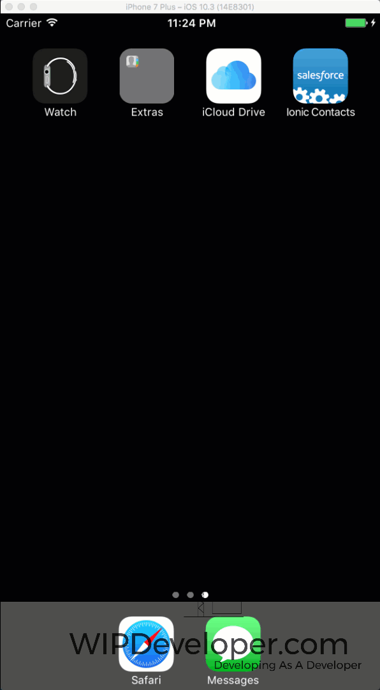

Since we are having [problems with our app on Android](https://wipdeveloper.wpcomstaging.com/2017/07/26/salesforce-mobile-sdk-ionic-debugging-part/) but have verified that [our logic works using a proxy server](https://wipdeveloper.wpcomstaging.com/2017/07/27/salesforce-mobile-sdk-ionic-debugging-part-ii/) we should try it on the other mobile platform to see if it behaves the same.  That means, time to move development to a Mac.

> I'm just going to assume you have npm installed and have already installed the appropriate global libraries (hint: `npm install -g ionic forceios forcedroid cordova`) 

## Clone the Repo

The get our code we will need to clone it from [https://github.com/BrettMN/salesforce-sdk-mobile-with-ionic-starter](https://github.com/BrettMN/salesforce-sdk-mobile-with-ionic-starter)

> You don't have to clone it there is an option to download it if you are git averse

Once you have the code you should run `npm install` to repopulate your `node_modules` folder with the required libraries.

## Add ios Platform

With the code base ready add ios platform.

#### Add ios

ionic cordova platform add ios

Now we will need to remove the Salesforce Mobile SDK plugin and re-add it.

#### Remove Salesforce Mobile SDK

cordova plugin remove com.salesforce

#### Add Salesforce Mobile SDK

cordova plugin add https://github.com/forcedotcom/SalesforceMobileSDK-CordovaPlugin --force

> The `--force` is so that if there is a second plugin that is installed that modifies the same values of the config the Salesforce Mobile SDK will overwrite them.

Before we can run the app we will need to run `npm run build` followed by `cordova prepare` or since you downloaded the repo from https://github.com/BrettMN/salesforce-sdk-mobile-with-ionic-starter you can use the `npm run dev` command that does both actions.

After that you should be able to open up `platforms/ios/Ionic Contacts.xcodeproj` in xcode and try running it.

## Run It

We should be able to run it now.

#### It Works!

 

 

## Conclusion

Now that we have ios working we can take a look at how to access the debug console for our app next time.

Don’t forget to sign up for [**The Weekly Stand-Up!**](https://wipdeveloper.wpcomstaging.com/newsletter/) to receive free the [WIP Developer.com](https://wipdeveloper.wpcomstaging.com/) weekly newsletter every Sunday!

Looking for the code and want to follow along?  Find it on [GitHub.com/BrettMN/salesforce-sdk-mobile-with-ionic-starter](https://github.com/BrettMN/salesforce-sdk-mobile-with-ionic-starter)
