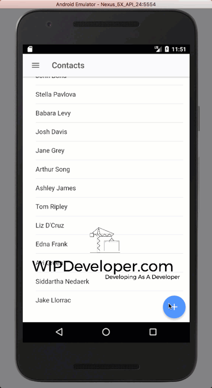

 

We are on [our way](https://wipdeveloper.wpcomstaging.com/2017/08/08/salesforce-mobile-sdk-ionic-create-object-part/) to get the feature of adding a new contact to our app.  Let's finish it up.

## Update `Contacts`

Let's add a method to create a modal on the `contacts.ts` for adding a new contact.

#### `addContact` Method

addContact(contact: any) {
  let editModal = this.modalCtrl.create(ContactEditPage);

  editModal.present();
}

This is similar to the method we used when [editing a `contact`](https://wipdeveloper.wpcomstaging.com/2017/07/24/salesforce-mobile-sdk-ionic-edit-contact-part-ii/) so we will need to import the `ModalController` from `ionic-angular` and the `ContactDetailsPage` from `'../contact-details/contact-details'`

#### Updated Imports

import { Component } from '@angular/core';
import { IonicPage, NavController, NavParams, ModalController } from 'ionic-angular';

import { ContactEditPage } from '../contact-edit/contact-edit';
import { ContactDetailsPage } from '../contact-details/contact-details';

import { ContactsServiceProvider } from '../../providers/contacts-service/contacts-service';

Now we will need a button to call our new `addContact` method.  For this feature I think one of those buttons that floats to the right side of the screen near the bottom would be a great choice.  It turns our there is a name for those **Floating Action Button** or **FAB** for short.  The Ionic Framework has this handle pretty well for us with it's [FAB components](https://ionicframework.com/docs/components/#fabs).

Let's use an `ion-fab` that is `right` and `bottom` and have a button call `addContact()` on `(click)` that uses an `ion-icon` with a `name` of `add`.

#### Our FAB

<ion-fab right bottom>
  <button ion-fab (click)="addContact()">
    <ion-icon name="add"></ion-icon>
  </button>
</ion-fab>

We will want to put this after the `ion-list` inside of the `ion-content` of the `contacts.html`

With that done let's run it and see what happens.

## Run it.

Now when we run it we should be able to to add a new Contact.

#### Adding New Contact

 

There are some navigational issues but it is working.

## Conclusion

We should probably work out some of those navigation issues in the near future.

Don’t forget to sign up for [**The Weekly Stand-Up!**](https://wipdeveloper.wpcomstaging.com/newsletter/) to receive free the [WIP Developer.com](https://wipdeveloper.wpcomstaging.com/) weekly newsletter every Sunday!

Looking for the code and want to follow along?  Find it on [GitHub.com/BrettMN/salesforce-sdk-mobile-with-ionic-starter](https://github.com/BrettMN/salesforce-sdk-mobile-with-ionic-starter)
