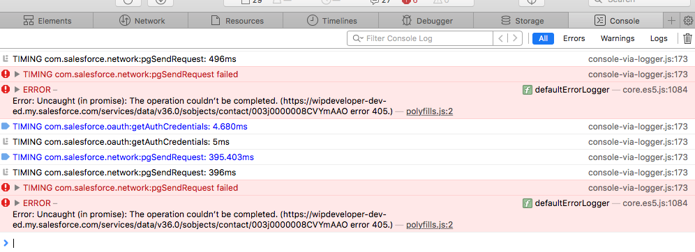

We now know how to [access the Web Inspector](https://wipdeveloper.wpcomstaging.com/2017/08/01/salesforce-mobile-sdk-ionic-accessing-web-inspector-ios/) so we can debug iOS.  Let's take a further look at our problem and see if it [behaves the same as it did on Android](https://wipdeveloper.wpcomstaging.com/2017/07/27/salesforce-mobile-sdk-ionic-debugging-part-ii/)

## Debug iOS

With the Web Inspector open to our app let's go to the `contacts` page and see if there are any errors in the console.

We should see that the `contacts` page loads like it did on Android and when using ForceJS so we are off to a good start.

#### Contacts Load

Let's go into a contact and see if there are any issues with the displaying the `contact-details` page.

#### Contact Details Works

 

Hopefully this works for you as well.

Something to note, up till this point with the Web Inspector open to the console we should see no errors so far.

#### No Errors

Now let's try editing a contact.

Choose the `Edit` button and change one of the fields and see if you get an error.

> When I first tried to edit a text field I encountered a problem with it not staying selects.  This is because the on screen keyboard was turned off.  To turn it back on I had to use the `command + k` keys. 

 

If you are like me clicking `Save` wont look like it does anything.  But if you look in the Web Inspector Console you'll see a different story.

#### Web Inspector Console With Errors

> I have multiple errors because I pressed `Save` multiple times :)

And the error you see here is uncaught and in a promise.  This sounds like it should be familiar.  Looking at my code I did not have the latest commit from [GitHub.com/BrettMN/salesforce-sdk-mobile-with-ionic-starter](https://github.com/BrettMN/salesforce-sdk-mobile-with-ionic-starter).  I forgot to push the changes from [Salesforce Mobile SDK and Ionic – Debugging Part II](https://wipdeveloper.wpcomstaging.com/2017/07/27/salesforce-mobile-sdk-ionic-debugging-part-ii/) so nobody had the latest :(

Oh well, let's run it again with the "newer" code.  And while we still get an error, it's a new one.

#### New Error

Since the line after `udpateContact had an error` is the error, `The operation couldn’t be completed. (https://wipdeveloper-dev-ed.my.salesforce.com/services/data/v40.0/sobjects/contact/003j0000008CVYmAAO error 405.)`,  it looks like this is not going to be an issue in our JavaScript.

## Conclusion

Next time we will try and figure out where to look next when the issue isn't in our JavaScript/TypeScript.

Don’t forget to sign up for [**The Weekly Stand-Up!**](https://wipdeveloper.wpcomstaging.com/newsletter/) to receive free the [WIP Developer.com](https://wipdeveloper.wpcomstaging.com/) weekly newsletter every Sunday!

Looking for the code and want to follow along?  Find it on [GitHub.com/BrettMN/salesforce-sdk-mobile-with-ionic-starter](https://github.com/BrettMN/salesforce-sdk-mobile-with-ionic-starter)
